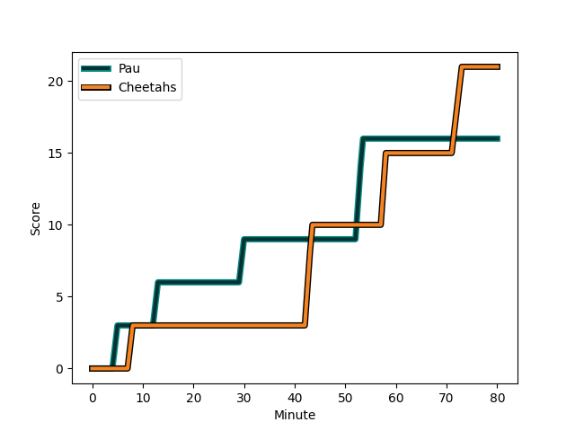
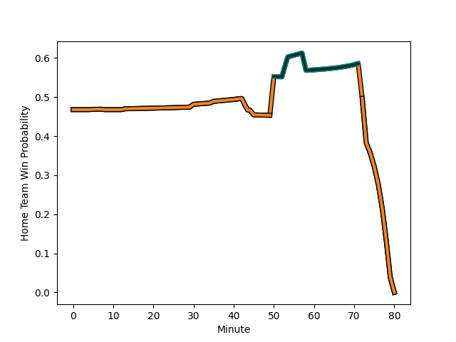

---  
layout: page  
title: Cheetahs at Pau; 21-16  
date: 2022-12-10 14:00:00 18:00:00 -0500  
categories: match review  
---
# Cheetahs (1512.57) at Pau (1461.62); 21-16

# Prediction: Cheetahs by 2.1

Cheetahs by 5.1 on a neutral field
## Scores over Time

## Win Probability over Time

# Pre-Match Prediction: Cheetahs by 3.5

Cheetahs by 6.5 on a neutral pitch

|   Away Minutes | Away Player                                                                              |   Away elo |   Away Percentile |   Number |   Home Percentile |   Home elo | Home Player                                                           |   Home Minutes |
|---------------:|:-----------------------------------------------------------------------------------------|-----------:|------------------:|---------:|------------------:|-----------:|:----------------------------------------------------------------------|---------------:|
|             45 | [Schalk Ferreira](..//playerfiles//SchalkFerreira_cleaned.md)                            |      75.93 |                 2 |        1 |                77 |     104.33 | [Remi Seneca](..//playerfiles//RemiSeneca_cleaned.md)                 |             60 |
|             45 | [Louis van der Westhuizen](..//playerfiles//LouisvanderWesthuizen_cleaned.md)            |     111.64 |                93 |        2 |                12 |      85.5  | [Lucas Rey](..//playerfiles//LucasRey_cleaned.md)                     |             50 |
|             45 | [Aranos Coetzee](..//playerfiles//AranosCoetzee_cleaned.md)                              |     108.59 |                89 |        3 |                 4 |      80.87 | [Nicolas Corato](..//playerfiles//NicolasCorato_cleaned.md)           |             60 |
|             45 | [Mzwanele Richman Zito](..//playerfiles//MzwaneleRichmanZito_cleaned.md)                 |      81.51 |                10 |        4 |                40 |      93    | [Hugo Auradou](..//playerfiles//HugoAuradou_cleaned.md)               |             80 |
|             80 | [Victor Kutlwano Sekekete](..//playerfiles//VictorKutlwanoSekekete_cleaned.md)           |     108.47 |                86 |        5 |                33 |      91.1  | [Jimi Maximin](..//playerfiles//JimiMaximin_cleaned.md)               |             50 |
|             35 | [Jeandre Rudolph](..//playerfiles//JeandreRudolph_cleaned.md)                            |      98.33 |                56 |        6 |                48 |      96.25 | [Martin Puech](..//playerfiles//MartinPuech_cleaned.md)               |             66 |
|             80 | [Oupa Mohoje](..//playerfiles//OupaMohoje_cleaned.md)                                    |     100.22 |                67 |        7 |                18 |      87.37 | [Thibault Hamonou](..//playerfiles//ThibaultHamonou_cleaned.md)       |             80 |
|             78 | [Friedle Olivier](..//playerfiles//FriedleOlivier_cleaned.md)                            |     100.22 |               nan |        8 |                42 |      93.7  | [Sacha Zegueur](..//playerfiles//SachaZegueur_cleaned.md)             |             80 |
|             74 | [Ruan Pienaar](..//playerfiles//RuanPienaar_cleaned.md)                                  |     124.95 |                98 |        9 |                82 |     109.52 | [Clovis Le bail](..//playerfiles//ClovisLebail_cleaned.md)            |             50 |
|             80 | [Siya Masuku](..//playerfiles//SiyaMasuku_cleaned.md)                                    |      98.65 |                59 |       10 |                68 |     101.58 | [Thibault Debaes](..//playerfiles//ThibaultDebaes_cleaned.md)         |             80 |
|             80 | [Tapiwa Lloyd Mafura](..//playerfiles//TapiwaLloydMafura_cleaned.md)                     |      88.67 |                20 |       11 |                67 |     100.09 | [Vincent Pinto](..//playerfiles//VincentPinto_cleaned.md)             |             80 |
|             80 | [Reinhardt Fortuin](..//playerfiles//ReinhardtFortuin_cleaned.md)                        |      93.12 |                48 |       12 |                52 |      96.48 | [Jale Vatubua](..//playerfiles//JaleVatubua_cleaned.md)               |             60 |
|             80 | [David Benjamin Brits](..//playerfiles//DavidBenjaminBrits_cleaned.md)                   |     106.6  |                80 |       13 |                82 |     107.6  | [Yvan Reilhac](..//playerfiles//YvanReilhac_cleaned.md)               |             80 |
|             80 | [Daniel Kasende Kalepula](..//playerfiles//DanielKasendeKalepula_cleaned.md)             |     103.48 |                77 |       14 |                47 |      94.91 | [Eoghan Barrett](..//playerfiles//EoghanBarrett_cleaned.md)           |             80 |
|             50 | [Francois Steyn](..//playerfiles//FrancoisSteyn_cleaned.md)                              |     125.74 |                95 |       15 |               nan |      95.41 | [Clement Mondinat](..//playerfiles//ClementMondinat_cleaned.md)       |             50 |
|             45 | [Daniel Johannes Maartens](..//playerfiles//DanielJohannesMaartens_cleaned.md)           |      99.72 |                66 |       16 |                97 |     119.51 | [Siegfried Fisi'ihoi](..//playerfiles//SiegfriedFisi'ihoi_cleaned.md) |             20 |
|             35 | [Mzamo Majola](..//playerfiles//MzamoMajola_cleaned.md)                                  |      97.12 |                57 |       17 |                62 |      96.88 | [Youri Delhommel](..//playerfiles//YouriDelhommel_cleaned.md)         |             30 |
|             35 | [Marko Louis Janse van Rensburg](..//playerfiles//MarkoLouisJansevanRensburg_cleaned.md) |     108    |                90 |       18 |                82 |     104.23 | [Maks van Dyk](..//playerfiles//MaksvanDyk_cleaned.md)                |             20 |
|             35 | [Hencus van Wyk](..//playerfiles//HencusvanWyk_cleaned.md)                               |      87.75 |                15 |       19 |                97 |     123.74 | [Mickael Capelli](..//playerfiles//MickaelCapelli_cleaned.md)         |             30 |
|             35 | [Rynier Bernardo](..//playerfiles//RynierBernardo_cleaned.md)                            |      94.02 |                44 |       20 |                39 |      93.17 | [Reece Hewat](..//playerfiles//ReeceHewat_cleaned.md)                 |             14 |
|             30 | [Robert Ebersohn](..//playerfiles//RobertEbersohn_cleaned.md)                            |      81.56 |                 8 |       21 |                95 |     118.48 | [Thibault Daubagna](..//playerfiles//ThibaultDaubagna_cleaned.md)     |             30 |
|              2 | [Sibabalo Qoma](..//playerfiles//SibabaloQoma_cleaned.md)                                |     114.8  |                90 |       22 |                14 |      86.49 | [Elliot Roudil](..//playerfiles//ElliotRoudil_cleaned.md)             |             20 |
|              6 | [Rewan Kruger](..//playerfiles//RewanKruger_cleaned.md)                                  |      96.02 |               nan |       23 |                20 |      88.61 | [Mathias Colombet](..//playerfiles//MathiasColombet_cleaned.md)       |             30 |

