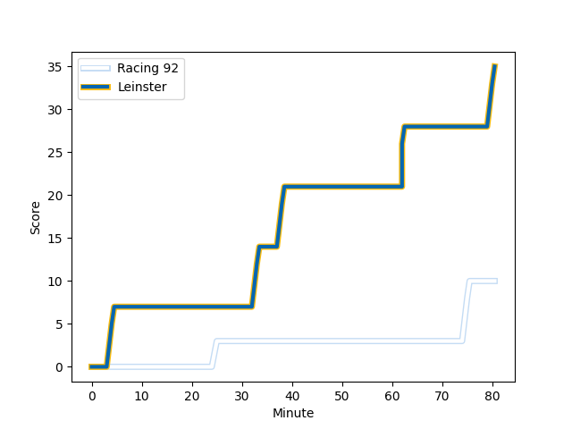
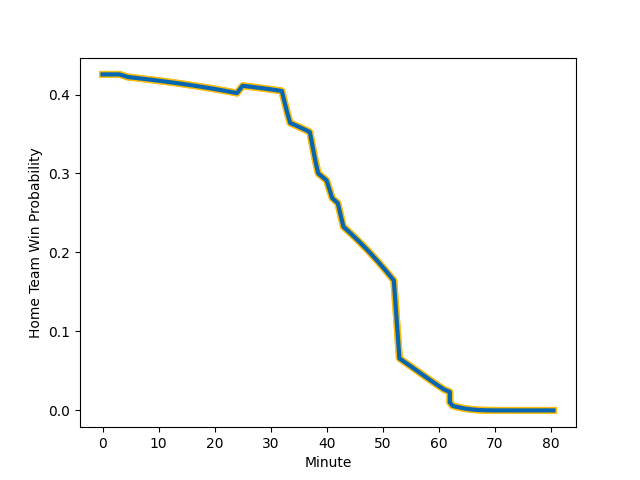

---  
layout: page  
title: Leinster at Racing 92; 42-10  
date: 2022-12-10 14:00:00 18:00:00 -0500  
categories: match review  
---
# Leinster (1700.88) at Racing 92 (1570.46); 42-10

# Prediction: Leinster by 10.0

Leinster by 13.0 on a neutral field
## Scores over Time

## Win Probability over Time

# Pre-Match Prediction: Leinster by 7.4

Leinster by 10.4 on a neutral pitch

|   Away Minutes | Away Player                                                           |   Away elo |   Away Percentile |   Number |   Home Percentile |   Home elo | Home Player                                                           |   Home Minutes |
|---------------:|:----------------------------------------------------------------------|-----------:|------------------:|---------:|------------------:|-----------:|:----------------------------------------------------------------------|---------------:|
|             62 | [Andrew Porter](..//playerfiles//AndrewPorter_cleaned.md)             |     101.37 |                74 |        1 |                98 |     124.27 | [Eddy Ben Arous](..//playerfiles//EddyBenArous_cleaned.md)            |             43 |
|             62 | [Dan Sheehan](..//playerfiles//DanSheehan_cleaned.md)                 |      96.29 |                57 |        2 |                93 |     112.06 | [Camille Chat](..//playerfiles//CamilleChat_cleaned.md)               |             53 |
|             62 | [Michael Alaalatoa](..//playerfiles//MichaelAlaalatoa_cleaned.md)     |     101.07 |                71 |        3 |                27 |      90.92 | [Cedate Gomes Sa](..//playerfiles//CedateGomesSa_cleaned.md)          |             43 |
|             53 | [Jason Jenkins](..//playerfiles//JasonJenkins_cleaned.md)             |      95.83 |                52 |        4 |                22 |      88.26 | [Cameron Woki](..//playerfiles//CameronWoki_cleaned.md)               |             73 |
|             62 | [James Ryan](..//playerfiles//JamesRyan_cleaned.md)                   |     114.01 |                91 |        5 |                 3 |      71.72 | [Fabien Sanconnie](..//playerfiles//FabienSanconnie_cleaned.md)       |             62 |
|             80 | [Ryan Baird](..//playerfiles//RyanBaird_cleaned.md)                   |     107.47 |                83 |        6 |                97 |     124.35 | [Wenceslas Lauret](..//playerfiles//WenceslasLauret_cleaned.md)       |             41 |
|             80 | [Josh van der Flier](..//playerfiles//JoshvanderFlier_cleaned.md)     |     122.68 |                96 |        7 |                52 |      95.93 | [Ibrahim Diallo](..//playerfiles//IbrahimDiallo_cleaned.md)           |             80 |
|             80 | [Caelan Doris](..//playerfiles//CaelanDoris_cleaned.md)               |     118.49 |                93 |        8 |                75 |     105.25 | [Maxime Baudonne](..//playerfiles//MaximeBaudonne_cleaned.md)         |             80 |
|             62 | [Jamison Gibson-Park](..//playerfiles//JamisonGibson-Park_cleaned.md) |     113.17 |                90 |        9 |                78 |     105.12 | [Nolann Le Garrec](..//playerfiles//NolannLeGarrec_cleaned.md)        |             80 |
|             68 | [Ross Byrne](..//playerfiles//RossByrne_cleaned.md)                   |     103.14 |                72 |       10 |                96 |     126.1  | [Finn Russell](..//playerfiles//FinnRussell_cleaned.md)               |             80 |
|             80 | [James Lowe](..//playerfiles//JamesLowe_cleaned.md)                   |     153.93 |                99 |       11 |                97 |     123.16 | [Juan Imhoff](..//playerfiles//JuanImhoff_cleaned.md)                 |             80 |
|             71 | [Charlie Ngatai](..//playerfiles//CharlieNgatai_cleaned.md)           |     116.58 |                92 |       12 |                94 |     118.52 | [Gael Fickou](..//playerfiles//GaelFickou_cleaned.md)                 |             80 |
|             80 | [Garry Ringrose](..//playerfiles//GarryRingrose_cleaned.md)           |     101.63 |                69 |       13 |                50 |      96.56 | [Francis Saili](..//playerfiles//FrancisSaili_cleaned.md)             |             62 |
|             80 | [Jimmy O'Brien](..//playerfiles//JimmyO'Brien_cleaned.md)             |     111.43 |                89 |       14 |                79 |     104.47 | [Christian Wade](..//playerfiles//ChristianWade_cleaned.md)           |             80 |
|             80 | [Hugo Keenan](..//playerfiles//HugoKeenan_cleaned.md)                 |     119.73 |                93 |       15 |                63 |      99    | [Max Spring](..//playerfiles//MaxSpring_cleaned.md)                   |             78 |
|             18 | [Ed Byrne](..//playerfiles//EdByrne_cleaned.md)                       |     119.64 |                97 |       16 |                18 |      88.26 | [Hassane Kolingar](..//playerfiles//HassaneKolingar_cleaned.md)       |             37 |
|             18 | [Ronan Kelleher](..//playerfiles//RonanKelleher_cleaned.md)           |     117.86 |                96 |       17 |                15 |      90.18 | [Janick Tarrit](..//playerfiles//JanickTarrit_cleaned.md)             |             27 |
|             18 | [Cian Healy](..//playerfiles//CianHealy_cleaned.md)                   |     113.35 |                93 |       18 |                74 |     102.99 | [Trevor Nyakane](..//playerfiles//TrevorNyakane_cleaned.md)           |             37 |
|             27 | [Ross Molony](..//playerfiles//RossMolony_cleaned.md)                 |     127.1  |                98 |       19 |                87 |     109.51 | [Boris Palu](..//playerfiles//BorisPalu_cleaned.md)                   |              7 |
|             18 | [Jack Conan](..//playerfiles//JackConan_cleaned.md)                   |     121.53 |                94 |       20 |                95 |     120.7  | [Anton Bresler](..//playerfiles//AntonBresler_cleaned.md)             |             18 |
|             12 | [Harry Byrne](..//playerfiles//HarryByrne_cleaned.md)                 |     114.17 |                88 |       21 |                68 |     100.96 | [Baptiste Chouzenoux](..//playerfiles//BaptisteChouzenoux_cleaned.md) |             39 |
|             18 | [Luke McGrath](..//playerfiles//LukeMcGrath_cleaned.md)               |     113.84 |                92 |       22 |                73 |     103.09 | [Olivier Klemenczak](..//playerfiles//OlivierKlemenczak_cleaned.md)   |             18 |
|              9 | [Jamie Osborne](..//playerfiles//JamieOsborne_cleaned.md)             |     101.37 |                68 |       23 |                84 |     109.81 | [Antoine Gibert](..//playerfiles//AntoineGibert_cleaned.md)           |              2 |

