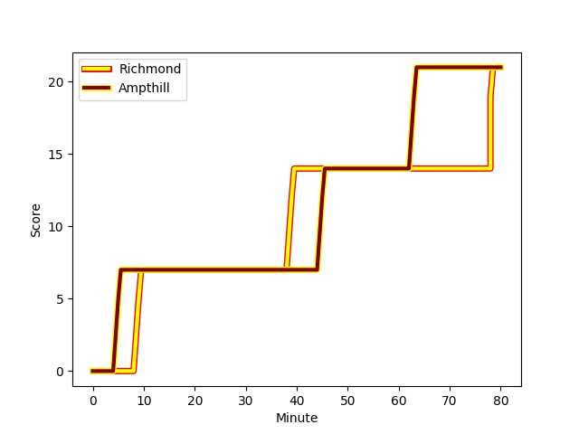
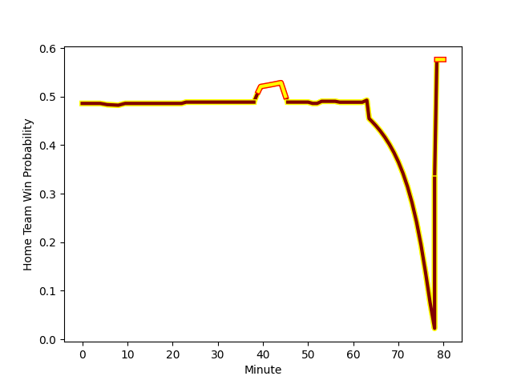

---  
layout: page  
title: Ampthill at Richmond; 21-21  
date: 2022-12-10 16:00:00 18:00:00 -0500  
categories: match review  
---
# Ampthill (1413.33) at Richmond (1384.69); 21-21

# Prediction: Richmond by 0.1

Ampthill by 2.9 on a neutral field
## Scores over Time

## Win Probability over Time

# Pre-Match Prediction: Ampthill by 2.1

Ampthill by 0.9 on a neutral pitch

|   Away Minutes | Away Player                                                           |   Away elo |   Away Percentile |   Number |   Home Percentile |   Home elo | Home Player                                                       |   Home Minutes |
|---------------:|:----------------------------------------------------------------------|-----------:|------------------:|---------:|------------------:|-----------:|:------------------------------------------------------------------|---------------:|
|             57 | [Zac Nearchou](..//playerfiles//ZacNearchou_cleaned.md)               |      92.13 |               nan |        1 |                37 |      93.53 | [Conor Maguire](..//playerfiles//ConorMaguire_cleaned.md)         |             73 |
|             57 | [Beck Cutting](..//playerfiles//BeckCutting_cleaned.md)               |      88.57 |                19 |        2 |               nan |      96.05 | [Joseph Vajner](..//playerfiles//JosephVajner_cleaned.md)         |             68 |
|             68 | [Dominic Hardman](..//playerfiles//DominicHardman_cleaned.md)         |      94.3  |                41 |        3 |                 1 |      73.63 | [Jimmy Litchfield](..//playerfiles//JimmyLitchfield_cleaned.md)   |             63 |
|             80 | [Charlie Beckett](..//playerfiles//CharlieBeckett_cleaned.md)         |     108.13 |                86 |        4 |                55 |      96.51 | [Jake Monson](..//playerfiles//JakeMonson_cleaned.md)             |             80 |
|             23 | [Cai Devine](..//playerfiles//CaiDevine_cleaned.md)                   |     101.16 |                69 |        5 |                13 |      84.07 | [Sam Collingridge](..//playerfiles//SamCollingridge_cleaned.md)   |             80 |
|             80 | [Caleb Montgomery](..//playerfiles//CalebMontgomery_cleaned.md)       |      97.45 |                57 |        6 |                61 |      98.45 | [David Massey](..//playerfiles//DavidMassey_cleaned.md)           |             80 |
|             68 | [Paddy Ryan](..//playerfiles//PaddyRyan_cleaned.md)                   |      98.79 |                62 |        7 |                76 |     103.22 | [Tobias Saysell](..//playerfiles//TobiasSaysell_cleaned.md)       |             60 |
|             80 | [Morgan Strong](..//playerfiles//MorganStrong_cleaned.md)             |      88.56 |                23 |        8 |                16 |      86.12 | [Mark Bright](..//playerfiles//MarkBright_cleaned.md)             |             80 |
|             68 | [Lewis Finlay](..//playerfiles//LewisFinlay_cleaned.md)               |      96.28 |                52 |        9 |                45 |      94.93 | [James Lennon](..//playerfiles//JamesLennon_cleaned.md)           |             53 |
|             80 | [Gwyn Parks](..//playerfiles//GwynParks_cleaned.md)                   |      98.66 |                59 |       10 |                30 |      91.85 | [Bill Johnston](..//playerfiles//BillJohnston_cleaned.md)         |             51 |
|             80 | [Alexandrer Harmes](..//playerfiles//AlexandrerHarmes_cleaned.md)     |      90.85 |                28 |       11 |                51 |      96.29 | [Hamish Graham](..//playerfiles//HamishGraham_cleaned.md)         |             73 |
|             80 | [Thomas Hitchcock](..//playerfiles//ThomasHitchcock_cleaned.md)       |      93.91 |               nan |       12 |                10 |      83.05 | [Paul Kiernan](..//playerfiles//PaulKiernan_cleaned.md)           |             80 |
|             80 | [George Worth](..//playerfiles//GeorgeWorth_cleaned.md)               |      81.82 |                 8 |       13 |                79 |     106.28 | [Michael Little](..//playerfiles//MichaelLittle_cleaned.md)       |             80 |
|             80 | [Conor Rankin](..//playerfiles//ConorRankin_cleaned.md)               |      97.03 |                54 |       14 |                50 |      96.08 | [Alexander O'Meara](..//playerfiles//AlexanderO'Meara_cleaned.md) |             80 |
|             80 | [Tomas Bacon](..//playerfiles//TomasBacon_cleaned.md)                 |      89.73 |                28 |       15 |               nan |      86.84 | [Darren Atkins](..//playerfiles//DarrenAtkins_cleaned.md)         |             80 |
|             57 | [Fyn Brown](..//playerfiles//FynBrown_cleaned.md)                     |      92.64 |                37 |       16 |                26 |      88.99 | [Owain James](..//playerfiles//OwainJames_cleaned.md)             |             29 |
|             23 | [Matt Gallagher](..//playerfiles//MattGallagher_cleaned.md)           |      95.78 |               nan |       17 |                57 |      98.66 | [Jack Stafford](..//playerfiles//JackStafford_cleaned.md)         |             27 |
|             23 | [Danny Hobbs-Awoyemi](..//playerfiles//DannyHobbs-Awoyemi_cleaned.md) |     112.04 |                94 |       18 |                32 |      91.49 | [Miles Wakeling](..//playerfiles//MilesWakeling_cleaned.md)       |             20 |
|             12 | [Ollie Fox](..//playerfiles//OllieFox_cleaned.md)                     |      74    |                 2 |       19 |                36 |      93.31 | [Luke Spring](..//playerfiles//LukeSpring_cleaned.md)             |             17 |
|             12 | [Jevaughn Warren](..//playerfiles//JevaughnWarren_cleaned.md)         |      93.55 |                38 |       20 |                 3 |      79.79 | [Callum Torpey](..//playerfiles//CallumTorpey_cleaned.md)         |             12 |
|             12 | [Isaac Curtis-Harris](..//playerfiles//IsaacCurtis-Harris_cleaned.md) |      83.51 |               nan |       21 |               nan |      93.42 | [George Cave](..//playerfiles//GeorgeCave_cleaned.md)             |              7 |
|            nan | nan                                                                   |     nan    |               nan |       22 |                11 |      82.41 | [Will Kaye](..//playerfiles//WillKaye_cleaned.md)                 |              7 |

