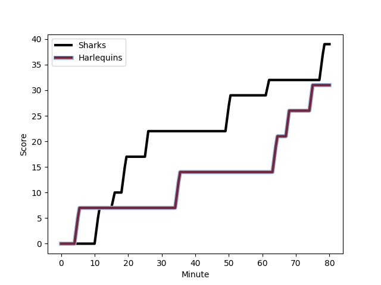
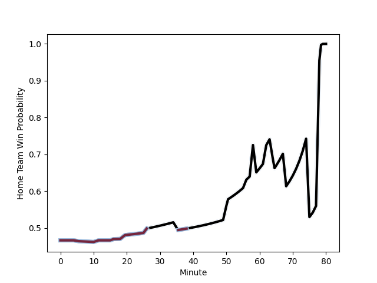

---  
layout: page  
title: Harlequins at Sharks; 31-39  
date: 2022-12-10 14:00:00 18:00:00 -0500  
categories: match review  
---
# Harlequins (1612.3) at Sharks (1554.72); 31-39

# Prediction: Harlequins by 2.8

Harlequins by 5.8 on a neutral field
## Scores over Time

## Win Probability over Time

# Pre-Match Prediction: Harlequins by 0.8

Harlequins by 3.8 on a neutral pitch

|   Away Minutes | Away Player                                                       |   Away elo |   Away Percentile |   Number |   Home Percentile |   Home elo | Home Player                                                                      |   Home Minutes |
|---------------:|:------------------------------------------------------------------|-----------:|------------------:|---------:|------------------:|-----------:|:---------------------------------------------------------------------------------|---------------:|
|             65 | [Joe Marler](..//playerfiles//JoeMarler_cleaned.md)               |     102.03 |                73 |        1 |                88 |     108.16 | [Ox Nche](..//playerfiles//OxNche_cleaned.md)                                    |             80 |
|             80 | [Jack Walker](..//playerfiles//JackWalker_cleaned.md)             |      96.54 |                56 |        2 |                97 |     120.45 | [Bongi Mbonambi](..//playerfiles//BongiMbonambi_cleaned.md)                      |             69 |
|             56 | [Wilco Louw](..//playerfiles//WilcoLouw_cleaned.md)               |     117.99 |                96 |        3 |                 3 |      77.01 | [Carlu Sadie](..//playerfiles//CarluSadie_cleaned.md)                            |             69 |
|             80 | [Dino Lamb](..//playerfiles//DinoLamb_cleaned.md)                 |     104.72 |                80 |        4 |                97 |     124.79 | [Eben Etzebeth](..//playerfiles//EbenEtzebeth_cleaned.md)                        |             80 |
|             56 | [Irne Herbst](..//playerfiles//IrneHerbst_cleaned.md)             |     113.14 |                90 |        5 |                 2 |      71.6  | [Gerbrandt Grobler](..//playerfiles//GerbrandtGrobler_cleaned.md)                |             69 |
|             80 | [Jack Kenningham](..//playerfiles//JackKenningham_cleaned.md)     |     113.46 |                91 |        6 |                92 |     114.49 | [Siya Kolisi](..//playerfiles//SiyaKolisi_cleaned.md)                            |             80 |
|             56 | [Will Evans](..//playerfiles//WillEvans_cleaned.md)               |      91.99 |                34 |        7 |                74 |     101.98 | [Vincent Tshituka](..//playerfiles//VincentTshituka_cleaned.md)                  |             57 |
|             80 | [Alex Dombrandt](..//playerfiles//AlexDombrandt_cleaned.md)       |     112.88 |                88 |        8 |                68 |     102.44 | [Phepsi Buthelezi](..//playerfiles//PhepsiButhelezi_cleaned.md)                  |             80 |
|             66 | [Danny Care](..//playerfiles//DannyCare_cleaned.md)               |     134.7  |                99 |        9 |                79 |     105.38 | [Jaden Hendrikse](..//playerfiles//JadenHendrikse_cleaned.md)                    |             69 |
|             58 | [Tommaso Allan](..//playerfiles//TommasoAllan_cleaned.md)         |     100.8  |                67 |       10 |                77 |     105.65 | [Curwin Bosch](..//playerfiles//CurwinBosch_cleaned.md)                          |             80 |
|             80 | [Josh Bassett](..//playerfiles//JoshBassett_cleaned.md)           |     119.07 |                94 |       11 |                95 |     119.5  | [Makazole Mapimpi](..//playerfiles//MakazoleMapimpi_cleaned.md)                  |             80 |
|             80 | [Andre Esterhuizen](..//playerfiles//AndreEsterhuizen_cleaned.md) |     113.52 |                89 |       12 |                65 |     100.22 | [Ben Tapuai](..//playerfiles//BenTapuai_cleaned.md)                              |             59 |
|             80 | [Joe Marchant](..//playerfiles//JoeMarchant_cleaned.md)           |     106.1  |                80 |       13 |                87 |     111.81 | [Francois Venter](..//playerfiles//FrancoisVenter_cleaned.md)                    |             73 |
|             80 | [Cadan Murley](..//playerfiles//CadanMurley_cleaned.md)           |     101.28 |                71 |       14 |                45 |      94.53 | [Werner Kok](..//playerfiles//WernerKok_cleaned.md)                              |             80 |
|             80 | [Nick David](..//playerfiles//NickDavid_cleaned.md)               |      99.44 |                64 |       15 |                53 |      96.2  | [Boeta Chamberlain](..//playerfiles//BoetaChamberlain_cleaned.md)                |             80 |
|             15 | [Fin Baxter](..//playerfiles//FinBaxter_cleaned.md)               |      95.23 |                47 |       16 |                86 |     109.16 | [Sikhumbuzo Notshe](..//playerfiles//SikhumbuzoNotshe_cleaned.md)                |             11 |
|             24 | [Simon Kerrod](..//playerfiles//SimonKerrod_cleaned.md)           |     105.9  |                83 |       17 |                53 |      94.8  | [Khuthuzani Kingdom Mchunu](..//playerfiles//KhuthuzaniKingdomMchunu_cleaned.md) |             11 |
|             24 | [George Hammond](..//playerfiles//GeorgeHammond_cleaned.md)       |      88.59 |                22 |       18 |                58 |      95.53 | [Hyron Andrews](..//playerfiles//HyronAndrews_cleaned.md)                        |             11 |
|             24 | [Tom Lawday](..//playerfiles//TomLawday_cleaned.md)               |      94.54 |                45 |       19 |                47 |      90.21 | [Daniel Viljoen Jooste](..//playerfiles//DanielViljoenJooste_cleaned.md)         |             23 |
|             14 | [Lewis Gjaltema](..//playerfiles//LewisGjaltema_cleaned.md)       |      98.56 |                63 |       20 |                82 |     105.56 | [Grant Williams](..//playerfiles//GrantWilliams_cleaned.md)                      |             11 |
|             22 | [Will Edwards](..//playerfiles//WillEdwards_cleaned.md)           |     109.8  |                82 |       21 |                71 |     100.49 | [Ntuthuko Mchunu](..//playerfiles//NtuthukoMchunu_cleaned.md)                    |             21 |
|            nan | nan                                                               |     nan    |               nan |       22 |                81 |     107.41 | [Rohan Janse van Rensburg](..//playerfiles//RohanJansevanRensburg_cleaned.md)    |              7 |

