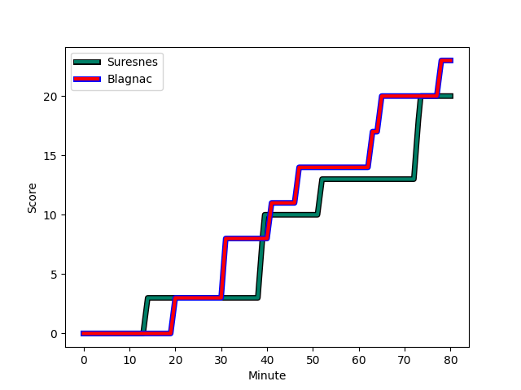
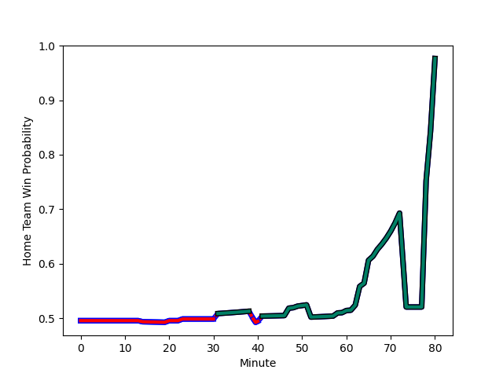

---  
layout: page  
title: Blagnac at Suresnes; 23-20  
date: 2022-12-10 18:00:00 18:00:00 -0500  
categories: match review  
---
# Blagnac (1394.38) at Suresnes (1375.19); 23-20

# Prediction: Suresnes by 1.1

Blagnac by 1.9 on a neutral field
## Scores over Time

## Win Probability over Time

# Pre-Match Prediction: Blagnac by 3.1

Blagnac by 6.1 on a neutral pitch

|   Away Minutes | Away Player                                                              |   Away elo |   Away Percentile |   Number |   Home Percentile |   Home elo | Home Player                                                                  |   Home Minutes |
|---------------:|:-------------------------------------------------------------------------|-----------:|------------------:|---------:|------------------:|-----------:|:-----------------------------------------------------------------------------|---------------:|
|             51 | [Alexis Decaux](..//playerfiles//AlexisDecaux_cleaned.md)                |      99.53 |                69 |        1 |                39 |      93.58 | [Lucas Dycke](..//playerfiles//LucasDycke_cleaned.md)                        |             80 |
|             60 | [Florian Bertrand](..//playerfiles//FlorianBertrand_cleaned.md)          |      95.22 |                48 |        2 |                16 |      87.42 | [Thomas Bordes](..//playerfiles//ThomasBordes_cleaned.md)                    |             52 |
|             40 | [Baptiste Collet](..//playerfiles//BaptisteCollet_cleaned.md)            |      97.63 |               nan |        3 |                93 |     113.79 | [Leandro Mario Assi](..//playerfiles//LeandroMarioAssi_cleaned.md)           |             80 |
|             80 | [Nikita Bekov](..//playerfiles//NikitaBekov_cleaned.md)                  |      99.75 |                68 |        4 |                 5 |      75.46 | [Christopher van Leeuwen](..//playerfiles//ChristophervanLeeuwen_cleaned.md) |             80 |
|             40 | [Lucas Tolofua](..//playerfiles//LucasTolofua_cleaned.md)                |      84.49 |                14 |        5 |                56 |      96.89 | [Wian Vosloo](..//playerfiles//WianVosloo_cleaned.md)                        |             23 |
|             80 | [Benjamin Collet](..//playerfiles//BenjaminCollet_cleaned.md)            |     109.8  |                87 |        6 |                27 |      89.38 | [Louis-Mathieu Jazeix](..//playerfiles//Louis-MathieuJazeix_cleaned.md)      |             64 |
|             49 | [Loïc Verdy](..//playerfiles//LoïcVerdy_cleaned.md)                      |      98.44 |                61 |        7 |                84 |     109.9  | [Bastien Berenguel](..//playerfiles//BastienBerenguel_cleaned.md)            |             80 |
|             80 | [Mathieu Vachon](..//playerfiles//MathieuVachon_cleaned.md)              |      95.56 |                46 |        8 |                99 |     139.46 | [Antonie Claassen](..//playerfiles//AntonieClaassen_cleaned.md)              |             80 |
|             80 | [Paul Ravier](..//playerfiles//PaulRavier_cleaned.md)                    |      96.93 |                54 |        9 |                45 |      94.8  | [Théo Bachiri](..//playerfiles//ThéoBachiri_cleaned.md)                      |             64 |
|             80 | [Ugo Seunes](..//playerfiles//UgoSeunes_cleaned.md)                      |      90.02 |                24 |       10 |                 7 |      82.72 | [Enzo Barbarit](..//playerfiles//EnzoBarbarit_cleaned.md)                    |             80 |
|             67 | [Benjamin Daurau Bedin](..//playerfiles//BenjaminDaurauBedin_cleaned.md) |      76.03 |                 3 |       11 |                 0 |      48.77 | [Ervin Muric](..//playerfiles//ErvinMuric_cleaned.md)                        |             80 |
|             80 | [Aurelien Labau](..//playerfiles//AurelienLabau_cleaned.md)              |      89.56 |                26 |       12 |                 4 |      75.62 | [Clément Amon](..//playerfiles//ClémentAmon_cleaned.md)                      |             52 |
|             58 | [Clément Vareilles](..//playerfiles//ClémentVareilles_cleaned.md)        |      90.42 |                29 |       13 |                30 |      90.76 | [Arthur Proult](..//playerfiles//ArthurProult_cleaned.md)                    |             80 |
|             62 | [Francois Tardieu](..//playerfiles//FrancoisTardieu_cleaned.md)          |      77.53 |                 4 |       14 |                27 |      89.29 | [Alexis Clément](..//playerfiles//AlexisClément_cleaned.md)                  |             80 |
|             80 | [Antoine Renaud](..//playerfiles//AntoineRenaud_cleaned.md)              |      76.59 |                 5 |       15 |                20 |      88.16 | [Gaëtan Robert](..//playerfiles//GaëtanRobert_cleaned.md)                    |             52 |
|             40 | [Fabien Lorenzon](..//playerfiles//FabienLorenzon_cleaned.md)            |      91.11 |                27 |       16 |                19 |      86.58 | [Anthony Bajart](..//playerfiles//AnthonyBajart_cleaned.md)                  |             28 |
|             40 | [Lilian Rousset](..//playerfiles//LilianRousset_cleaned.md)              |      96.59 |                55 |       17 |                18 |      88.06 | [Yakine Djebarri](..//playerfiles//YakineDjebarri_cleaned.md)                |             57 |
|             31 | [Mateo Ibanez](..//playerfiles//MateoIbanez_cleaned.md)                  |     100.69 |                68 |       18 |                21 |      89.34 | [Quentin Dauvergne](..//playerfiles//QuentinDauvergne_cleaned.md)            |             16 |
|             13 | [Simon Villemur](..//playerfiles//SimonVillemur_cleaned.md)              |      97.55 |                57 |       19 |                44 |      94.14 | [Petero Tuwai](..//playerfiles//PeteroTuwai_cleaned.md)                      |             28 |
|             18 | [Dorian Terrou](..//playerfiles//DorianTerrou_cleaned.md)                |     108.48 |                84 |       20 |                14 |      84.73 | [Thomas Baudy](..//playerfiles//ThomasBaudy_cleaned.md)                      |             28 |
|             29 | [Cesar Biscioni](..//playerfiles//CesarBiscioni_cleaned.md)              |      89.42 |                21 |       21 |                56 |      97.29 | [Théo David Nathan Tanda](..//playerfiles//ThéoDavidNathanTanda_cleaned.md)  |             16 |
|             20 | [Gabin Villerouge](..//playerfiles//GabinVillerouge_cleaned.md)          |      98.82 |                66 |       22 |               nan |     nan    | nan                                                                          |            nan |
|             22 | [Jean-Andre Vernetti](..//playerfiles//Jean-AndreVernetti_cleaned.md)    |     110.53 |                86 |       23 |               nan |     nan    | nan                                                                          |            nan |

