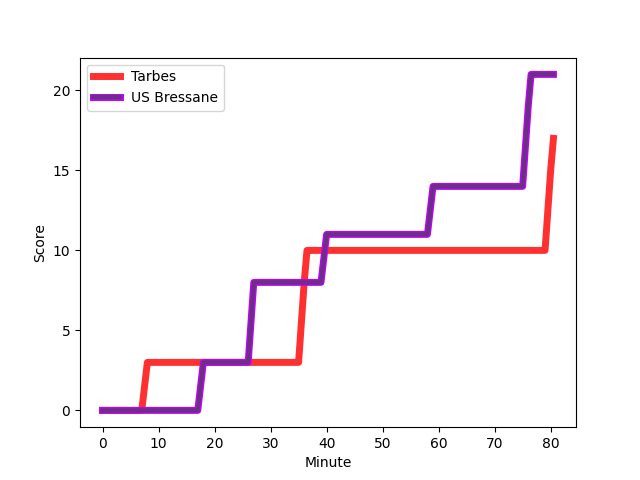
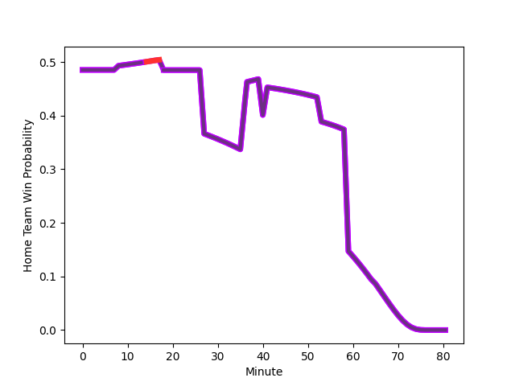

---  
layout: page  
title: US Bressane at Tarbes; 21-17  
date: 2022-12-10 19:00:00 18:00:00 -0500  
categories: match review  
---
# US Bressane (1423.51) at Tarbes (1397.73); 21-17

# Prediction: Tarbes by 0.4

US Bressane by 2.6 on a neutral field
## Scores over Time

## Win Probability over Time

# Pre-Match Prediction: US Bressane by 0.3

US Bressane by 2.7 on a neutral pitch

|   Away Minutes | Away Player                                                                       |   Away elo |   Away Percentile |   Number |   Home Percentile |   Home elo | Home Player                                                                      |   Home Minutes |
|---------------:|:----------------------------------------------------------------------------------|-----------:|------------------:|---------:|------------------:|-----------:|:---------------------------------------------------------------------------------|---------------:|
|             65 | [Vazha Kapanadze](..//playerfiles//VazhaKapanadze_cleaned.md)                     |      81.15 |                 5 |        1 |                52 |      96.44 | [Antoine Palisse](..//playerfiles//AntoinePalisse_cleaned.md)                    |             50 |
|             47 | [Sione Anga'aelangi](..//playerfiles//SioneAnga'aelangi_cleaned.md)               |     114.65 |                94 |        2 |                12 |      85.67 | [Florian Lamothe](..//playerfiles//FlorianLamothe_cleaned.md)                    |             50 |
|             41 | [Erich de Jager](..//playerfiles//ErichdeJager_cleaned.md)                        |     108.94 |                89 |        3 |                42 |      93.22 | [Mariano Ezequiel Filomeno](..//playerfiles//MarianoEzequielFilomeno_cleaned.md) |             50 |
|             80 | [Louis Bruinsma](..//playerfiles//LouisBruinsma_cleaned.md)                       |      94.39 |                46 |        4 |                68 |      99.89 | [Antoine Bousquet](..//playerfiles//AntoineBousquet_cleaned.md)                  |             27 |
|             65 | [Cyril Veyret](..//playerfiles//CyrilVeyret_cleaned.md)                           |     113.75 |                91 |        5 |                23 |      88.55 | [Jone Trevor Seuvou](..//playerfiles//JoneTrevorSeuvou_cleaned.md)               |             78 |
|             65 | [Thomas Déliance](..//playerfiles//ThomasDéliance_cleaned.md)                     |      97.95 |                58 |        6 |                92 |     113.62 | [Aurelien Ricart](..//playerfiles//AurelienRicart_cleaned.md)                    |             80 |
|             80 | [TJ Ioane](..//playerfiles//TJIoane_cleaned.md)                                   |      76.23 |                 4 |        7 |                41 |      93.62 | [Mattéo Coustalat](..//playerfiles//MattéoCoustalat_cleaned.md)                  |             78 |
|             80 | [Loic Baradel](..//playerfiles//LoicBaradel_cleaned.md)                           |      88.2  |                20 |        8 |                 6 |      78.09 | [Len Massyn](..//playerfiles//LenMassyn_cleaned.md)                              |             80 |
|             53 | [Jeremy Valencot](..//playerfiles//JeremyValencot_cleaned.md)                     |      91.01 |                28 |        9 |                95 |     118.15 | [Thomas Lhusero](..//playerfiles//ThomasLhusero_cleaned.md)                      |             80 |
|             80 | [Sebastian Poet](..//playerfiles//SebastianPoet_cleaned.md)                       |      94.56 |                43 |       10 |                 6 |      80.59 | [Anthony Fuertes](..//playerfiles//AnthonyFuertes_cleaned.md)                    |             80 |
|             80 | [Élie De Fleurian](..//playerfiles//ÉlieDeFleurian_cleaned.md)                    |      90.42 |                26 |       11 |                83 |     107.33 | [Jonathan Duffau](..//playerfiles//JonathanDuffau_cleaned.md)                    |             80 |
|             71 | [Maile Mamao](..//playerfiles//MaileMamao_cleaned.md)                             |      99.21 |                62 |       12 |                87 |     111.32 | [Alofa Alofa](..//playerfiles//AlofaAlofa_cleaned.md)                            |             59 |
|             80 | [Benjamin Doy](..//playerfiles//BenjaminDoy_cleaned.md)                           |      71.05 |                 2 |       13 |                70 |     102.05 | [Josaia Vakacegu](..//playerfiles//JosaiaVakacegu_cleaned.md)                    |             80 |
|             80 | [Audric Sanlaville](..//playerfiles//AudricSanlaville_cleaned.md)                 |     101.44 |                71 |       14 |                29 |      90.59 | [Théo Belair](..//playerfiles//ThéoBelair_cleaned.md)                            |             17 |
|             77 | [Pierre Berard](..//playerfiles//PierreBerard_cleaned.md)                         |     112.87 |                90 |       15 |                 1 |      70.5  | [Maxime Oltmann](..//playerfiles//MaximeOltmann_cleaned.md)                      |             80 |
|             15 | [Teo Bordenave](..//playerfiles//TeoBordenave_cleaned.md)                         |      92.55 |                36 |       16 |                26 |      90.03 | [Alexandre Combier](..//playerfiles//AlexandreCombier_cleaned.md)                |             30 |
|             33 | [Clement Jullien](..//playerfiles//ClementJullien_cleaned.md)                     |      87.46 |                18 |       17 |                11 |      84.68 | [Johan Mees Erasmus](..//playerfiles//JohanMeesErasmus_cleaned.md)               |             30 |
|             39 | [Zauri Tevdorashvili](..//playerfiles//ZauriTevdorashvili_cleaned.md)             |      86.58 |                14 |       18 |                18 |      88.19 | [Alexandre Duny](..//playerfiles//AlexandreDuny_cleaned.md)                      |             30 |
|             15 | [Marius Antonescu](..//playerfiles//MariusAntonescu_cleaned.md)                   |     100.12 |                70 |       19 |                 5 |      74.3  | [Paul Sajous](..//playerfiles//PaulSajous_cleaned.md)                            |             53 |
|             15 | [Wael May](..//playerfiles//WaelMay_cleaned.md)                                   |      99.48 |                66 |       20 |               nan |      94.23 | [Léo Estaque](..//playerfiles//LéoEstaque_cleaned.md)                            |              2 |
|             27 | [Nicolas Faure](..//playerfiles//NicolasFaure_cleaned.md)                         |     120.8  |                96 |       21 |                28 |      91.14 | [Florian Mansieux](..//playerfiles//FlorianMansieux_cleaned.md)                  |              2 |
|              9 | [Parataiso Silafai-Lea'ana](..//playerfiles//ParataisoSilafai-Lea'ana_cleaned.md) |     108.69 |                83 |       22 |                 1 |      72.17 | [Thomas Millet](..//playerfiles//ThomasMillet_cleaned.md)                        |             21 |
|              3 | [Christian Lacombe](..//playerfiles//ChristianLacombe_cleaned.md)                 |      81.54 |                 8 |       23 |                30 |      90.48 | [Thibaut Trotta](..//playerfiles//ThibautTrotta_cleaned.md)                      |             63 |

