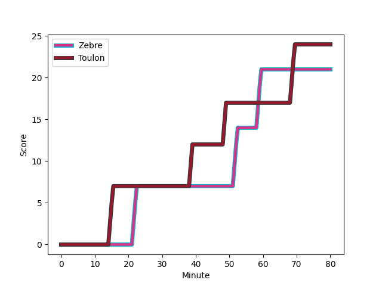
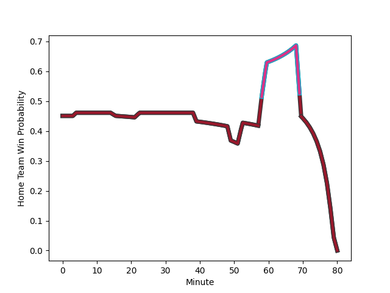

---  
layout: page  
title: Toulon at Zebre; 24-21  
date: 2022-12-10 21:00:00 18:00:00 -0500  
categories: match review  
---
# Toulon (1463.05) at Zebre (1377.5); 24-21

# Prediction: Toulon by 5.6

Toulon by 8.6 on a neutral field
## Scores over Time

## Win Probability over Time

# Pre-Match Prediction: Toulon by 4.7

Toulon by 7.7 on a neutral pitch

|   Away Minutes | Away Player                                                       |   Away elo |   Away Percentile |   Number |   Home Percentile |   Home elo | Home Player                                                            |   Home Minutes |
|---------------:|:------------------------------------------------------------------|-----------:|------------------:|---------:|------------------:|-----------:|:-----------------------------------------------------------------------|---------------:|
|             80 | [Bruce Devaux](..//playerfiles//BruceDevaux_cleaned.md)           |      87.02 |                17 |        1 |                21 |      89.82 | [Luca Rizzoli](..//playerfiles//LucaRizzoli_cleaned.md)                |             58 |
|             80 | [Teddy Baubigny](..//playerfiles//TeddyBaubigny_cleaned.md)       |      90.46 |                27 |        2 |                19 |      89.1  | [Luca Bigi](..//playerfiles//LucaBigi_cleaned.md)                      |             56 |
|              4 | [Emerick Setiano](..//playerfiles//EmerickSetiano_cleaned.md)     |     102.84 |                84 |        3 |                48 |      95.7  | [Matteo Nocera](..//playerfiles//MatteoNocera_cleaned.md)              |             80 |
|             50 | [Matthias Halagahu](..//playerfiles//MatthiasHalagahu_cleaned.md) |      93.29 |               nan |        4 |                43 |      93.92 | [David Sisi](..//playerfiles//DavidSisi_cleaned.md)                    |             49 |
|             50 | [Adrien Warion](..//playerfiles//AdrienWarion_cleaned.md)         |      82.6  |               nan |        5 |                12 |      83.31 | [Andrea Zambonin](..//playerfiles//AndreaZambonin_cleaned.md)          |             80 |
|             70 | [Jules Coulon](..//playerfiles//JulesCoulon_cleaned.md)           |      96.47 |                57 |        6 |                94 |     118.52 | [Taina Fox-Matamua](..//playerfiles//TainaFox-Matamua_cleaned.md)      |             80 |
|             80 | [Raphael Lakafia](..//playerfiles//RaphaelLakafia_cleaned.md)     |     106.35 |                82 |        7 |                 4 |      77.94 | [MJ Pelser](..//playerfiles//MJPelser_cleaned.md)                      |             80 |
|             80 | [Sergio Parisse](..//playerfiles//SergioParisse_cleaned.md)       |     108.97 |                85 |        8 |                70 |     101.95 | [Matt Kvesic](..//playerfiles//MattKvesic_cleaned.md)                  |             62 |
|             61 | [Jules Danglot](..//playerfiles//JulesDanglot_cleaned.md)         |      94.29 |                43 |        9 |               nan |      81.86 | [Gonzalo Jesus Garcia](..//playerfiles//GonzaloJesusGarcia_cleaned.md) |             78 |
|             80 | [Dan Biggar](..//playerfiles//DanBiggar_cleaned.md)               |     141.7  |                99 |       10 |                14 |      86.41 | [Tiff Eden](..//playerfiles//TiffEden_cleaned.md)                      |             80 |
|             80 | [Gaël Dréan](..//playerfiles//GaëlDréan_cleaned.md)               |      87.89 |                18 |       11 |                 0 |      60.34 | [Latu Latunipulu](..//playerfiles//LatuLatunipulu_cleaned.md)          |             80 |
|             67 | [Mathieu Smaili](..//playerfiles//MathieuSmaili_cleaned.md)       |      93.81 |                40 |       12 |                89 |     112.37 | [Enrico Lucchin](..//playerfiles//EnricoLucchin_cleaned.md)            |             80 |
|             80 | [Jérémy Sinzelle](..//playerfiles//JérémySinzelle_cleaned.md)     |      82.87 |                 9 |       13 |                21 |      88.02 | [Erich Cronje](..//playerfiles//ErichCronje_cleaned.md)                |             80 |
|             80 | [Gervais Cordin](..//playerfiles//GervaisCordin_cleaned.md)       |      97.21 |                59 |       14 |               nan |     114.84 | [Jacobus van Wyk](..//playerfiles//JacobusvanWyk_cleaned.md)           |             61 |
|             80 | [Aymeric Luc](..//playerfiles//AymericLuc_cleaned.md)             |     100.87 |                69 |       15 |                44 |      94.31 | [Lorenzo Pani](..//playerfiles//LorenzoPani_cleaned.md)                |             80 |
|             76 | [Kieran Brookes](..//playerfiles//KieranBrookes_cleaned.md)       |      86.08 |                11 |       16 |                36 |      93.29 | [Juan Manuel Pitinari](..//playerfiles//JuanManuelPitinari_cleaned.md) |             22 |
|             30 | [Sitaleki Timani](..//playerfiles//SitalekiTimani_cleaned.md)     |     116.56 |                93 |       17 |                 0 |      71.04 | [Marco Manfredi](..//playerfiles//MarcoManfredi_cleaned.md)            |             24 |
|             30 | [Mathieu Tanguy](..//playerfiles//MathieuTanguy_cleaned.md)       |      91.46 |                35 |       18 |               nan |      95.41 | [Riccardo Genovese](..//playerfiles//RiccardoGenovese_cleaned.md)      |             31 |
|             10 | [Mattéo Le Corvec](..//playerfiles//MattéoLeCorvec_cleaned.md)    |      96.6  |                52 |       19 |                35 |      92.13 | [Guido Volpi](..//playerfiles//GuidoVolpi_cleaned.md)                  |             18 |
|             19 | [Benoit Paillaugue](..//playerfiles//BenoitPaillaugue_cleaned.md) |     107.05 |                85 |       20 |               nan |      94.15 | [Ratko Jelic](..//playerfiles//RatkoJelic_cleaned.md)                  |              2 |
|             13 | [Maëlan Rabut](..//playerfiles//MaëlanRabut_cleaned.md)           |      76.75 |                 4 |       21 |                42 |      93.25 | [Franco Smith](..//playerfiles//FrancoSmith_cleaned.md)                |             19 |

