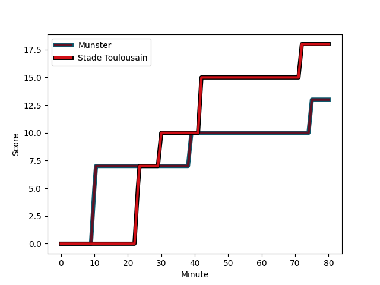
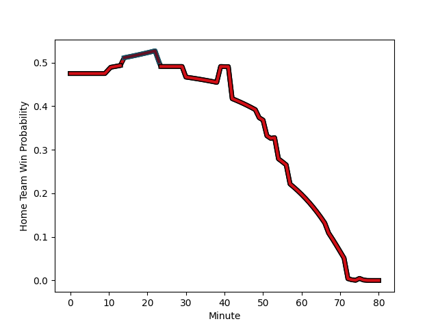

---  
layout: page  
title: Stade Toulousain at Munster; 18-13  
date: 2022-12-11 16:15:00 18:00:00 -0500  
categories: match review  
---
# Stade Toulousain (1609.06) at Munster (1556.47); 18-13

# Prediction: Stade Toulousain by 2.3

Stade Toulousain by 5.3 on a neutral field
## Scores over Time

## Win Probability over Time

# Pre-Match Prediction: Stade Toulousain by 3.8

Stade Toulousain by 6.8 on a neutral pitch

|   Away Minutes | Away Player                                                       |   Away elo |   Away Percentile |   Number |   Home Percentile |   Home elo | Home Player                                                   |   Home Minutes |
|---------------:|:------------------------------------------------------------------|-----------:|------------------:|---------:|------------------:|-----------:|:--------------------------------------------------------------|---------------:|
|             54 | [Rodrigue Neti](..//playerfiles//RodrigueNeti_cleaned.md)         |      82.81 |                 7 |        1 |                93 |     112.61 | [Jeremy Loughman](..//playerfiles//JeremyLoughman_cleaned.md) |             57 |
|             54 | [Julien Marchand](..//playerfiles//JulienMarchand_cleaned.md)     |     105.91 |                82 |        2 |                77 |     103.48 | [Niall Scannell](..//playerfiles//NiallScannell_cleaned.md)   |             57 |
|             57 | [Dorian Aldegheri](..//playerfiles//DorianAldegheri_cleaned.md)   |     113.64 |                93 |        3 |                76 |     102.53 | [John Ryan](..//playerfiles//JohnRyan_cleaned.md)             |             80 |
|             72 | [Richie Arnold](..//playerfiles//RichieArnold_cleaned.md)         |      83.02 |                12 |        4 |                77 |     103.46 | [Jean Kleyn](..//playerfiles//JeanKleyn_cleaned.md)           |             53 |
|             80 | [Emmanuel Meafou](..//playerfiles//EmmanuelMeafou_cleaned.md)     |      89.55 |                25 |        5 |                93 |     115.69 | [Tadhg Beirne](..//playerfiles//TadhgBeirne_cleaned.md)       |             80 |
|             80 | [Anthony Jelonch](..//playerfiles//AnthonyJelonch_cleaned.md)     |     106.33 |                81 |        6 |                12 |      85.41 | [Peter O'Mahony](..//playerfiles//PeterO'Mahony_cleaned.md)   |             80 |
|             49 | [Alban Placines](..//playerfiles//AlbanPlacines_cleaned.md)       |     109.32 |                87 |        7 |                52 |      96.22 | [John Hodnett](..//playerfiles//JohnHodnett_cleaned.md)       |             80 |
|             14 | [Alexandre Roumat](..//playerfiles//AlexandreRoumat_cleaned.md)   |     126.38 |                95 |        8 |                88 |     112.96 | [Gavin Coombes](..//playerfiles//GavinCoombes_cleaned.md)     |             80 |
|             80 | [Antoine Dupont](..//playerfiles//AntoineDupont_cleaned.md)       |     124.22 |                97 |        9 |                63 |      98.7  | [Craig Casey](..//playerfiles//CraigCasey_cleaned.md)         |             51 |
|             80 | [Romain Ntamack](..//playerfiles//RomainNtamack_cleaned.md)       |     108.93 |                83 |       10 |                51 |      96.79 | [Joey Carbery](..//playerfiles//JoeyCarbery_cleaned.md)       |             80 |
|             80 | [Matthis Lebel](..//playerfiles//MatthisLebel_cleaned.md)         |     127.63 |                98 |       11 |                97 |     123.21 | [Shane Daly](..//playerfiles//ShaneDaly_cleaned.md)           |             67 |
|             80 | [Pita Ahki](..//playerfiles//PitaAhki_cleaned.md)                 |      97.12 |                53 |       12 |                93 |     117.13 | [Rory Scannell](..//playerfiles//RoryScannell_cleaned.md)     |             51 |
|             80 | [Dimitri Delibes](..//playerfiles//DimitriDelibes_cleaned.md)     |      98.61 |                60 |       13 |                48 |      95.95 | [Antoine Frisch](..//playerfiles//AntoineFrisch_cleaned.md)   |             80 |
|             40 | [Ange Capuozzo](..//playerfiles//AngeCapuozzo_cleaned.md)         |     107.43 |                84 |       14 |                93 |     116.5  | [Calvin Nash](..//playerfiles//CalvinNash_cleaned.md)         |             80 |
|             80 | [Thomas Ramos](..//playerfiles//ThomasRamos_cleaned.md)           |     120.72 |                94 |       15 |                42 |      93.38 | [Mike Haley](..//playerfiles//MikeHaley_cleaned.md)           |             80 |
|             66 | [Thibaud Flament](..//playerfiles//ThibaudFlament_cleaned.md)     |     114.58 |                91 |       16 |                25 |      92.41 | [Paddy Patterson](..//playerfiles//PaddyPatterson_cleaned.md) |             29 |
|             40 | [Lucas Tauzin](..//playerfiles//LucasTauzin_cleaned.md)           |      99.89 |                68 |       17 |                49 |      96.76 | [Jack Crowley](..//playerfiles//JackCrowley_cleaned.md)       |             29 |
|             31 | [Jack Willis](..//playerfiles//JackWillis_cleaned.md)             |     117.25 |                94 |       18 |                82 |     106.44 | [Jack O'Donoghue](..//playerfiles//JackO'Donoghue_cleaned.md) |             27 |
|             26 | [Peato Mauvaka](..//playerfiles//PeatoMauvaka_cleaned.md)         |     113.12 |                93 |       19 |                88 |     110.56 | [Diarmuid Barron](..//playerfiles//DiarmuidBarron_cleaned.md) |             23 |
|             26 | [Cyril Baille](..//playerfiles//CyrilBaille_cleaned.md)           |     111.32 |                91 |       20 |                14 |      87.2  | [Josh Wycherley](..//playerfiles//JoshWycherley_cleaned.md)   |             23 |
|             23 | [Charlie Faumuina](..//playerfiles//CharlieFaumuina_cleaned.md)   |     130.9  |                99 |       21 |                70 |     100.96 | [Keith Earls](..//playerfiles//KeithEarls_cleaned.md)         |             13 |
|              8 | [Yannick Youyoutte](..//playerfiles//YannickYouyoutte_cleaned.md) |      96.12 |                51 |       22 |               nan |     nan    | nan                                                           |            nan |

