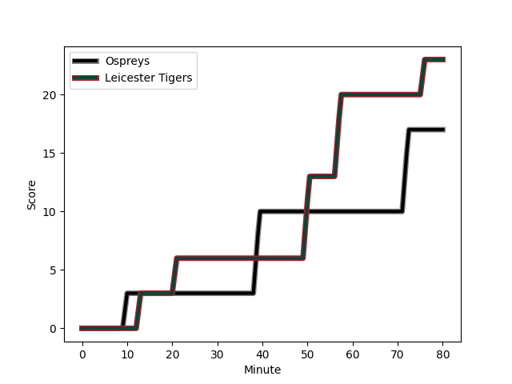
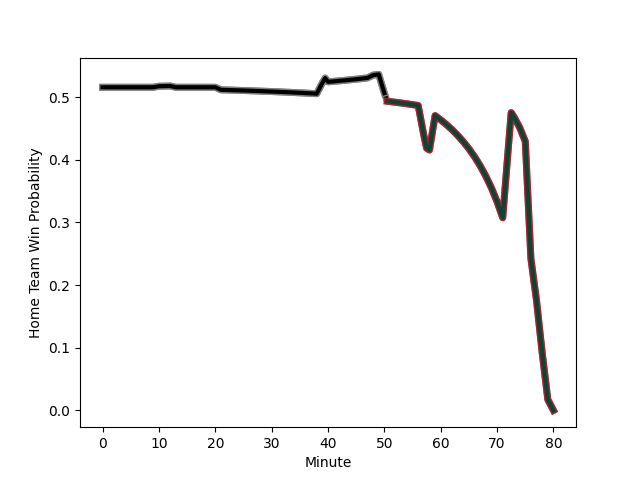

---  
layout: page  
title: Leicester Tigers at Ospreys; 23-17  
date: 2022-12-11 18:30:00 18:00:00 -0500  
categories: match review  
---
# Leicester Tigers (1472.12) at Ospreys (1499.38); 23-17

# Prediction: Ospreys by 5.7

Ospreys by 2.7 on a neutral field
## Scores over Time

## Win Probability over Time

# Pre-Match Prediction: Ospreys by 6.8

Ospreys by 3.8 on a neutral pitch

|   Away Minutes | Away Player                                                             |   Away elo |   Away Percentile |   Number |   Home Percentile |   Home elo | Home Player                                                                 |   Home Minutes |
|---------------:|:------------------------------------------------------------------------|-----------:|------------------:|---------:|------------------:|-----------:|:----------------------------------------------------------------------------|---------------:|
|             68 | [James Whitcombe](..//playerfiles//JamesWhitcombe_cleaned.md)           |      88.79 |                20 |        1 |                32 |      89.67 | [Nicky Smith](..//playerfiles//NickySmith_cleaned.md)                       |             59 |
|             74 | [Charlie Clare](..//playerfiles//CharlieClare_cleaned.md)               |      85.72 |                13 |        2 |                93 |     113.72 | [Scott Baldwin](..//playerfiles//ScottBaldwin_cleaned.md)                   |             59 |
|             48 | [Joe Heyes](..//playerfiles//JoeHeyes_cleaned.md)                       |     101.57 |                74 |        3 |                97 |     118.34 | [Tomas Francis](..//playerfiles//TomasFrancis_cleaned.md)                   |             59 |
|             55 | [Harry Wells](..//playerfiles//HarryWells_cleaned.md)                   |     119.44 |                95 |        4 |                39 |      92.81 | [Adam Beard](..//playerfiles//AdamBeard_cleaned.md)                         |             80 |
|             80 | [Ollie Chessum](..//playerfiles//OllieChessum_cleaned.md)               |     104.7  |                80 |        5 |                85 |     108.53 | [Alun Wyn Jones](..//playerfiles//AlunWynJones_cleaned.md)                  |             80 |
|             80 | [George Martin](..//playerfiles//GeorgeMartin_cleaned.md)               |      99.8  |                69 |        6 |                50 |      95.54 | [Jac Morgan](..//playerfiles//JacMorgan_cleaned.md)                         |             59 |
|             80 | [Hanro Liebenberg](..//playerfiles//HanroLiebenberg_cleaned.md)         |     112.49 |                90 |        7 |                93 |     115.05 | [Justin Tipuric](..//playerfiles//JustinTipuric_cleaned.md)                 |             80 |
|             68 | [Olly Cracknell](..//playerfiles//OllyCracknell_cleaned.md)             |      83.21 |                11 |        8 |                15 |      85.64 | [Morgan Morris](..//playerfiles//MorganMorris_cleaned.md)                   |             80 |
|             59 | [Jack van Poortvliet](..//playerfiles//JackvanPoortvliet_cleaned.md)    |     105.6  |                80 |        9 |                69 |     100.26 | [Rhys Webb](..//playerfiles//RhysWebb_cleaned.md)                           |             74 |
|             80 | [Charlie Atkinson](..//playerfiles//CharlieAtkinson_cleaned.md)         |      98.14 |                59 |       10 |                70 |     101.73 | [Jack Walsh](..//playerfiles//JackWalsh_cleaned.md)                         |             74 |
|             80 | [Harry Simmons](..//playerfiles//HarrySimmons_cleaned.md)               |      97.89 |                59 |       11 |                 4 |      77.09 | [Keelan Giles](..//playerfiles//KeelanGiles_cleaned.md)                     |             80 |
|             70 | [Dan Kelly](..//playerfiles//DanKelly_cleaned.md)                       |     116.17 |                92 |       12 |                22 |      88.26 | [Joe Hawkins](..//playerfiles//JoeHawkins_cleaned.md)                       |             80 |
|             80 | [Guy Porter](..//playerfiles//GuyPorter_cleaned.md)                     |      91.89 |                35 |       13 |                96 |     125.15 | [George North](..//playerfiles//GeorgeNorth_cleaned.md)                     |             40 |
|             80 | [Harry Potter](..//playerfiles//HarryPotter_cleaned.md)                 |      91.69 |                37 |       14 |                90 |     113.06 | [Alex Cuthbert](..//playerfiles//AlexCuthbert_cleaned.md)                   |             80 |
|             80 | [Anthony Watson](..//playerfiles//AnthonyWatson_cleaned.md)             |      87.61 |                17 |       15 |                67 |     100.38 | [Max Nagy](..//playerfiles//MaxNagy_cleaned.md)                             |             80 |
|             32 | [Will Hurd](..//playerfiles//WillHurd_cleaned.md)                       |      93.04 |                36 |       16 |                82 |     108.49 | [Michael Collins](..//playerfiles//MichaelCollins_cleaned.md)               |             40 |
|             25 | [Eli Snyman](..//playerfiles//EliSnyman_cleaned.md)                     |      85.09 |                18 |       17 |                60 |      98.22 | [Rhys Davies](..//playerfiles//RhysDavies_cleaned.md)                       |             21 |
|             21 | [Richard Wigglesworth](..//playerfiles//RichardWigglesworth_cleaned.md) |     113.37 |                91 |       18 |                 4 |      80.5  | [Gareth Thomas](..//playerfiles//GarethThomas_cleaned.md)                   |             21 |
|             12 | [Nephi Leatigaga](..//playerfiles//NephiLeatigaga_cleaned.md)           |      87.54 |                19 |       19 |                22 |      89.34 | [Sam Parry](..//playerfiles//SamParry_cleaned.md)                           |             21 |
|             12 | [Sean Jansen](..//playerfiles//SeanJansen_cleaned.md)                   |      94.19 |                42 |       20 |                53 |      97.25 | [Reuben Morgan-Williams](..//playerfiles//ReubenMorgan-Williams_cleaned.md) |              6 |
|             10 | [Matt Scott](..//playerfiles//MattScott_cleaned.md)                     |      97.43 |                55 |       21 |                92 |     118.4  | [Owen Williams](..//playerfiles//OwenWilliams_cleaned.md)                   |              6 |
|              6 | [Gabriel Oghre](..//playerfiles//GabrielOghre_cleaned.md)               |      91.14 |                30 |       22 |                 3 |      78.57 | [Tom Botha](..//playerfiles//TomBotha_cleaned.md)                           |             21 |

