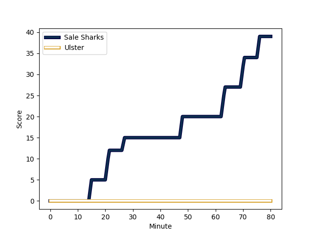
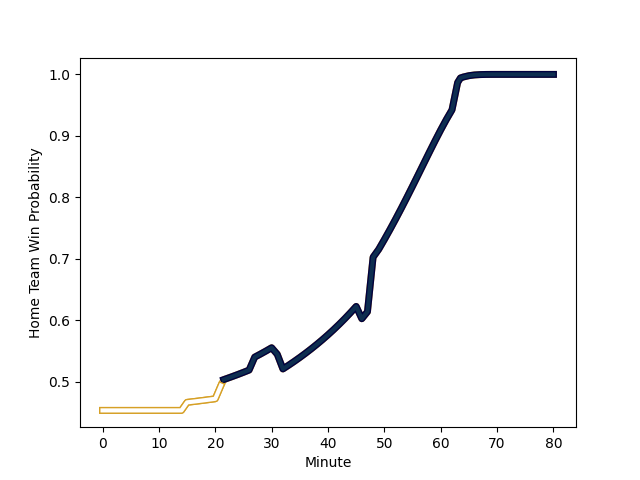

---  
layout: page  
title: Ulster at Sale Sharks; 0-39  
date: 2022-12-11 14:00:00 18:00:00 -0500  
categories: match review  
---
# Ulster (1636.15) at Sale Sharks (1549.41); 0-39

# Prediction: Ulster by 5.7

Ulster by 8.7 on a neutral field
## Scores over Time

## Win Probability over Time

# Pre-Match Prediction: Ulster by 1.7

Ulster by 4.7 on a neutral pitch

|   Away Minutes | Away Player                                                     |   Away elo |   Away Percentile |   Number |   Home Percentile |   Home elo | Home Player                                                         |   Home Minutes |
|---------------:|:----------------------------------------------------------------|-----------:|------------------:|---------:|------------------:|-----------:|:--------------------------------------------------------------------|---------------:|
|             49 | [Andrew Warwick](..//playerfiles//AndrewWarwick_cleaned.md)     |     105.84 |                85 |        1 |                90 |     109.22 | [Bevan Rodd](..//playerfiles//BevanRodd_cleaned.md)                 |             58 |
|             49 | [Rob Herring](..//playerfiles//RobHerring_cleaned.md)           |     101.69 |                72 |        2 |                98 |     121.14 | [Akker van der Merwe](..//playerfiles//AkkervanderMerwe_cleaned.md) |             58 |
|             49 | [Tom O'Toole](..//playerfiles//TomO'Toole_cleaned.md)           |      95.58 |                43 |        3 |                11 |      85.77 | [Nic Schonert](..//playerfiles//NicSchonert_cleaned.md)             |             59 |
|             74 | [Alan O'Connor](..//playerfiles//AlanO'Connor_cleaned.md)       |     122.13 |                96 |        4 |                47 |      94.61 | [Cobus Wiese](..//playerfiles//CobusWiese_cleaned.md)               |             80 |
|             80 | [Kieran Treadwell](..//playerfiles//KieranTreadwell_cleaned.md) |     102.8  |                76 |        5 |                20 |      87.47 | [Jonny Hill](..//playerfiles//JonnyHill_cleaned.md)                 |             64 |
|             46 | [Matthew Rea](..//playerfiles//MatthewRea_cleaned.md)           |      87.75 |                18 |        6 |                97 |     127.78 | [Jean-Luc du Preez](..//playerfiles//Jean-LucduPreez_cleaned.md)    |             59 |
|             80 | [Nick Timoney](..//playerfiles//NickTimoney_cleaned.md)         |     108.1  |                83 |        7 |                75 |     102.99 | [Tom Curry](..//playerfiles//TomCurry_cleaned.md)                   |             80 |
|             80 | [Duane Vermeulen](..//playerfiles//DuaneVermeulen_cleaned.md)   |     135.92 |                99 |        8 |                94 |     122.56 | [Daniel du Preez](..//playerfiles//DanielduPreez_cleaned.md)        |             80 |
|             59 | [Nathan Doak](..//playerfiles//NathanDoak_cleaned.md)           |      89.96 |                19 |        9 |                17 |      88.13 | [Gus Warr](..//playerfiles//GusWarr_cleaned.md)                     |             63 |
|             80 | [Billy Burns](..//playerfiles//BillyBurns_cleaned.md)           |     121.11 |                93 |       10 |                10 |      83.98 | [Robert du Preez](..//playerfiles//RobertduPreez_cleaned.md)        |             80 |
|             59 | [Jacob Stockdale](..//playerfiles//JacobStockdale_cleaned.md)   |     105.76 |                81 |       11 |                94 |     118.08 | [Tom O'Flaherty](..//playerfiles//TomO'Flaherty_cleaned.md)         |             63 |
|             80 | [Stuart McCloskey](..//playerfiles//StuartMcCloskey_cleaned.md) |     129.12 |                98 |       12 |                91 |     115.16 | [Manu Tuilagi](..//playerfiles//ManuTuilagi_cleaned.md)             |             32 |
|             31 | [James Hume](..//playerfiles//JamesHume_cleaned.md)             |     102.45 |                71 |       13 |                93 |     118.15 | [Sam James](..//playerfiles//SamJames_cleaned.md)                   |             80 |
|             80 | [Ethan McIlroy](..//playerfiles//EthanMcIlroy_cleaned.md)       |     106.78 |                83 |       14 |                90 |     112.34 | [Arron Reed](..//playerfiles//ArronReed_cleaned.md)                 |             80 |
|             80 | [Michael Lowry](..//playerfiles//MichaelLowry_cleaned.md)       |     100.11 |                66 |       15 |                 6 |      78.57 | [Joe Carpenter](..//playerfiles//JoeCarpenter_cleaned.md)           |             80 |
|             49 | [Stewart Moore](..//playerfiles//StewartMoore_cleaned.md)       |     115.08 |                91 |       16 |                40 |      93.42 | [Tom Curtis](..//playerfiles//TomCurtis_cleaned.md)                 |             48 |
|             34 | [Marcus Rea](..//playerfiles//MarcusRea_cleaned.md)             |     120.8  |                95 |       17 |                91 |     108.33 | [Simon McIntyre](..//playerfiles//SimonMcIntyre_cleaned.md)         |             22 |
|             31 | [Tom Stewart](..//playerfiles//TomStewart_cleaned.md)           |      94.77 |                49 |       18 |                65 |      98.11 | [Tommy Taylor](..//playerfiles//TommyTaylor_cleaned.md)             |             22 |
|             31 | [Marty Moore](..//playerfiles//MartyMoore_cleaned.md)           |     105.06 |                83 |       19 |               nan |      93.87 | [Joe Jones](..//playerfiles//JoeJones_cleaned.md)                   |             21 |
|             31 | [Eric O'Sullivan](..//playerfiles//EricO'Sullivan_cleaned.md)   |     105.5  |                84 |       20 |                46 |      94.89 | [Jono Ross](..//playerfiles//JonoRoss_cleaned.md)                   |             21 |
|             21 | [Ben Moxham](..//playerfiles//BenMoxham_cleaned.md)             |      96.05 |                51 |       21 |               nan |     107.41 | [Joe Simpson](..//playerfiles//JoeSimpson_cleaned.md)               |             17 |
|             21 | [David Shanahan](..//playerfiles//DavidShanahan_cleaned.md)     |      96.78 |               nan |       22 |                98 |     127.01 | [Byron McGuigan](..//playerfiles//ByronMcGuigan_cleaned.md)         |             17 |
|              6 | [Sam Carter](..//playerfiles//SamCarter_cleaned.md)             |     111    |                89 |       23 |                81 |     105.38 | [Josh Beaumont](..//playerfiles//JoshBeaumont_cleaned.md)           |             16 |

