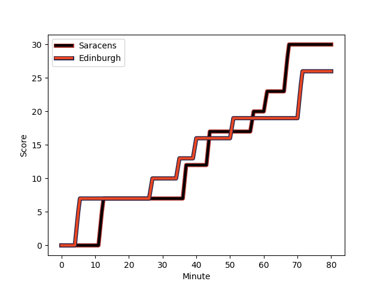
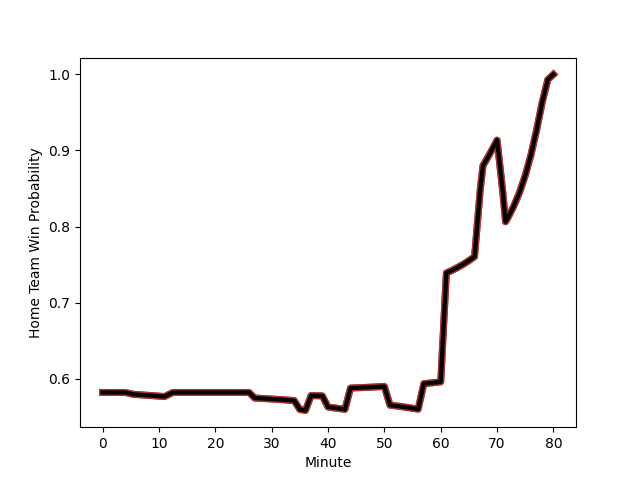

---  
layout: page  
title: Edinburgh at Saracens; 26-30  
date: 2022-12-11 16:15:00 18:00:00 -0500  
categories: match review  
---
# Edinburgh (1564.02) at Saracens (1739.17); 26-30

# Prediction: Saracens by 20.5

Saracens by 17.5 on a neutral field
## Scores over Time

## Win Probability over Time

# Pre-Match Prediction: Saracens by 26.0

Saracens by 23.0 on a neutral pitch

|   Away Minutes | Away Player                                                         |   Away elo |   Away Percentile |   Number |   Home Percentile |   Home elo | Home Player                                                         |   Home Minutes |
|---------------:|:--------------------------------------------------------------------|-----------:|------------------:|---------:|------------------:|-----------:|:--------------------------------------------------------------------|---------------:|
|             61 | [Pierre Schoeman](..//playerfiles//PierreSchoeman_cleaned.md)       |      92.42 |                33 |        1 |                99 |     135.35 | [Mako Vunipola](..//playerfiles//MakoVunipola_cleaned.md)           |             66 |
|             80 | [Stuart McInally](..//playerfiles//StuartMcInally_cleaned.md)       |      74.42 |                 1 |        2 |                99 |     138.44 | [Jamie George](..//playerfiles//JamieGeorge_cleaned.md)             |             64 |
|             32 | [Luan de Bruin](..//playerfiles//LuandeBruin_cleaned.md)            |      93.89 |                41 |        3 |                54 |      96.86 | [Marco Riccioni](..//playerfiles//MarcoRiccioni_cleaned.md)         |             72 |
|             46 | [Jamie Hodgson](..//playerfiles//JamieHodgson_cleaned.md)           |      96.16 |                53 |        4 |                93 |     115.87 | [Maro Itoje](..//playerfiles//MaroItoje_cleaned.md)                 |             80 |
|             80 | [Grant Gilchrist](..//playerfiles//GrantGilchrist_cleaned.md)       |     110.19 |                88 |        5 |                93 |     117.56 | [Hugh Tizard](..//playerfiles//HughTizard_cleaned.md)               |             64 |
|             80 | [Jamie Ritchie](..//playerfiles//JamieRitchie_cleaned.md)           |     131.72 |                98 |        6 |                47 |      94.95 | [Theodore McFarland](..//playerfiles//TheodoreMcFarland_cleaned.md) |             53 |
|             72 | [Luke Crosbie](..//playerfiles//LukeCrosbie_cleaned.md)             |     109.23 |                86 |        7 |                95 |     118.97 | [Ben Earl](..//playerfiles//BenEarl_cleaned.md)                     |             80 |
|             80 | [Viliame Mata](..//playerfiles//ViliameMata_cleaned.md)             |      93.46 |                40 |        8 |                97 |     129.01 | [Billy Vunipola](..//playerfiles//BillyVunipola_cleaned.md)         |             72 |
|             61 | [Ben Vellacott](..//playerfiles//BenVellacott_cleaned.md)           |     100.22 |                68 |        9 |                58 |      98.07 | [Ivan van Zyl](..//playerfiles//IvanvanZyl_cleaned.md)              |             72 |
|             80 | [Blair Kinghorn](..//playerfiles//BlairKinghorn_cleaned.md)         |     134.02 |                98 |       10 |                99 |     136.12 | [Owen Farrell](..//playerfiles//OwenFarrell_cleaned.md)             |             80 |
|             80 | [Duhan van der Merwe](..//playerfiles//DuhanvanderMerwe_cleaned.md) |      94.43 |                45 |       11 |                98 |     126.94 | [Sean Maitland](..//playerfiles//SeanMaitland_cleaned.md)           |             80 |
|             80 | [James Lang](..//playerfiles//JamesLang_cleaned.md)                 |     106.54 |                81 |       12 |                99 |     131.72 | [Nick Tompkins](..//playerfiles//NickTompkins_cleaned.md)           |             80 |
|             36 | [Mark Bennett](..//playerfiles//MarkBennett_cleaned.md)             |     110.08 |                85 |       13 |                55 |      97.56 | [Alex Lozowski](..//playerfiles//AlexLozowski_cleaned.md)           |             61 |
|             80 | [Wes Goosen](..//playerfiles//WesGoosen_cleaned.md)                 |     109.82 |                83 |       14 |                78 |     103.75 | [Alex Lewington](..//playerfiles//AlexLewington_cleaned.md)         |             80 |
|             80 | [Emiliano Boffelli](..//playerfiles//EmilianoBoffelli_cleaned.md)   |      86.52 |                14 |       15 |                84 |     108.97 | [Elliot Daly](..//playerfiles//ElliotDaly_cleaned.md)               |             80 |
|             48 | [WP Nel](..//playerfiles//WPNel_cleaned.md)                         |     127.18 |                99 |       16 |                56 |      98.22 | [Andy Christie](..//playerfiles//AndyChristie_cleaned.md)           |             27 |
|             44 | [Damien Hoyland](..//playerfiles//DamienHoyland_cleaned.md)         |     103.63 |                78 |       17 |                96 |     125.18 | [Alex Goode](..//playerfiles//AlexGoode_cleaned.md)                 |             19 |
|             34 | [Marshall Sykes](..//playerfiles//MarshallSykes_cleaned.md)         |      97.58 |                66 |       18 |                11 |      82.23 | [Callum Hunter-Hill](..//playerfiles//CallumHunter-Hill_cleaned.md) |             16 |
|             19 | [Charlie Shiel](..//playerfiles//CharlieShiel_cleaned.md)           |     108.72 |                85 |       19 |                90 |     109.28 | [Tom Woolstencroft](..//playerfiles//TomWoolstencroft_cleaned.md)   |             16 |
|             19 | [Boan Venter](..//playerfiles//BoanVenter_cleaned.md)               |     104.3  |                86 |       20 |                38 |      93.39 | [Eroni Mawi](..//playerfiles//EroniMawi_cleaned.md)                 |             14 |
|              8 | [Ben Muncaster](..//playerfiles//BenMuncaster_cleaned.md)           |      99.51 |                60 |       21 |                99 |     136.29 | [Jackson Wray](..//playerfiles//JacksonWray_cleaned.md)             |              8 |
|            nan | nan                                                                 |     nan    |               nan |       22 |                55 |     100.12 | [Alec Clarey](..//playerfiles//AlecClarey_cleaned.md)               |              8 |
|            nan | nan                                                                 |     nan    |               nan |       23 |                75 |     103.63 | [Aled Davies](..//playerfiles//AledDavies_cleaned.md)               |              8 |

