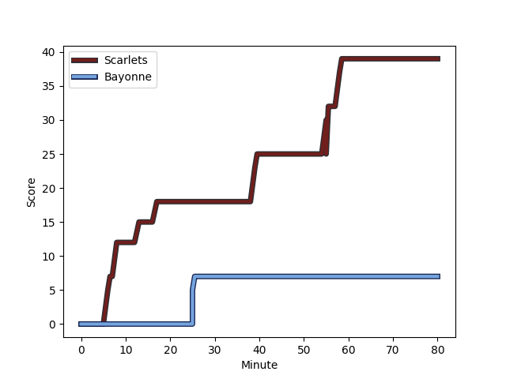
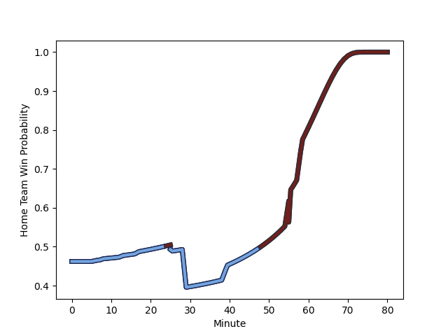

---  
layout: page  
title: Bayonne at Scarlets; 7-39  
date: 2022-12-11 16:15:00 18:00:00 -0500  
categories: match review  
---
# Bayonne (1517.5) at Scarlets (1431.01); 7-39

# Prediction: Bayonne by 5.6

Bayonne by 8.6 on a neutral field
## Scores over Time

## Win Probability over Time

# Pre-Match Prediction: Bayonne by 5.1

Bayonne by 8.1 on a neutral pitch

|   Away Minutes | Away Player                                                                  |   Away elo |   Away Percentile |   Number |   Home Percentile |   Home elo | Home Player                                                     |   Home Minutes |
|---------------:|:-----------------------------------------------------------------------------|-----------:|------------------:|---------:|------------------:|-----------:|:----------------------------------------------------------------|---------------:|
|             66 | [Pieter Scholtz](..//playerfiles//PieterScholtz_cleaned.md)                  |      91.94 |                25 |        1 |               nan |      93.32 | [Kemsley Mathias](..//playerfiles//KemsleyMathias_cleaned.md)   |             68 |
|             62 | [Thomas Acquier](..//playerfiles//ThomasAcquier_cleaned.md)                  |     119.63 |                96 |        2 |                89 |     108.07 | [Ryan Elias](..//playerfiles//RyanElias_cleaned.md)             |             55 |
|             62 | [Chris Talakai](..//playerfiles//ChrisTalakai_cleaned.md)                    |      93.98 |                39 |        3 |                84 |     106.12 | [WillGriff John](..//playerfiles//WillGriffJohn_cleaned.md)     |             57 |
|             80 | [Manuel Leindekar](..//playerfiles//ManuelLeindekar_cleaned.md)              |     110.1  |                88 |        4 |                67 |     100.95 | [Sione Kalamafoni](..//playerfiles//SioneKalamafoni_cleaned.md) |             80 |
|             80 | [Kote Mikautadze](..//playerfiles//KoteMikautadze_cleaned.md)                |      79.01 |                 7 |        5 |                79 |     104.14 | [Sam Lousi](..//playerfiles//SamLousi_cleaned.md)               |             55 |
|             18 | [OJ Noa](..//playerfiles//OJNoa_cleaned.md)                                  |      94.44 |                42 |        6 |                55 |      96.89 | [Aaron Shingler](..//playerfiles//AaronShingler_cleaned.md)     |             55 |
|             80 | [Geoff Cridge](..//playerfiles//GeoffCridge_cleaned.md)                      |     100.81 |                64 |        7 |                24 |      88.28 | [Josh MacLeod](..//playerfiles//JoshMacLeod_cleaned.md)         |             80 |
|             41 | [Afaesetiti Amosa](..//playerfiles//AfaesetitiAmosa_cleaned.md)              |     106.23 |                81 |        8 |                35 |      92.2  | [Blade Thomson](..//playerfiles//BladeThomson_cleaned.md)       |             80 |
|             62 | [Michael Ruru](..//playerfiles//MichaelRuru_cleaned.md)                      |     116.14 |                92 |        9 |                 6 |      76.41 | [Dane Blacker](..//playerfiles//DaneBlacker_cleaned.md)         |             55 |
|             62 | [Thomas Dolhagaray](..//playerfiles//ThomasDolhagaray_cleaned.md)            |     108.55 |                82 |       10 |                 2 |      72.55 | [Sam Costelow](..//playerfiles//SamCostelow_cleaned.md)         |             69 |
|             34 | [Jean-Teiva Jacquelin](..//playerfiles//Jean-TeivaJacquelin_cleaned.md)      |      85.3  |                12 |       11 |                18 |      87.8  | [Ryan Conbeer](..//playerfiles//RyanConbeer_cleaned.md)         |             80 |
|             80 | [Guillaume Martocq](..//playerfiles//GuillaumeMartocq_cleaned.md)            |     103.03 |                73 |       12 |                90 |     114.64 | [Jonathan Davies](..//playerfiles//JonathanDavies_cleaned.md)   |             80 |
|             80 | [Peyo Muscarditz](..//playerfiles//PeyoMuscarditz_cleaned.md)                |     119.99 |                95 |       13 |                29 |      89.97 | [Ioan Nicholas](..//playerfiles//IoanNicholas_cleaned.md)       |             80 |
|             80 | [Bastien Pourailly](..//playerfiles//BastienPourailly_cleaned.md)            |      84.65 |                11 |       14 |                12 |      84.81 | [Tom Rogers](..//playerfiles//TomRogers_cleaned.md)             |             29 |
|             80 | [Martin Bogado](..//playerfiles//MartinBogado_cleaned.md)                    |     102.11 |                69 |       15 |                85 |     111    | [Johnny McNicholl](..//playerfiles//JohnnyMcNicholl_cleaned.md) |             80 |
|             18 | [Facundo Bosch](..//playerfiles//FacundoBosch_cleaned.md)                    |     106.37 |                84 |       16 |                20 |      87.74 | [Steffan Thomas](..//playerfiles//SteffanThomas_cleaned.md)     |             12 |
|             18 | [Pascal Cotet](..//playerfiles//PascalCotet_cleaned.md)                      |      92.39 |                33 |       17 |                46 |      94.16 | [Ken Owens](..//playerfiles//KenOwens_cleaned.md)               |             25 |
|             62 | [Uzair Cassiem](..//playerfiles//UzairCassiem_cleaned.md)                    |     105.4  |                78 |       18 |                15 |      87.36 | [Harri O'Connor](..//playerfiles//HarriO'Connor_cleaned.md)     |             23 |
|             14 | [Swan Cormenier](..//playerfiles//SwanCormenier_cleaned.md)                  |     104.3  |                80 |       19 |                 1 |      67.44 | [Tom Price](..//playerfiles//TomPrice_cleaned.md)               |             25 |
|             39 | [Baptiste Heguy](..//playerfiles//BaptisteHeguy_cleaned.md)                  |     105.47 |                79 |       20 |                36 |      92.12 | [Tomas Lezana](..//playerfiles//TomasLezana_cleaned.md)         |             25 |
|             18 | [Guillaume Rouet Piffard](..//playerfiles//GuillaumeRouetPiffard_cleaned.md) |      96.53 |                53 |       21 |                89 |     107.89 | [Kieran Hardy](..//playerfiles//KieranHardy_cleaned.md)         |             25 |
|             18 | [Jason Robertson](..//playerfiles//JasonRobertson_cleaned.md)                |      80.54 |                 7 |       22 |                99 |     134.39 | [Rhys Patchell](..//playerfiles//RhysPatchell_cleaned.md)       |             11 |
|             46 | [Tom Spring](..//playerfiles//TomSpring_cleaned.md)                          |      94.62 |               nan |       23 |                62 |      99.02 | [Steffan Evans](..//playerfiles//SteffanEvans_cleaned.md)       |             51 |

