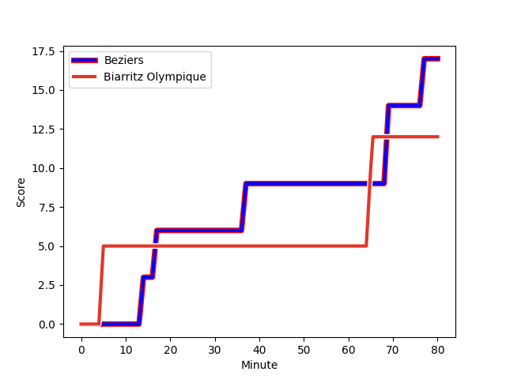
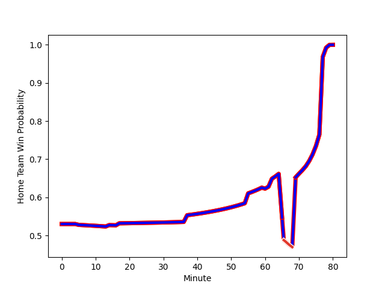

---  
layout: page  
title: Biarritz Olympique at Beziers; 12-17  
date: 2022-12-15 21:00:00 18:00:00 -0500  
categories: match review  
---
# Biarritz Olympique (1494.84) at Beziers (1547.03); 12-17

# Prediction: Beziers by 8.2

Beziers by 5.2 on a neutral field
## Scores over Time

## Win Probability over Time

# Pre-Match Prediction: Beziers by 10.2

Beziers by 7.2 on a neutral pitch

|   Away Minutes | Away Player                                                           |   Away elo |   Away Percentile |   Number |   Home Percentile |   Home elo | Home Player                                                                          |   Home Minutes |
|---------------:|:----------------------------------------------------------------------|-----------:|------------------:|---------:|------------------:|-----------:|:-------------------------------------------------------------------------------------|---------------:|
|             80 | [Baptiste Erdocio](..//playerfiles//BaptisteErdocio_cleaned.md)       |      97.95 |                59 |        1 |                77 |     102.85 | [Francisco Fernandes Moreira](..//playerfiles//FranciscoFernandesMoreira_cleaned.md) |             55 |
|             72 | [Thomas Sauveterre](..//playerfiles//ThomasSauveterre_cleaned.md)     |      93.94 |                44 |        2 |                53 |      95.7  | [Clément Esteriola](..//playerfiles//ClémentEsteriola_cleaned.md)                    |             70 |
|             65 | [Quentin Samaran](..//playerfiles//QuentinSamaran_cleaned.md)         |      95.42 |                47 |        3 |                84 |     105.43 | [Jon Zabala Arrieta](..//playerfiles//JonZabalaArrieta_cleaned.md)                   |             55 |
|             41 | [Johan Aliouat](..//playerfiles//JohanAliouat_cleaned.md)             |     101.12 |                71 |        4 |                81 |     104.6  | [Clément Bitz](..//playerfiles//ClémentBitz_cleaned.md)                              |             80 |
|             80 | [Adrian Motoc](..//playerfiles//AdrianMotoc_cleaned.md)               |     101.6  |                73 |        5 |                64 |      99.14 | [John Madigan](..//playerfiles//JohnMadigan_cleaned.md)                              |             65 |
|             80 | [Johnny Dyer](..//playerfiles//JohnnyDyer_cleaned.md)                 |      85.09 |                14 |        6 |                 4 |      77.68 | [Jean-Baptiste Barrère](..//playerfiles//Jean-BaptisteBarrère_cleaned.md)            |             62 |
|             80 | [Temo Matiu](..//playerfiles//TemoMatiu_cleaned.md)                   |      99.26 |                63 |        7 |                73 |     102.22 | [Gillian Benoy](..//playerfiles//GillianBenoy_cleaned.md)                            |             80 |
|             80 | [Tornike Jalagonia](..//playerfiles//TornikeJalagonia_cleaned.md)     |     107.39 |                81 |        8 |                74 |     103.7  | [Sias Koen](..//playerfiles//SiasKoen_cleaned.md)                                    |             80 |
|             51 | [Barnabe Couilloud](..//playerfiles//BarnabeCouilloud_cleaned.md)     |      81.53 |                 6 |        9 |                79 |     104.33 | [Jean Victor Goillot](..//playerfiles//JeanVictorGoillot_cleaned.md)                 |              2 |
|             51 | [Ilian Perraux](..//playerfiles//IlianPerraux_cleaned.md)             |     100.16 |                65 |       10 |                65 |     100.44 | [Romain Uruty](..//playerfiles//RomainUruty_cleaned.md)                              |             60 |
|             40 | [Steeve Barry](..//playerfiles//SteeveBarry_cleaned.md)               |     102.09 |                74 |       11 |                82 |     106.2  | [Gabin Lorre](..//playerfiles//GabinLorre_cleaned.md)                                |             80 |
|             80 | [Auguste Cadot](..//playerfiles//AugusteCadot_cleaned.md)             |     101.74 |                69 |       12 |                80 |     104.97 | [Paul Recor](..//playerfiles//PaulRecor_cleaned.md)                                  |             68 |
|             80 | [Joe Jonas](..//playerfiles//JoeJonas_cleaned.md)                     |     100.58 |                66 |       13 |                99 |     134.99 | [Maxime Espeut](..//playerfiles//MaximeEspeut_cleaned.md)                            |             80 |
|             65 | [Henry Speight](..//playerfiles//HenrySpeight_cleaned.md)             |     129.21 |                98 |       14 |                97 |     123.27 | [Nicolas Plazy](..//playerfiles//NicolasPlazy_cleaned.md)                            |             80 |
|             80 | [Romain Lonca](..//playerfiles//RomainLonca_cleaned.md)               |     113.32 |                90 |       15 |                24 |      88.55 | [Charly Malie](..//playerfiles//CharlyMalie_cleaned.md)                              |             80 |
|             40 | [Francois Vergnaud](..//playerfiles//FrancoisVergnaud_cleaned.md)     |      87.56 |                20 |       16 |                25 |      91.63 | [Mitch Short](..//playerfiles//MitchShort_cleaned.md)                                |             78 |
|             39 | [Nafi Ma'afu](..//playerfiles//NafiMa'afu_cleaned.md)                 |      93.43 |               nan |       17 |                87 |     107.16 | [Giorgi Akhaladze](..//playerfiles//GiorgiAkhaladze_cleaned.md)                      |             25 |
|             29 | [Kerman Aurrekoetxea](..//playerfiles//KermanAurrekoetxea_cleaned.md) |      85.2  |                12 |       18 |                92 |     111.33 | [Jamie Hagan](..//playerfiles//JamieHagan_cleaned.md)                                |             25 |
|             29 | [Baptiste Germain](..//playerfiles//BaptisteGermain_cleaned.md)       |      96.71 |                50 |       19 |                22 |      89.64 | [Victor Dreuille](..//playerfiles//VictorDreuille_cleaned.md)                        |             20 |
|             15 | [Yohann Artru](..//playerfiles//YohannArtru_cleaned.md)               |     101.5  |                72 |       20 |                69 |     101.42 | [William van Bost](..//playerfiles//WilliamvanBost_cleaned.md)                       |             18 |
|             15 | [Luka Tchelidze](..//playerfiles//LukaTchelidze_cleaned.md)           |      97.74 |                52 |       21 |                22 |      91.71 | [Yassine Maamry](..//playerfiles//YassineMaamry_cleaned.md)                          |             15 |
|              8 | [Leo Carella](..//playerfiles//LeoCarella_cleaned.md)                 |      95.33 |               nan |       22 |                85 |     108.4  | [Watisoni Votu](..//playerfiles//WatisoniVotu_cleaned.md)                            |             12 |
|            nan | nan                                                                   |     nan    |               nan |       23 |                49 |      98.71 | [Yvann Lalevee](..//playerfiles//YvannLalevee_cleaned.md)                            |             10 |

