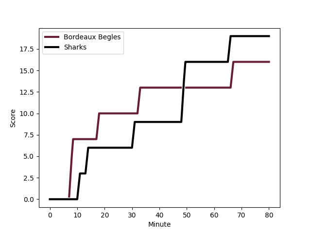
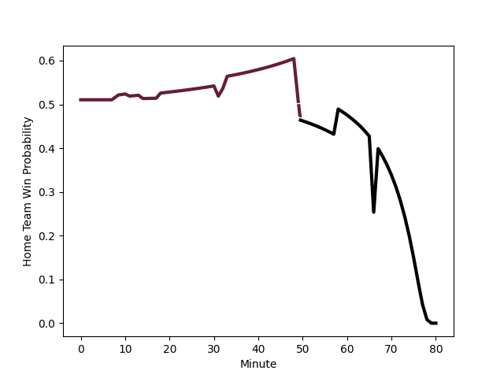

---  
layout: page  
title: Sharks at Bordeaux Begles; 19-16  
date: 2022-12-16 21:00:00 18:00:00 -0500  
categories: match review  
---
# Sharks (1585.16) at Bordeaux Begles (1589.36); 19-16

# Prediction: Bordeaux Begles by 3.4

Bordeaux Begles by 0.4 on a neutral field
## Scores over Time

## Win Probability over Time

# Pre-Match Prediction: Bordeaux Begles by 7.4

Bordeaux Begles by 4.4 on a neutral pitch

|   Away Minutes | Away Player                                                              |   Away elo |   Away Percentile |   Number |   Home Percentile |   Home elo | Home Player                                                           |   Home Minutes |
|---------------:|:-------------------------------------------------------------------------|-----------:|------------------:|---------:|------------------:|-----------:|:----------------------------------------------------------------------|---------------:|
|             32 | [Ntuthuko Mchunu](..//playerfiles//NtuthukoMchunu_cleaned.md)            |      99.9  |                69 |        1 |                87 |     107.11 | [Lekso Kaulashvili](..//playerfiles//LeksoKaulashvili_cleaned.md)     |             58 |
|             67 | [Bongi Mbonambi](..//playerfiles//BongiMbonambi_cleaned.md)              |     121.28 |                98 |        2 |                91 |     109.87 | [Clement Maynadier](..//playerfiles//ClementMaynadier_cleaned.md)     |             65 |
|             77 | [Thomas du Toit](..//playerfiles//ThomasduToit_cleaned.md)               |     104.46 |                80 |        3 |                97 |     120.61 | [Vadim Cobilas](..//playerfiles//VadimCobilas_cleaned.md)             |             67 |
|             80 | [Eben Etzebeth](..//playerfiles//EbenEtzebeth_cleaned.md)                |     129.09 |                98 |        4 |                96 |     121.64 | [Cyril Cazeaux](..//playerfiles//CyrilCazeaux_cleaned.md)             |             80 |
|             65 | [Gerbrandt Grobler](..//playerfiles//GerbrandtGrobler_cleaned.md)        |      78.02 |                 6 |        5 |                94 |     118.83 | [Jandré Marais](..//playerfiles//JandréMarais_cleaned.md)             |             61 |
|             80 | [Siya Kolisi](..//playerfiles//SiyaKolisi_cleaned.md)                    |     111.72 |                90 |        6 |                71 |     101.43 | [Renato Giammarioli](..//playerfiles//RenatoGiammarioli_cleaned.md)   |             80 |
|             80 | [Vincent Tshituka](..//playerfiles//VincentTshituka_cleaned.md)          |     102.29 |                73 |        7 |                53 |      97.43 | [Antoine Miquel](..//playerfiles//AntoineMiquel_cleaned.md)           |             80 |
|             58 | [Phepsi Buthelezi](..//playerfiles//PhepsiButhelezi_cleaned.md)          |     104.48 |                77 |        8 |                27 |      90.25 | [Caleb Timu](..//playerfiles//CalebTimu_cleaned.md)                   |             61 |
|             58 | [Jaden Hendrikse](..//playerfiles//JadenHendrikse_cleaned.md)            |     103.72 |                79 |        9 |                 8 |      83.63 | [Jules Gimbert](..//playerfiles//JulesGimbert_cleaned.md)             |             61 |
|             80 | [Curwin Bosch](..//playerfiles//CurwinBosch_cleaned.md)                  |     106.59 |                78 |       10 |                95 |     124.99 | [Zack Holmes](..//playerfiles//ZackHolmes_cleaned.md)                 |             80 |
|             80 | [Makazole Mapimpi](..//playerfiles//MakazoleMapimpi_cleaned.md)          |     120.8  |                96 |       11 |                94 |     118.35 | [Madosh Tambwe](..//playerfiles//MadoshTambwe_cleaned.md)             |             80 |
|             80 | [Ben Tapuai](..//playerfiles//BenTapuai_cleaned.md)                      |     103.9  |                75 |       12 |                 6 |      79.39 | [Federico Mori](..//playerfiles//FedericoMori_cleaned.md)             |             58 |
|             80 | [Francois Venter](..//playerfiles//FrancoisVenter_cleaned.md)            |     109.89 |                85 |       13 |                64 |     100.06 | [Jean-Baptiste Dubie](..//playerfiles//Jean-BaptisteDubie_cleaned.md) |             80 |
|             80 | [Werner Kok](..//playerfiles//WernerKok_cleaned.md)                      |      97.59 |                57 |       14 |                54 |      97.06 | [Geoffrey Cros](..//playerfiles//GeoffreyCros_cleaned.md)             |             72 |
|             80 | [Boeta Chamberlain](..//playerfiles//BoetaChamberlain_cleaned.md)        |      99.3  |                64 |       15 |                87 |     110.81 | [Nans Ducuing](..//playerfiles//NansDucuing_cleaned.md)               |             80 |
|             13 | [Daniel Viljoen Jooste](..//playerfiles//DanielViljoenJooste_cleaned.md) |      89.92 |                42 |       16 |                55 |      96.65 | [Christopher Vaotoa](..//playerfiles//ChristopherVaotoa_cleaned.md)   |             13 |
|             48 | [Dian Bleuler](..//playerfiles//DianBleuler_cleaned.md)                  |      87.8  |                15 |       17 |                32 |      91.32 | [Maxime Lamothe](..//playerfiles//MaximeLamothe_cleaned.md)           |             15 |
|              3 | [Hanro Jacobs](..//playerfiles//HanroJacobs_cleaned.md)                  |      98.34 |               nan |       18 |                99 |     129.92 | [Ben Tameifuna](..//playerfiles//BenTameifuna_cleaned.md)             |             22 |
|             15 | [Hyron Andrews](..//playerfiles//HyronAndrews_cleaned.md)                |      95.18 |                55 |       19 |                63 |      98.78 | [Alban Roussel](..//playerfiles//AlbanRoussel_cleaned.md)             |             19 |
|             22 | [Sikhumbuzo Notshe](..//playerfiles//SikhumbuzoNotshe_cleaned.md)        |     110.26 |                88 |       20 |                44 |      94.97 | [Tom Willis](..//playerfiles//TomWillis_cleaned.md)                   |             19 |
|             22 | [Grant Williams](..//playerfiles//GrantWilliams_cleaned.md)              |     103.47 |                80 |       21 |                80 |     104.79 | [Santiago Cordero](..//playerfiles//SantiagoCordero_cleaned.md)       |             19 |
|            nan | nan                                                                      |     nan    |               nan |       22 |                26 |      90.21 | [Mateo Garcia](..//playerfiles//MateoGarcia_cleaned.md)               |              8 |
|            nan | nan                                                                      |     nan    |               nan |       23 |                84 |     109.52 | [Remi Lamerat](..//playerfiles//RemiLamerat_cleaned.md)               |             22 |

