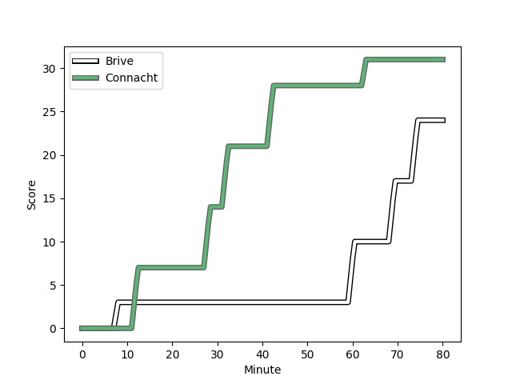
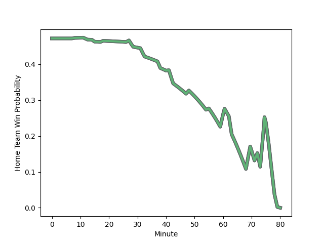

---  
layout: page  
title: Connacht at Brive; 31-24  
date: 2022-12-16 21:00:00 18:00:00 -0500  
categories: match review  
---
# Connacht (1508.46) at Brive (1433.57); 31-24

# Prediction: Connacht by 4.5

Connacht by 7.5 on a neutral field
## Scores over Time

## Win Probability over Time

# Pre-Match Prediction: Connacht by 7.2

Connacht by 10.2 on a neutral pitch

|   Away Minutes | Away Player                                                                   |   Away elo |   Away Percentile |   Number |   Home Percentile |   Home elo | Home Player                                                       |   Home Minutes |
|---------------:|:------------------------------------------------------------------------------|-----------:|------------------:|---------:|------------------:|-----------:|:------------------------------------------------------------------|---------------:|
|             48 | [Peter Dooley](..//playerfiles//PeterDooley_cleaned.md)                       |     123.68 |                98 |        1 |                21 |      88.98 | [Daniel Brennan](..//playerfiles//DanielBrennan_cleaned.md)       |             27 |
|             72 | [Shane Delahunt](..//playerfiles//ShaneDelahunt_cleaned.md)                   |     114.75 |                94 |        2 |                84 |     102.93 | [Florian Dufour](..//playerfiles//FlorianDufour_cleaned.md)       |             15 |
|             48 | [Sam Illo](..//playerfiles//SamIllo_cleaned.md)                               |      93.83 |               nan |        3 |                66 |      99.52 | [Tietie Tuimauga](..//playerfiles//TietieTuimauga_cleaned.md)     |             80 |
|             80 | [Darragh Murray](..//playerfiles//DarraghMurray_cleaned.md)                   |      94.25 |               nan |        4 |                22 |      88.05 | [Renger Van Eerten](..//playerfiles//RengerVanEerten_cleaned.md)  |             80 |
|             42 | [Gavin Thornbury](..//playerfiles//GavinThornbury_cleaned.md)                 |     104.11 |                76 |        5 |                66 |      98.78 | [Tevita Ratuva](..//playerfiles//TevitaRatuva_cleaned.md)         |             48 |
|             80 | [Oisin Dowling](..//playerfiles//OisinDowling_cleaned.md)                     |      93.12 |                40 |        6 |                46 |      94.35 | [Retief Marais](..//playerfiles//RetiefMarais_cleaned.md)         |             80 |
|             80 | [Shamus Hurley-Langton](..//playerfiles//ShamusHurley-Langton_cleaned.md)     |      95.85 |                52 |        7 |                94 |     116.98 | [Said Hireche](..//playerfiles//SaidHireche_cleaned.md)           |             55 |
|             18 | [Paul Boyle](..//playerfiles//PaulBoyle_cleaned.md)                           |     105.55 |                78 |        8 |                65 |     101.29 | [Abraham Papali'i](..//playerfiles//AbrahamPapali'i_cleaned.md)   |             80 |
|             41 | [Kieran Marmion](..//playerfiles//KieranMarmion_cleaned.md)                   |     112.78 |                90 |        9 |                18 |      86.16 | [Paul Abadie](..//playerfiles//PaulAbadie_cleaned.md)             |             55 |
|             80 | [David Hawkshaw](..//playerfiles//DavidHawkshaw_cleaned.md)                   |     103.18 |                72 |       10 |                96 |     125.61 | [Nicolas Sanchez](..//playerfiles//NicolasSanchez_cleaned.md)     |             38 |
|             80 | [Diarmuid Kilgallen](..//playerfiles//DiarmuidKilgallen_cleaned.md)           |      95.13 |                47 |       11 |                 3 |      74.61 | [Wesley Douglas](..//playerfiles//WesleyDouglas_cleaned.md)       |             80 |
|             80 | [Tom Daly](..//playerfiles//TomDaly_cleaned.md)                               |      85.87 |                16 |       12 |                14 |      84.67 | [Sammy Arnold](..//playerfiles//SammyArnold_cleaned.md)           |             80 |
|             75 | [Bundee Aki](..//playerfiles//BundeeAki_cleaned.md)                           |     127.79 |                97 |       13 |                82 |     107.98 | [Nico Lee](..//playerfiles//NicoLee_cleaned.md)                   |             80 |
|             48 | [Adam Byrne](..//playerfiles//AdamByrne_cleaned.md)                           |     112.14 |                89 |       14 |               nan |      95    | [Kevin Fabien](..//playerfiles//KevinFabien_cleaned.md)           |             80 |
|             80 | [Conor Fitzgerald](..//playerfiles//ConorFitzgerald_cleaned.md)               |      84.46 |                12 |       15 |                45 |      94.61 | [Seta Tuicuvu](..//playerfiles//SetaTuicuvu_cleaned.md)           |             55 |
|             38 | [Niall Murray](..//playerfiles//NiallMurray_cleaned.md)                       |     104.7  |                80 |       16 |                38 |      92.4  | [Vano Karkadze](..//playerfiles//VanoKarkadze_cleaned.md)         |             65 |
|             32 | [Jordan Duggan](..//playerfiles//JordanDuggan_cleaned.md)                     |      92.49 |                36 |       17 |                63 |      98.84 | [Nathan Fraissenon](..//playerfiles//NathanFraissenon_cleaned.md) |             53 |
|             32 | [Dominic Robertson-McCoy](..//playerfiles//DominicRobertson-McCoy_cleaned.md) |      96.6  |               nan |       18 |                22 |      88.97 | [Matthieu Voisin](..//playerfiles//MatthieuVoisin_cleaned.md)     |             25 |
|              8 | [Dave Heffernan](..//playerfiles//DaveHeffernan_cleaned.md)                   |      96.37 |                55 |       19 |                16 |      85.66 | [Julien Delannoy](..//playerfiles//JulienDelannoy_cleaned.md)     |             32 |
|             39 | [Colm Reilly](..//playerfiles//ColmReilly_cleaned.md)                         |     100.11 |                62 |       20 |                12 |      85.26 | [Enzo Sanga](..//playerfiles//EnzoSanga_cleaned.md)               |             25 |
|             62 | [Ciaran Booth](..//playerfiles//CiaranBooth_cleaned.md)                       |      96.37 |               nan |       21 |                36 |      92.78 | [Tom Raffy](..//playerfiles//TomRaffy_cleaned.md)                 |             42 |
|              5 | [Oran McNulty](..//playerfiles//OranMcNulty_cleaned.md)                       |     100.84 |                68 |       22 |                94 |     118.85 | [Thomas Laranjeira](..//playerfiles//ThomasLaranjeira_cleaned.md) |             25 |
|             32 | [Byron Ralston](..//playerfiles//ByronRalston_cleaned.md)                     |      86.81 |                15 |       23 |               nan |     nan    | nan                                                               |            nan |

