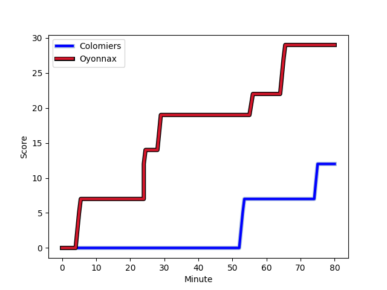
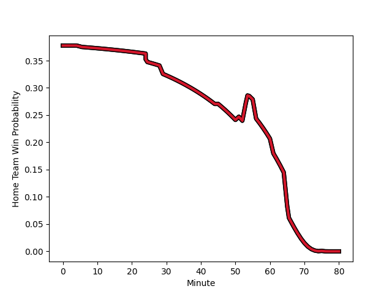

---  
layout: page  
title: Oyonnax at Colomiers; 29-12  
date: 2022-12-16 21:00:00 18:00:00 -0500  
categories: match review  
---
# Oyonnax (1615.91) at Colomiers (1400.15); 29-12

# Prediction: Oyonnax by 18.6

Oyonnax by 21.6 on a neutral field
## Scores over Time

## Win Probability over Time

# Pre-Match Prediction: Oyonnax by 19.3

Oyonnax by 22.3 on a neutral pitch

|   Away Minutes | Away Player                                                       |   Away elo |   Away Percentile |   Number |   Home Percentile |   Home elo | Home Player                                                               |   Home Minutes |
|---------------:|:------------------------------------------------------------------|-----------:|------------------:|---------:|------------------:|-----------:|:--------------------------------------------------------------------------|---------------:|
|             45 | [Tommy Raynaud](..//playerfiles//TommyRaynaud_cleaned.md)         |      90.23 |                30 |        1 |                 1 |      72.72 | [Thomas Dubois](..//playerfiles//ThomasDubois_cleaned.md)                 |             51 |
|             61 | [Benjamin Geledan](..//playerfiles//BenjaminGeledan_cleaned.md)   |     102.88 |                76 |        2 |                20 |      88.65 | [Andrew Ready](..//playerfiles//AndrewReady_cleaned.md)                   |             51 |
|             74 | [Thomas Laclayat](..//playerfiles//ThomasLaclayat_cleaned.md)     |     103.03 |                77 |        3 |                85 |     106.69 | [Marco Fepulea'i](..//playerfiles//MarcoFepulea'i_cleaned.md)             |             51 |
|             80 | [Phoenix Battye](..//playerfiles//PhoenixBattye_cleaned.md)       |     143.19 |                99 |        4 |                 0 |      59.54 | [Anthony Coletta](..//playerfiles//AnthonyColetta_cleaned.md)             |             80 |
|             54 | [Hugo Fabregue](..//playerfiles//HugoFabregue_cleaned.md)         |     110.91 |                89 |        5 |                70 |     100.6  | [Jean Thomas](..//playerfiles//JeanThomas_cleaned.md)                     |             54 |
|             60 | [Wandrille Picault](..//playerfiles//WandrillePicault_cleaned.md) |      93.66 |                42 |        6 |                30 |      91.13 | [Pierre-Samuel Pacheco](..//playerfiles//Pierre-SamuelPacheco_cleaned.md) |             61 |
|             80 | [Loïc Credoz](..//playerfiles//LoïcCredoz_cleaned.md)             |      89.98 |                25 |        7 |                20 |      88.33 | [Waël Ponpon](..//playerfiles//WaëlPonpon_cleaned.md)                     |             80 |
|             45 | [Rory Grice](..//playerfiles//RoryGrice_cleaned.md)               |     134.21 |                98 |        8 |                60 |      99.68 | [Aldric Lescure](..//playerfiles//AldricLescure_cleaned.md)               |             80 |
|             67 | [Charlie Cassang](..//playerfiles//CharlieCassang_cleaned.md)     |     113.42 |                91 |        9 |                77 |     104.54 | [Ugo Seguela](..//playerfiles//UgoSeguela_cleaned.md)                     |             54 |
|             80 | [Jules Soulan](..//playerfiles//JulesSoulan_cleaned.md)           |     110.72 |                88 |       10 |                 6 |      84.04 | [Maxime Javaux](..//playerfiles//MaximeJavaux_cleaned.md)                 |             70 |
|             80 | [Enzo Reybier](..//playerfiles//EnzoReybier_cleaned.md)           |     103.66 |                78 |       11 |                14 |      86.51 | [Valentin Saurs](..//playerfiles//ValentinSaurs_cleaned.md)               |             80 |
|             80 | [Gaby Lovobalavu](..//playerfiles//GabyLovobalavu_cleaned.md)     |      79.69 |                 6 |       12 |                87 |     112.54 | [Johan Deysel (Jnr)](..//playerfiles//JohanDeysel(Jnr)_cleaned.md)        |             80 |
|             80 | [Theo Millet](..//playerfiles//TheoMillet_cleaned.md)             |     117    |                93 |       13 |                77 |     104.98 | [Fabien Perrin](..//playerfiles//FabienPerrin_cleaned.md)                 |             80 |
|             54 | [Joe Ravouvou](..//playerfiles//JoeRavouvou_cleaned.md)           |     108.63 |                85 |       14 |                 2 |      74.64 | [Victor Moro](..//playerfiles//VictorMoro_cleaned.md)                     |             61 |
|             80 | [Darren Sweetnam](..//playerfiles//DarrenSweetnam_cleaned.md)     |     112.7  |                89 |       15 |                45 |      93.82 | [Max Auriac](..//playerfiles//MaxAuriac_cleaned.md)                       |             80 |
|             35 | [Thibault Berthaud](..//playerfiles//ThibaultBerthaud_cleaned.md) |      91.36 |                29 |       16 |                92 |     111.75 | [Guillaume Tartas](..//playerfiles//GuillaumeTartas_cleaned.md)           |             29 |
|             35 | [Kevin Lebreton](..//playerfiles//KevinLebreton_cleaned.md)       |     110.89 |                88 |       17 |                96 |     117.25 | [Beka Sheklashvili](..//playerfiles//BekaSheklashvili_cleaned.md)         |             29 |
|             26 | [Tom Murday](..//playerfiles//TomMurday_cleaned.md)               |     145.08 |                99 |       18 |                93 |     112.77 | [Hika Elliot](..//playerfiles//HikaElliot_cleaned.md)                     |             29 |
|             26 | [Justin Bouraux](..//playerfiles//JustinBouraux_cleaned.md)       |     102.09 |                70 |       19 |                68 |      99.98 | [Alexandre Ricard](..//playerfiles//AlexandreRicard_cleaned.md)           |             26 |
|             20 | [Filimo Taofifenua](..//playerfiles//FilimoTaofifenua_cleaned.md) |     131.07 |                98 |       20 |               nan |      95.46 | [Mathis Galthié](..//playerfiles//MathisGalthié_cleaned.md)               |             26 |
|             19 | [Manu Leiataua](..//playerfiles//ManuLeiataua_cleaned.md)         |      89.29 |                24 |       21 |                45 |      95.46 | [Jorick Dastugue](..//playerfiles//JorickDastugue_cleaned.md)             |             19 |
|             13 | [Ilan El Khattabi](..//playerfiles//IlanElKhattabi_cleaned.md)    |      96.2  |               nan |       22 |                66 |      99.62 | [Alexis Palisson](..//playerfiles//AlexisPalisson_cleaned.md)             |             19 |
|              6 | [Rémi Di Pietro](..//playerfiles//RémiDiPietro_cleaned.md)        |      95    |               nan |       23 |                41 |      93.84 | [Romuald Séguy](..//playerfiles//RomualdSéguy_cleaned.md)                 |             10 |

