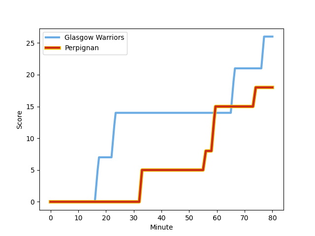
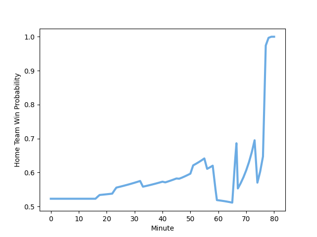

---  
layout: page  
title: Perpignan at Glasgow Warriors; 18-26  
date: 2022-12-16 21:00:00 18:00:00 -0500  
categories: match review  
---
# Perpignan (1468.33) at Glasgow Warriors (1508.04); 18-26

# Prediction: Glasgow Warriors by 7.0

Glasgow Warriors by 4.0 on a neutral field
## Scores over Time

## Win Probability over Time

# Pre-Match Prediction: Glasgow Warriors by 3.4

Glasgow Warriors by 0.4 on a neutral pitch

|   Away Minutes | Away Player                                                            |   Away elo |   Away Percentile |   Number |   Home Percentile |   Home elo | Home Player                                                               |   Home Minutes |
|---------------:|:-----------------------------------------------------------------------|-----------:|------------------:|---------:|------------------:|-----------:|:--------------------------------------------------------------------------|---------------:|
|             47 | [Giorgi Tetrashvili](..//playerfiles//GiorgiTetrashvili_cleaned.md)    |      83.54 |                 9 |        1 |                88 |     108.32 | [Jamie Bhatti](..//playerfiles//JamieBhatti_cleaned.md)                   |             67 |
|             46 | [Seilala Lam](..//playerfiles//SeilalaLam_cleaned.md)                  |      79.65 |                 4 |        2 |                98 |     122.6  | [George Turner](..//playerfiles//GeorgeTurner_cleaned.md)                 |             67 |
|             41 | [Siua Halanukonuka](..//playerfiles//SiuaHalanukonuka_cleaned.md)      |     103.96 |                78 |        3 |                46 |      98.49 | [Murphy Walker](..//playerfiles//MurphyWalker_cleaned.md)                 |             46 |
|             46 | [Piula Faasalele](..//playerfiles//PiulaFaasalele_cleaned.md)          |     101.21 |                72 |        4 |                32 |      91.26 | [Lewis Bean](..//playerfiles//LewisBean_cleaned.md)                       |             80 |
|             80 | [Tristan Labouteley](..//playerfiles//TristanLabouteley_cleaned.md)    |      73.96 |                 3 |        5 |                45 |      94.56 | [Richie Gray](..//playerfiles//RichieGray_cleaned.md)                     |             80 |
|             80 | [Lucas Velarte](..//playerfiles//LucasVelarte_cleaned.md)              |      86.97 |                15 |        6 |                94 |     123.11 | [Matt Fagerson](..//playerfiles//MattFagerson_cleaned.md)                 |             80 |
|             64 | [Kelian Galletier](..//playerfiles//KelianGalletier_cleaned.md)        |      88.19 |                20 |        7 |                25 |      89.92 | [Sione Vailanu](..//playerfiles//SioneVailanu_cleaned.md)                 |             79 |
|             80 | [Genesis Mamea Lemalu](..//playerfiles//GenesisMameaLemalu_cleaned.md) |     103.95 |                74 |        8 |                19 |      87.28 | [Jack Dempsey](..//playerfiles//JackDempsey_cleaned.md)                   |             80 |
|             46 | [Tom Ecochard](..//playerfiles//TomEcochard_cleaned.md)                |     109.75 |                87 |        9 |                97 |     125.13 | [George Horne](..//playerfiles//GeorgeHorne_cleaned.md)                   |             46 |
|             80 | [Jake McIntyre](..//playerfiles//JakeMcIntyre_cleaned.md)              |     103.52 |                73 |       10 |                52 |      97.47 | [Duncan Weir](..//playerfiles//DuncanWeir_cleaned.md)                     |             67 |
|             80 | [Mathieu Acebes](..//playerfiles//MathieuAcebes_cleaned.md)            |     138.07 |                99 |       11 |                70 |     100.92 | [Rufus McLean](..//playerfiles//RufusMcLean_cleaned.md)                   |             80 |
|             80 | [Dorian Laborde](..//playerfiles//DorianLaborde_cleaned.md)            |     110.43 |                85 |       12 |                40 |      93.44 | [Huw Jones](..//playerfiles//HuwJones_cleaned.md)                         |             80 |
|             80 | [Afusipa Taumoepeau](..//playerfiles//AfusipaTaumoepeau_cleaned.md)    |     113.82 |                89 |       13 |                13 |      84.41 | [Sione Tuipulotu](..//playerfiles//SioneTuipulotu_cleaned.md)             |             80 |
|             51 | [George Tilsley](..//playerfiles//GeorgeTilsley_cleaned.md)            |     105.5  |                80 |       14 |                91 |     113.8  | [Sebastian Cancelliere](..//playerfiles//SebastianCancelliere_cleaned.md) |             80 |
|             51 | [Tristan Tedder](..//playerfiles//TristanTedder_cleaned.md)            |      83.02 |                10 |       15 |                46 |      94.45 | [Josh McKay](..//playerfiles//JoshMcKay_cleaned.md)                       |             80 |
|             33 | [Xavier Chiocci](..//playerfiles//XavierChiocci_cleaned.md)            |      83.91 |                 9 |       16 |               nan |      92.61 | [Nathan McBeth](..//playerfiles//NathanMcBeth_cleaned.md)                 |             13 |
|             34 | [Mike Tadjer Barbosa](..//playerfiles//MikeTadjerBarbosa_cleaned.md)   |      85.45 |                12 |       17 |                40 |      93.84 | [Simon Berghan](..//playerfiles//SimonBerghan_cleaned.md)                 |             34 |
|             39 | [Arthur Joly](..//playerfiles//ArthurJoly_cleaned.md)                  |     112.02 |                92 |       18 |                34 |      92.66 | [Johnny Matthews](..//playerfiles//JohnnyMatthews_cleaned.md)             |             13 |
|             34 | [Posolo Tuilagi](..//playerfiles//PosoloTuilagi_cleaned.md)            |      93.15 |               nan |       19 |               nan |     108.48 | [Euan Ferrie](..//playerfiles//EuanFerrie_cleaned.md)                     |              1 |
|             16 | [Lucas Bachelier](..//playerfiles//LucasBachelier_cleaned.md)          |     110.11 |                87 |       20 |                85 |     108.95 | [Ali Price](..//playerfiles//AliPrice_cleaned.md)                         |             34 |
|             34 | [Sadek Deghmache](..//playerfiles//SadekDeghmache_cleaned.md)          |      82.41 |                 8 |       21 |                27 |      90.81 | [Tom Jordan](..//playerfiles//TomJordan_cleaned.md)                       |             13 |
|             29 | [Lucas Dubois](..//playerfiles//LucasDubois_cleaned.md)                |      91.2  |                29 |       22 |               nan |     nan    | nan                                                                       |            nan |
|             29 | [Boris Goutard](..//playerfiles//BorisGoutard_cleaned.md)              |      61.18 |                 0 |       23 |               nan |     nan    | nan                                                                       |            nan |

