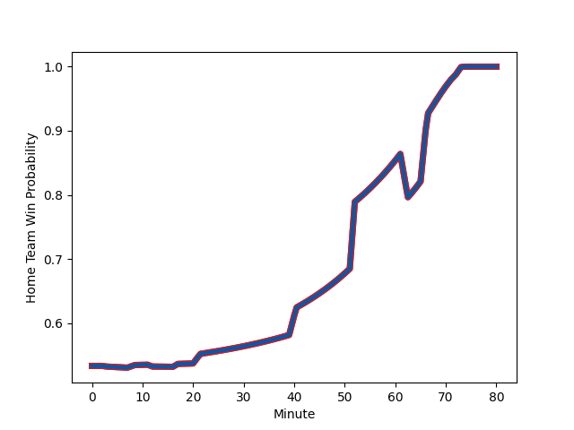

---  
layout: page  
title: Massy at Grenoble; 15-38  
date: 2022-12-16 19:30:00 18:00:00 -0500  
categories: match review  
---
# Massy (1336.28) at Grenoble (1394.17); 15-38

# Prediction: Grenoble by 8.8

Grenoble by 5.8 on a neutral field
## Scores over Time

## Win Probability over Time

# Pre-Match Prediction: Grenoble by 8.1

Grenoble by 5.1 on a neutral pitch

|   Away Minutes | Away Player                                                           |   Away elo |   Away Percentile |   Number |   Home Percentile |   Home elo | Home Player                                                                         |   Home Minutes |
|---------------:|:----------------------------------------------------------------------|-----------:|------------------:|---------:|------------------:|-----------:|:------------------------------------------------------------------------------------|---------------:|
|             45 | [Fernandez Correa](..//playerfiles//FernandezCorrea_cleaned.md)       |      80.09 |                 5 |        1 |                82 |     105.33 | [Zack Gauthier](..//playerfiles//ZackGauthier_cleaned.md)                           |             60 |
|             45 | [Corentin Chabeaudie](..//playerfiles//CorentinChabeaudie_cleaned.md) |      78.17 |                 4 |        2 |                23 |      88.37 | [Enzo Camilleri](..//playerfiles//EnzoCamilleri_cleaned.md)                         |             55 |
|             45 | [Nicolas Ferrer](..//playerfiles//NicolasFerrer_cleaned.md)           |      98.6  |                67 |        3 |                27 |      91.04 | [Irakli Aptsiauri](..//playerfiles//IrakliAptsiauri_cleaned.md)                     |             52 |
|             48 | [Marco Fuser](..//playerfiles//MarcoFuser_cleaned.md)                 |     102.19 |                76 |        4 |                72 |     101.08 | [Thomas Lainault](..//playerfiles//ThomasLainault_cleaned.md)                       |             80 |
|             80 | [Dion Evrard Oulai](..//playerfiles//DionEvrardOulai_cleaned.md)      |      79.56 |                 8 |        5 |                71 |     100.76 | [Pio Muarua](..//playerfiles//PioMuarua_cleaned.md)                                 |             41 |
|             80 | [Yohann Gbizie](..//playerfiles//YohannGbizie_cleaned.md)             |      92.89 |                43 |        6 |                 3 |      75.43 | [Thibaut Martel](..//playerfiles//ThibautMartel_cleaned.md)                         |             80 |
|             41 | [Samuel Nollet](..//playerfiles//SamuelNollet_cleaned.md)             |      94.39 |                46 |        7 |                66 |     100.14 | [Steeve Blanc-Mappaz](..//playerfiles//SteeveBlanc-Mappaz_cleaned.md)               |             80 |
|             52 | [Dylan Lam](..//playerfiles//DylanLam_cleaned.md)                     |      83.53 |                11 |        8 |                55 |      98.24 | [Marko Gazzotti](..//playerfiles//MarkoGazzotti_cleaned.md)                         |             53 |
|             57 | [Benjamin Prier](..//playerfiles//BenjaminPrier_cleaned.md)           |     104.76 |                80 |        9 |                62 |      97.84 | [Eric Escande](..//playerfiles//EricEscande_cleaned.md)                             |             73 |
|             57 | [Will Haydon-Wood](..//playerfiles//WillHaydon-Wood_cleaned.md)       |      97.22 |                57 |       10 |                20 |      88.4  | [Thomas Fortunel](..//playerfiles//ThomasFortunel_cleaned.md)                       |             80 |
|             80 | [Nathan Farissier](..//playerfiles//NathanFarissier_cleaned.md)       |      90.32 |                25 |       11 |                45 |      94.51 | [Lucas Dupont](..//playerfiles//LucasDupont_cleaned.md)                             |             80 |
|             80 | [Mathieu Guillomot](..//playerfiles//MathieuGuillomot_cleaned.md)     |      75.55 |                 4 |       12 |                31 |      91.03 | [Romain Trouilloud](..//playerfiles//RomainTrouilloud_cleaned.md)                   |             60 |
|             80 | [Victorien Jacomme](..//playerfiles//VictorienJacomme_cleaned.md)     |      86.31 |                17 |       13 |                 7 |      80.18 | [Atunaisa Taulanga Vaka Manu](..//playerfiles//AtunaisaTaulangaVakaManu_cleaned.md) |             52 |
|             80 | [Yanis Dit Robaglia](..//playerfiles//YanisDitRobaglia_cleaned.md)    |      86.16 |                13 |       14 |                19 |      88.5  | [Karim Qadiri](..//playerfiles//KarimQadiri_cleaned.md)                             |             80 |
|             80 | [Massimo Ortolan](..//playerfiles//MassimoOrtolan_cleaned.md)         |      92.04 |                32 |       15 |                60 |      98.07 | [Julien Farnoux](..//playerfiles//JulienFarnoux_cleaned.md)                         |             80 |
|             39 | [Clement Lanen](..//playerfiles//ClementLanen_cleaned.md)             |      87.48 |                18 |       16 |                65 |      99.73 | [Tanginoa Halaifonua](..//playerfiles//TanginoaHalaifonua_cleaned.md)               |             39 |
|             35 | [Mamoudou Meite](..//playerfiles//MamoudouMeite_cleaned.md)           |      90.87 |                22 |       17 |                45 |      93.67 | [Vincent Vial](..//playerfiles//VincentVial_cleaned.md)                             |             28 |
|             35 | [Tijde Visser](..//playerfiles//TijdeVisser_cleaned.md)               |      83.63 |                 8 |       18 |                63 |     100.04 | [Bautista Ezcurra](..//playerfiles//BautistaEzcurra_cleaned.md)                     |             28 |
|             35 | [Robin Poipy](..//playerfiles//RobinPoipy_cleaned.md)                 |     101.96 |                74 |       19 |                16 |      86.98 | [Clement Ancely](..//playerfiles//ClementAncely_cleaned.md)                         |             27 |
|             32 | [Ewan Coetzee](..//playerfiles//EwanCoetzee_cleaned.md)               |      74.81 |                 4 |       20 |                19 |      88.15 | [Jean Charles Orioli](..//playerfiles//JeanCharlesOrioli_cleaned.md)                |             25 |
|             28 | [Andy Timo](..//playerfiles//AndyTimo_cleaned.md)                     |      92.76 |                37 |       21 |                52 |      96.18 | [Romain Fusier](..//playerfiles//RomainFusier_cleaned.md)                           |             20 |
|             23 | [Samuel Boissinot](..//playerfiles//SamuelBoissinot_cleaned.md)       |      90.97 |                27 |       22 |                 1 |      68.22 | [Eli Eglaine](..//playerfiles//EliEglaine_cleaned.md)                               |             20 |
|             23 | [Arthur Seigneuret](..//playerfiles//ArthurSeigneuret_cleaned.md)     |     100.56 |                65 |       23 |               nan |      95    | [Kelian Boissier](..//playerfiles//KelianBoissier_cleaned.md)                       |              7 |

