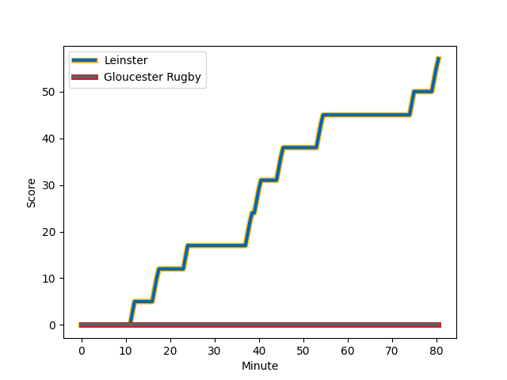
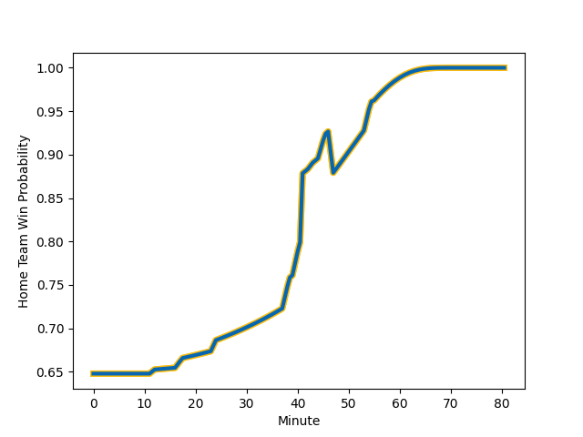

---  
layout: page  
title: Gloucester Rugby at Leinster; 0-57  
date: 2022-12-16 21:00:00 18:00:00 -0500  
categories: match review  
---
# Gloucester Rugby (1494.96) at Leinster (1759.73); 0-57

# Prediction: Leinster by 29.5

Leinster by 26.5 on a neutral field
## Scores over Time

## Win Probability over Time

# Pre-Match Prediction: Leinster by 30.1

Leinster by 27.1 on a neutral pitch

|   Away Minutes | Away Player                                                         |   Away elo |   Away Percentile |   Number |   Home Percentile |   Home elo | Home Player                                                           |   Home Minutes |
|---------------:|:--------------------------------------------------------------------|-----------:|------------------:|---------:|------------------:|-----------:|:----------------------------------------------------------------------|---------------:|
|             47 | [Harry Elrington](..//playerfiles//HarryElrington_cleaned.md)       |     100.54 |                71 |        1 |                73 |     101.22 | [Andrew Porter](..//playerfiles//AndrewPorter_cleaned.md)             |             47 |
|             43 | [Henry Walker](..//playerfiles//HenryWalker_cleaned.md)             |     104.56 |                83 |        2 |                92 |     111.31 | [Ronan Kelleher](..//playerfiles//RonanKelleher_cleaned.md)           |             47 |
|             57 | [Ciaran Knight](..//playerfiles//CiaranKnight_cleaned.md)           |      82.43 |                22 |        3 |                87 |     107.13 | [Michael Alaalatoa](..//playerfiles//MichaelAlaalatoa_cleaned.md)     |             41 |
|             80 | [Freddie Thomas](..//playerfiles//FreddieThomas_cleaned.md)         |      95    |               nan |        4 |                98 |     131.7  | [Ross Molony](..//playerfiles//RossMolony_cleaned.md)                 |             80 |
|             34 | [Freddie Clarke](..//playerfiles//FreddieClarke_cleaned.md)         |     110.37 |                89 |        5 |                91 |     113.27 | [James Ryan](..//playerfiles//JamesRyan_cleaned.md)                   |             51 |
|             80 | [Jake Polledri](..//playerfiles//JakePolledri_cleaned.md)           |      93.47 |                42 |        6 |                90 |     116.21 | [Caelan Doris](..//playerfiles//CaelanDoris_cleaned.md)               |             80 |
|             80 | [Jack Clement](..//playerfiles//JackClement_cleaned.md)             |      92.78 |                42 |        7 |                96 |     121.39 | [Josh van der Flier](..//playerfiles//JoshvanderFlier_cleaned.md)     |             56 |
|             55 | [Albert Tuisue](..//playerfiles//AlbertTuisue_cleaned.md)           |     101.54 |                74 |        8 |                94 |     123.56 | [Jack Conan](..//playerfiles//JackConan_cleaned.md)                   |             80 |
|             80 | [Ben Meehan](..//playerfiles//BenMeehan_cleaned.md)                 |     113.72 |                93 |        9 |                92 |     114.79 | [Luke McGrath](..//playerfiles//LukeMcGrath_cleaned.md)               |             59 |
|             10 | [George Barton](..//playerfiles//GeorgeBarton_cleaned.md)           |      96.72 |                63 |       10 |                80 |     107.56 | [Ross Byrne](..//playerfiles//RossByrne_cleaned.md)                   |             59 |
|             80 | [Jake Morris](..//playerfiles//JakeMorris_cleaned.md)               |      84.98 |                11 |       11 |               100 |     156.73 | [James Lowe](..//playerfiles//JamesLowe_cleaned.md)                   |             80 |
|             80 | [Billy Twelvetrees](..//playerfiles//BillyTwelvetrees_cleaned.md)   |     112.71 |                89 |       12 |                91 |     114.7  | [Charlie Ngatai](..//playerfiles//CharlieNgatai_cleaned.md)           |             80 |
|             80 | [Giorgi Kveseladze](..//playerfiles//GiorgiKveseladze_cleaned.md)   |     104.7  |                77 |       13 |                78 |     105.2  | [Garry Ringrose](..//playerfiles//GarryRingrose_cleaned.md)           |             80 |
|             21 | [Alex Hearle](..//playerfiles//AlexHearle_cleaned.md)               |      93.33 |                39 |       14 |                92 |     116.07 | [Jimmy O'Brien](..//playerfiles//JimmyO'Brien_cleaned.md)             |             53 |
|             80 | [Lloyd Evans](..//playerfiles//LloydEvans_cleaned.md)               |     116.53 |                93 |       15 |                95 |     118.76 | [Hugo Keenan](..//playerfiles//HugoKeenan_cleaned.md)                 |             80 |
|             33 | [Alex Seville](..//playerfiles//AlexSeville_cleaned.md)             |     103.38 |                79 |       16 |                97 |     119.72 | [Ed Byrne](..//playerfiles//EdByrne_cleaned.md)                       |             33 |
|             37 | [Seb Blake](..//playerfiles//SebBlake_cleaned.md)                   |      95    |               nan |       17 |                73 |     100.87 | [Dan Sheehan](..//playerfiles//DanSheehan_cleaned.md)                 |             33 |
|             46 | [Alex Craig](..//playerfiles//AlexCraig_cleaned.md)                 |     101.47 |                72 |       18 |                97 |     117.96 | [Cian Healy](..//playerfiles//CianHealy_cleaned.md)                   |             39 |
|             23 | [Kirill Gotovtsev](..//playerfiles//KirillGotovtsev_cleaned.md)     |     110.7  |                92 |       19 |                87 |     110.72 | [Max Deegan](..//playerfiles//MaxDeegan_cleaned.md)                   |             24 |
|             25 | [Harry Taylor](..//playerfiles//HarryTaylor_cleaned.md)             |      93.78 |                42 |       20 |                86 |     109.35 | [Jamison Gibson-Park](..//playerfiles//JamisonGibson-Park_cleaned.md) |             21 |
|             70 | [Sebastien Atkinson](..//playerfiles//SebastienAtkinson_cleaned.md) |      89.68 |                25 |       21 |                94 |     122.59 | [Johnny Sexton](..//playerfiles//JohnnySexton_cleaned.md)             |             21 |
|             59 | [Kyle Moyle](..//playerfiles//KyleMoyle_cleaned.md)                 |      93.88 |                44 |       22 |                80 |     105.46 | [Jordan Larmour](..//playerfiles//JordanLarmour_cleaned.md)           |             27 |
|            nan | nan                                                                 |     nan    |               nan |       23 |                73 |     101.69 | [Joe McCarthy](..//playerfiles//JoeMcCarthy_cleaned.md)               |             29 |

