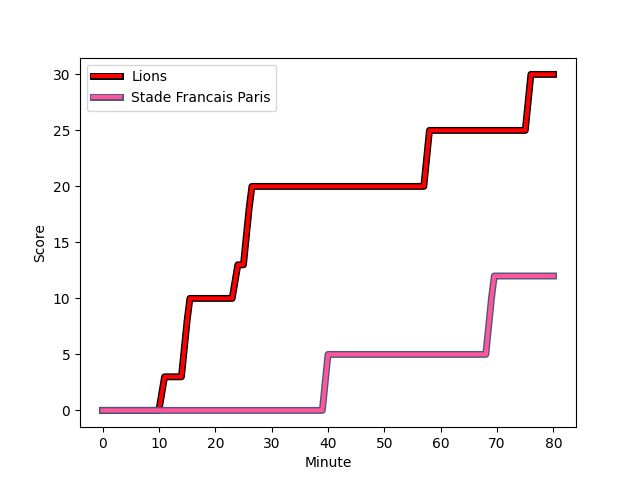
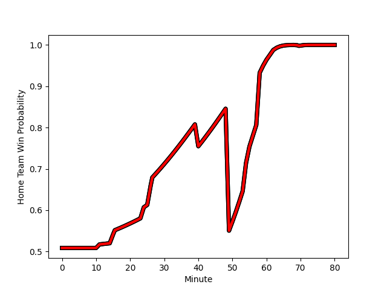

---  
layout: page  
title: Stade Francais Paris at Lions; 12-30  
date: 2022-12-16 18:30:00 18:00:00 -0500  
categories: match review  
---
# Stade Francais Paris (1492.98) at Lions (1501.06); 12-30

# Prediction: Lions by 3.8

Lions by 0.8 on a neutral field
## Scores over Time

## Win Probability over Time

# Pre-Match Prediction: Lions by 2.7

Stade Francais Paris by 0.3 on a neutral pitch

|   Away Minutes | Away Player                                                             |   Away elo |   Away Percentile |   Number |   Home Percentile |   Home elo | Home Player                                                                   |   Home Minutes |
|---------------:|:------------------------------------------------------------------------|-----------:|------------------:|---------:|------------------:|-----------:|:------------------------------------------------------------------------------|---------------:|
|             46 | [Vasil Kakovin](..//playerfiles//VasilKakovin_cleaned.md)               |      94.26 |                43 |        1 |                43 |      95.17 | [Jean-Pierre Smith](..//playerfiles//Jean-PierreSmith_cleaned.md)             |             49 |
|             46 | [Laurent Panis](..//playerfiles//LaurentPanis_cleaned.md)               |      86.95 |                12 |        2 |                85 |     106.9  | [Jaco Visagie](..//playerfiles//JacoVisagie_cleaned.md)                       |             62 |
|             46 | [Giorgi Melikidze](..//playerfiles//GiorgiMelikidze_cleaned.md)         |     103.5  |                78 |        3 |                 3 |      81.72 | [Asenathi Ntlabakanye](..//playerfiles//AsenathiNtlabakanye_cleaned.md)       |             62 |
|             57 | [Nathan Huguen](..//playerfiles//NathanHuguen_cleaned.md)               |      95.28 |               nan |        4 |                84 |     107.36 | [Willem Alberts](..//playerfiles//WillemAlberts_cleaned.md)                   |             58 |
|             58 | [JJ van der Mescht](..//playerfiles//JJvanderMescht_cleaned.md)         |     107.57 |                84 |        5 |                70 |      98.2  | [Pieter Jansen van Vuuren](..//playerfiles//PieterJansenvanVuuren_cleaned.md) |             49 |
|             12 | [Giorgi Tsutskeridze](..//playerfiles//GiorgiTsutskeridze_cleaned.md)   |     110.57 |                88 |        6 |                97 |     125.29 | [Jaco Kriel](..//playerfiles//JacoKriel_cleaned.md)                           |             58 |
|             80 | [Mathieu Hirigoyen](..//playerfiles//MathieuHirigoyen_cleaned.md)       |      81.26 |                 7 |        7 |                86 |     110.38 | [Ruan Venter](..//playerfiles//RuanVenter_cleaned.md)                         |             80 |
|             80 | [Juan Martin Scelzo](..//playerfiles//JuanMartinScelzo_cleaned.md)      |      96.79 |                51 |        8 |                 5 |      77.59 | [Emmanuel Tshituka](..//playerfiles//EmmanuelTshituka_cleaned.md)             |             80 |
|             54 | [James Hall](..//playerfiles//JamesHall_cleaned.md)                     |     119.71 |                94 |        9 |                83 |     107.95 | [Sanele Nohamba](..//playerfiles//SaneleNohamba_cleaned.md)                   |             70 |
|             80 | [Leo Barre](..//playerfiles//LeoBarre_cleaned.md)                       |     104.59 |                75 |       10 |                16 |      86.78 | [Jordan Hendrikse](..//playerfiles//JordanHendrikse_cleaned.md)               |             80 |
|             80 | [Harry Glover](..//playerfiles//HarryGlover_cleaned.md)                 |     123.92 |                97 |       11 |                75 |     104.75 | [Quan Horn](..//playerfiles//QuanHorn_cleaned.md)                             |             80 |
|             80 | [Theo Dachary](..//playerfiles//TheoDachary_cleaned.md)                 |      99.56 |               nan |       12 |                86 |     111.03 | [Marius Louw](..//playerfiles//MariusLouw_cleaned.md)                         |             80 |
|             55 | [Paolo Odogwu](..//playerfiles//PaoloOdogwu_cleaned.md)                 |     100.17 |                64 |       13 |                58 |      98.16 | [Henco van Wyk](..//playerfiles//HencovanWyk_cleaned.md)                      |             42 |
|             80 | [Nadir Megdoud](..//playerfiles//NadirMegdoud_cleaned.md)               |      92.38 |                35 |       14 |                30 |      91.4  | [Edwill van der Merwe](..//playerfiles//EdwillvanderMerwe_cleaned.md)         |             80 |
|             80 | [Leo Monin](..//playerfiles//LeoMonin_cleaned.md)                       |      95    |               nan |       15 |                70 |     102.32 | [Andries Coetzee](..//playerfiles//AndriesCoetzee_cleaned.md)                 |             80 |
|             34 | [Sergo Abramishvili](..//playerfiles//SergoAbramishvili_cleaned.md)     |      98.59 |                62 |       16 |                77 |     103.14 | [Sti Sithole](..//playerfiles//StiSithole_cleaned.md)                         |             31 |
|             34 | [Lucas Peyresblanques](..//playerfiles//LucasPeyresblanques_cleaned.md) |     106.62 |                84 |       17 |               nan |      98.27 | [Michael van Vuuren](..//playerfiles//MichaelvanVuuren_cleaned.md)            |             18 |
|             34 | [Paul Alo-Emile](..//playerfiles//PaulAlo-Emile_cleaned.md)             |     106.91 |                87 |       18 |                85 |     108.13 | [Ruan Smith](..//playerfiles//RuanSmith_cleaned.md)                           |             18 |
|             23 | [Noa Kanika](..//playerfiles//NoaKanika_cleaned.md)                     |      95    |               nan |       19 |                38 |      92.62 | [Darrien-Lane Landsberg](..//playerfiles//Darrien-LaneLandsberg_cleaned.md)   |             22 |
|             68 | [Ferdinand Dreno](..//playerfiles//FerdinandDreno_cleaned.md)           |      95    |               nan |       20 |                65 |      99.14 | [Reinhard Nothnagel](..//playerfiles//ReinhardNothnagel_cleaned.md)           |             31 |
|             26 | [Arthur Coville](..//playerfiles//ArthurCoville_cleaned.md)             |      91.8  |                31 |       21 |                41 |      91.71 | [Sibusiso Sangweni](..//playerfiles//SibusisoSangweni_cleaned.md)             |             22 |
|             25 | [Alex Arrate](..//playerfiles//AlexArrate_cleaned.md)                   |      84.07 |                12 |       22 |                16 |      87.14 | [Andre Warner](..//playerfiles//AndreWarner_cleaned.md)                       |             10 |
|             22 | [Moses Alo-Emile](..//playerfiles//MosesAlo-Emile_cleaned.md)           |      97.57 |                59 |       23 |                81 |     107.62 | [Rynardt Jonker](..//playerfiles//RynardtJonker_cleaned.md)                   |             38 |

