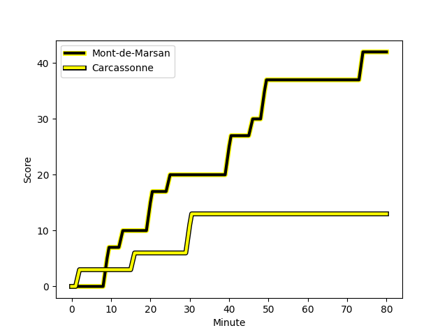
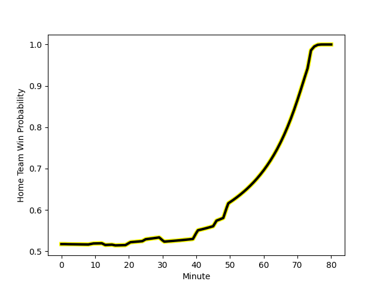

---  
layout: page  
title: Carcassonne at Mont-de-Marsan; 13-42  
date: 2022-12-16 19:30:00 18:00:00 -0500  
categories: match review  
---
# Carcassonne (1414.9) at Mont-de-Marsan (1444.87); 13-42

# Prediction: Mont-de-Marsan by 6.0

Mont-de-Marsan by 3.0 on a neutral field
## Scores over Time

## Win Probability over Time

# Pre-Match Prediction: Mont-de-Marsan by 9.4

Mont-de-Marsan by 6.4 on a neutral pitch

|   Away Minutes | Away Player                                                              |   Away elo |   Away Percentile |   Number |   Home Percentile |   Home elo | Home Player                                                                      |   Home Minutes |
|---------------:|:-------------------------------------------------------------------------|-----------:|------------------:|---------:|------------------:|-----------:|:---------------------------------------------------------------------------------|---------------:|
|             50 | [Sami Mavinga](..//playerfiles//SamiMavinga_cleaned.md)                  |      94.23 |                41 |        1 |                47 |      95.34 | [Max Curie](..//playerfiles//MaxCurie_cleaned.md)                                |             50 |
|             50 | [Raphael Carbou](..//playerfiles//RaphaelCarbou_cleaned.md)              |      76.49 |                 2 |        2 |                17 |      90.22 | [Romain Laterrade](..//playerfiles//RomainLaterrade_cleaned.md)                  |             50 |
|             54 | [Vakhtangi Akhobadze](..//playerfiles//VakhtangiAkhobadze_cleaned.md)    |      62.68 |                 0 |        3 |                10 |      84.32 | [Gheorge Gajion](..//playerfiles//GheorgeGajion_cleaned.md)                      |             50 |
|             80 | [Rob Harley](..//playerfiles//RobHarley_cleaned.md)                      |     113.96 |                92 |        4 |                21 |      87.67 | [Aston Fortuin](..//playerfiles//AstonFortuin_cleaned.md)                        |             41 |
|             54 | [George Merrick](..//playerfiles//GeorgeMerrick_cleaned.md)              |      89.79 |                26 |        5 |                42 |      94.03 | [Andrei Ostrikov](..//playerfiles//AndreiOstrikov_cleaned.md)                    |             80 |
|             80 | [Aaron Carroll](..//playerfiles//AaronCarroll_cleaned.md)                |     105.06 |                78 |        6 |                13 |      85.42 | [Léo Banos](..//playerfiles//LéoBanos_cleaned.md)                                |             80 |
|             50 | [Stephane Onambele](..//playerfiles//StephaneOnambele_cleaned.md)        |      66.24 |                 1 |        7 |                89 |     111.41 | [Nicolas Garrault](..//playerfiles//NicolasGarrault_cleaned.md)                  |             59 |
|             50 | [Gregory Annetta](..//playerfiles//GregoryAnnetta_cleaned.md)            |      79.04 |                 4 |        8 |                64 |      99.46 | [Veresa Tuqovu Ramototabua](..//playerfiles//VeresaTuqovuRamototabua_cleaned.md) |             80 |
|             13 | [Damien Añon](..//playerfiles//DamienAñon_cleaned.md)                    |     101.63 |                68 |        9 |                 2 |      76.36 | [Christophe Loustalot](..//playerfiles//ChristopheLoustalot_cleaned.md)          |             70 |
|             50 | [Dorian Jones](..//playerfiles//DorianJones_cleaned.md)                  |     101.65 |                69 |       10 |                91 |     115.62 | [Willie du Plessis](..//playerfiles//WillieduPlessis_cleaned.md)                 |             56 |
|             80 | [Martin Dulon](..//playerfiles//MartinDulon_cleaned.md)                  |     103.28 |                74 |       11 |                65 |      99.3  | [Kaminieli Rasaku](..//playerfiles//KaminieliRasaku_cleaned.md)                  |             80 |
|             80 | [Nick Grigg](..//playerfiles//NickGrigg_cleaned.md)                      |      95.89 |                48 |       12 |                76 |     104.19 | [Lucas Mensa](..//playerfiles//LucasMensa_cleaned.md)                            |             80 |
|             80 | [Pierre Aguillon](..//playerfiles//PierreAguillon_cleaned.md)            |      84.16 |                12 |       13 |                89 |     114.35 | [Nacani Wakaya](..//playerfiles//NacaniWakaya_cleaned.md)                        |             50 |
|             80 | [Benoit Jasmin](..//playerfiles//BenoitJasmin_cleaned.md)                |     121.71 |                96 |       14 |                41 |      93.9  | [Pierre Sayerse](..//playerfiles//PierreSayerse_cleaned.md)                      |             80 |
|             80 | [Baptiste Mouchous](..//playerfiles//BaptisteMouchous_cleaned.md)        |      82.23 |                11 |       15 |                23 |      87.66 | [Alexandre de Nardi](..//playerfiles//AlexandredeNardi_cleaned.md)               |             80 |
|             67 | [Samuel Marques](..//playerfiles//SamuelMarques_cleaned.md)              |     122.55 |                97 |       16 |                79 |     104.49 | [Romain Durand](..//playerfiles//RomainDurand_cleaned.md)                        |             39 |
|             30 | [Luka Petriashvili](..//playerfiles//LukaPetriashvili_cleaned.md)        |      95.74 |               nan |       17 |                14 |      87.68 | [Jean-Luc Innocente](..//playerfiles//Jean-LucInnocente_cleaned.md)              |             30 |
|             30 | [Etienne Herjean](..//playerfiles//EtienneHerjean_cleaned.md)            |      87.66 |                19 |       18 |                35 |      92.36 | [Simon Renda](..//playerfiles//SimonRenda_cleaned.md)                            |             30 |
|             30 | [Guilhem Vettore](..//playerfiles//GuilhemVettore_cleaned.md)            |      94.34 |               nan |       19 |                85 |     106.73 | [Jose Luis Gonzalez](..//playerfiles//JoseLuisGonzalez_cleaned.md)               |             30 |
|             30 | [Jules Martinez](..//playerfiles//JulesMartinez_cleaned.md)              |      77.93 |                 5 |       20 |                81 |     103.41 | [Lasha Macharashvili](..//playerfiles//LashaMacharashvili_cleaned.md)            |             30 |
|             30 | [Chris Hilsenbeck](..//playerfiles//ChrisHilsenbeck_cleaned.md)          |      82.5  |                 9 |       21 |                43 |      94.63 | [Joris Pialot](..//playerfiles//JorisPialot_cleaned.md)                          |             24 |
|             26 | [Come Clayver Joussain](..//playerfiles//ComeClayverJoussain_cleaned.md) |      93.32 |                41 |       22 |                82 |     108.04 | [Aurélien Lisena](..//playerfiles//AurélienLisena_cleaned.md)                    |             21 |
|             26 | [Mehmet Kilickaya](..//playerfiles//MehmetKilickaya_cleaned.md)          |      95    |               nan |       23 |               nan |      95.33 | [Baptiste Canut](..//playerfiles//BaptisteCanut_cleaned.md)                      |             10 |

