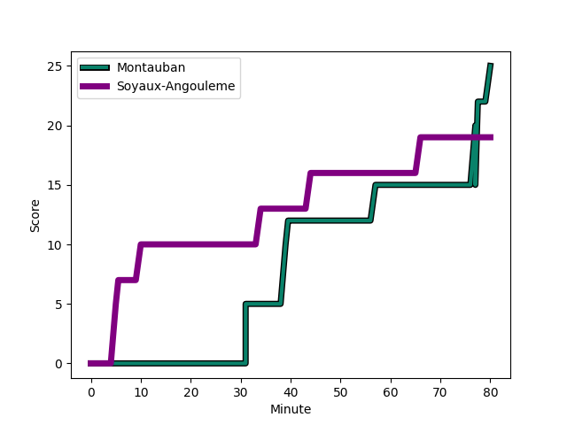
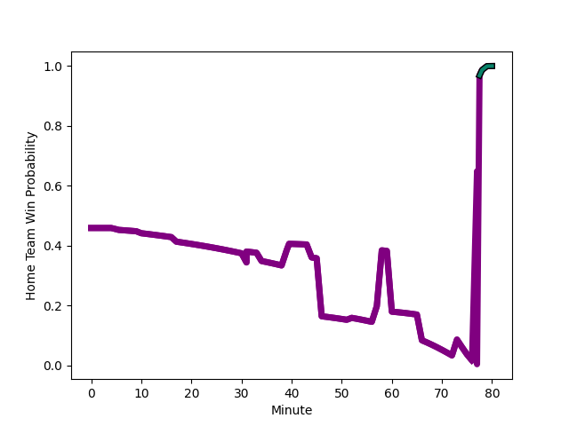

---  
layout: page  
title: Soyaux-Angouleme at Montauban; 19-25  
date: 2022-12-16 19:30:00 18:00:00 -0500  
categories: match review  
---
# Soyaux-Angouleme (1496.96) at Montauban (1425.86); 19-25

# Prediction: Soyaux-Angouleme by 4.1

Soyaux-Angouleme by 7.1 on a neutral field
## Scores over Time

## Win Probability over Time

# Pre-Match Prediction: Soyaux-Angouleme by 1.1

Soyaux-Angouleme by 4.1 on a neutral pitch

|   Away Minutes | Away Player                                                            |   Away elo |   Away Percentile |   Number |   Home Percentile |   Home elo | Home Player                                                                    |   Home Minutes |
|---------------:|:-----------------------------------------------------------------------|-----------:|------------------:|---------:|------------------:|-----------:|:-------------------------------------------------------------------------------|---------------:|
|             80 | [Omar Odishvili](..//playerfiles//OmarOdishvili_cleaned.md)            |     106.91 |                86 |        1 |                82 |     104.48 | [Nicolas Agnesi](..//playerfiles//NicolasAgnesi_cleaned.md)                    |             80 |
|             58 | [Ole Avei](..//playerfiles//OleAvei_cleaned.md)                        |     102.08 |                79 |        2 |                 0 |      63.16 | [Cyril Deligny](..//playerfiles//CyrilDeligny_cleaned.md)                      |             52 |
|             25 | [Yassine Boutemane](..//playerfiles//YassineBoutemane_cleaned.md)      |      74.13 |                 2 |        3 |                51 |      94.93 | [Mirian Burduli](..//playerfiles//MirianBurduli_cleaned.md)                    |             60 |
|             80 | [Sikeli Nabou](..//playerfiles//SikeliNabou_cleaned.md)                |     118.76 |                94 |        4 |                14 |      86.82 | [Dimitri Vaotoa](..//playerfiles//DimitriVaotoa_cleaned.md)                    |             80 |
|             80 | [Janse Roux](..//playerfiles//JanseRoux_cleaned.md)                    |     101.01 |                67 |        5 |                73 |     101.53 | [Alexandre Manukula](..//playerfiles//AlexandreManukula_cleaned.md)            |             46 |
|             17 | [Hubert Texier](..//playerfiles//HubertTexier_cleaned.md)              |      95.22 |                51 |        6 |                57 |      97.09 | [Tjuee Uanivi](..//playerfiles//TjueeUanivi_cleaned.md)                        |             62 |
|             80 | [Germain Burgaud](..//playerfiles//GermainBurgaud_cleaned.md)          |      96.08 |                51 |        7 |                 6 |      80.05 | [Frédéric Quercy](..//playerfiles//FrédéricQuercy_cleaned.md)                  |             55 |
|             31 | [Yassine Jarmouni](..//playerfiles//YassineJarmouni_cleaned.md)        |      91.97 |                34 |        8 |                48 |      96.03 | [Tyrone Viiga](..//playerfiles//TyroneViiga_cleaned.md)                        |             80 |
|             73 | [Manu Saubusse](..//playerfiles//ManuSaubusse_cleaned.md)              |     111.75 |                90 |        9 |                68 |     101.03 | [Alexis Bernadet](..//playerfiles//AlexisBernadet_cleaned.md)                  |             52 |
|             73 | [Matthieu Ugalde](..//playerfiles//MatthieuUgalde_cleaned.md)          |     112.35 |                87 |       10 |                39 |      93.53 | [Tedo Abzhandadze](..//playerfiles//TedoAbzhandadze_cleaned.md)                |             80 |
|             80 | [Marvin Lestremau](..//playerfiles//MarvinLestremau_cleaned.md)        |      92.43 |                34 |       11 |                33 |      92.08 | [Bastien Guillemin](..//playerfiles//BastienGuillemin_cleaned.md)              |             80 |
|             80 | [Mathis Lafon](..//playerfiles//MathisLafon_cleaned.md)                |     103.42 |                74 |       12 |                64 |     100.12 | [Maxime Mathy](..//playerfiles//MaximeMathy_cleaned.md)                        |             80 |
|             80 | [Ledua Mau](..//playerfiles//LeduaMau_cleaned.md)                      |      81.03 |                 7 |       13 |                21 |      88.25 | [Taleta Tupuola](..//playerfiles//TaletaTupuola_cleaned.md)                    |             80 |
|             80 | [Inaki Ayarza Saporta](..//playerfiles//InakiAyarzaSaporta_cleaned.md) |      90.74 |                29 |       14 |                93 |     117.22 | [Semesa Rokoduguni](..//playerfiles//SemesaRokoduguni_cleaned.md)              |             80 |
|             80 | [Pierre Lafitte](..//playerfiles//PierreLafitte_cleaned.md)            |      88.8  |                25 |       15 |                94 |     117.59 | [Maxime Salles](..//playerfiles//MaximeSalles_cleaned.md)                      |             63 |
|             63 | [Saba Pesvianidze](..//playerfiles//SabaPesvianidze_cleaned.md)        |     105.71 |                83 |       16 |                30 |      91    | [Quentin Witt](..//playerfiles//QuentinWitt_cleaned.md)                        |             34 |
|             51 | [Manasa Saulo Romumu](..//playerfiles//ManasaSauloRomumu_cleaned.md)   |     114.91 |                96 |       17 |                15 |      85.34 | [Arnaud Feltrin](..//playerfiles//ArnaudFeltrin_cleaned.md)                    |             28 |
|             49 | [Nicolas Martins](..//playerfiles//NicolasMartins_cleaned.md)          |      91.68 |                33 |       18 |                 3 |      75.39 | [Anthony Meric](..//playerfiles//AnthonyMeric_cleaned.md)                      |             28 |
|             22 | [Rayne Barka](..//playerfiles//RayneBarka_cleaned.md)                  |     100.57 |                75 |       19 |                 6 |      81.22 | [Stéphane Munoz](..//playerfiles//StéphaneMunoz_cleaned.md)                    |             25 |
|              7 | [Adrien Bau](..//playerfiles//AdrienBau_cleaned.md)                    |      73.8  |                 2 |       20 |                 6 |      84.71 | [Kevin Yameogo](..//playerfiles//KevinYameogo_cleaned.md)                      |             20 |
|              7 | [Jacob Botica](..//playerfiles//JacobBotica_cleaned.md)                |      98.74 |                64 |       21 |                90 |     114.21 | [Rodrigo Fernandez Criado](..//playerfiles//RodrigoFernandezCriado_cleaned.md) |             18 |
|              4 | [Seydou Diakité](..//playerfiles//SeydouDiakité_cleaned.md)            |      97    |                59 |       22 |                60 |      98.63 | [Raphael Sanchez](..//playerfiles//RaphaelSanchez_cleaned.md)                  |             17 |

