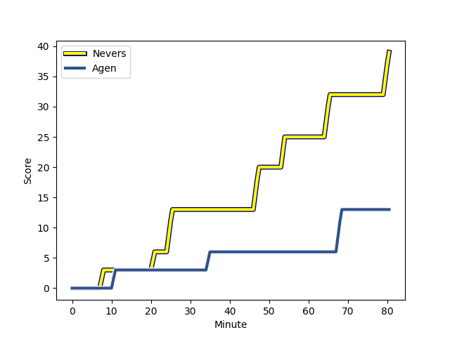
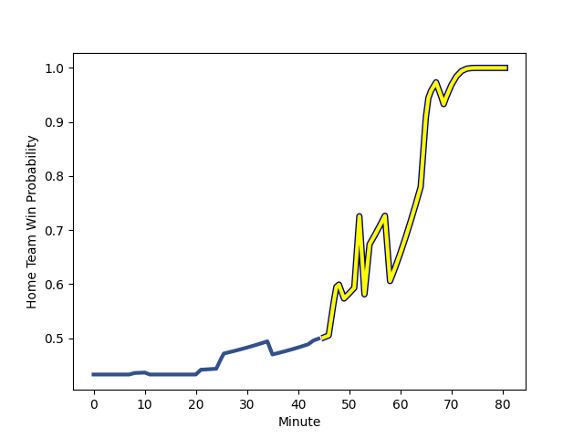

---  
layout: page  
title: Agen at Nevers; 13-39  
date: 2022-12-16 19:00:00 18:00:00 -0500  
categories: match review  
---
# Agen (1556.53) at Nevers (1462.32); 13-39

# Prediction: Agen by 6.4

Agen by 9.4 on a neutral field
## Scores over Time

## Win Probability over Time

# Pre-Match Prediction: Agen by 5.5

Agen by 8.5 on a neutral pitch

|   Away Minutes | Away Player                                                             |   Away elo |   Away Percentile |   Number |   Home Percentile |   Home elo | Home Player                                                           |   Home Minutes |
|---------------:|:------------------------------------------------------------------------|-----------:|------------------:|---------:|------------------:|-----------:|:----------------------------------------------------------------------|---------------:|
|             60 | [Hans Lombard-Buret](..//playerfiles//HansLombard-Buret_cleaned.md)     |      95.23 |                47 |        1 |                20 |      89.03 | [Kamaliele Tufele](..//playerfiles//KamalieleTufele_cleaned.md)       |             66 |
|             66 | [Mike Sosene-Feagai](..//playerfiles//MikeSosene-Feagai_cleaned.md)     |     107.24 |                88 |        2 |                16 |      87.89 | [Elia Elia](..//playerfiles//EliaElia_cleaned.md)                     |             58 |
|             35 | [Malik Hamadache](..//playerfiles//MalikHamadache_cleaned.md)           |     101.74 |                75 |        3 |                31 |      92.2  | [Cleopas Kundiona](..//playerfiles//CleopasKundiona_cleaned.md)       |             43 |
|             45 | [Corentin Vernet](..//playerfiles//CorentinVernet_cleaned.md)           |      98.23 |                65 |        4 |                59 |      97.61 | [Maxence Barjaud](..//playerfiles//MaxenceBarjaud_cleaned.md)         |             66 |
|             80 | [Zak Farrance](..//playerfiles//ZakFarrance_cleaned.md)                 |      93.63 |                42 |        5 |                90 |     110.71 | [Will Skelton](..//playerfiles//WillSkelton_cleaned.md)               |             80 |
|             80 | [Arnaud Duputs](..//playerfiles//ArnaudDuputs_cleaned.md)               |     103.36 |                76 |        6 |                45 |      94.47 | [Julien Kazubek](..//playerfiles//JulienKazubek_cleaned.md)           |             80 |
|             45 | [Antoine Erbani](..//playerfiles//AntoineErbani_cleaned.md)             |     100.6  |                68 |        7 |                93 |     115.19 | [Hugues Bastide](..//playerfiles//HuguesBastide_cleaned.md)           |             49 |
|             80 | [Martin Devergie](..//playerfiles//MartinDevergie_cleaned.md)           |     105.19 |                79 |        8 |                96 |     128.16 | [Jason-Colin Fraser](..//playerfiles//Jason-ColinFraser_cleaned.md)   |             80 |
|             53 | [Tane Takulua](..//playerfiles//TaneTakulua_cleaned.md)                 |      87.96 |                17 |        9 |               nan |      94.63 | [Arthurs Barbier](..//playerfiles//ArthursBarbier_cleaned.md)         |             52 |
|             80 | [Thomas Vincent](..//playerfiles//ThomasVincent_cleaned.md)             |     119.16 |                92 |       10 |                 9 |      82.71 | [Shaun Reynolds](..//playerfiles//ShaunReynolds_cleaned.md)           |             66 |
|             80 | [Iban Etcheverry](..//playerfiles//IbanEtcheverry_cleaned.md)           |     102.84 |                75 |       11 |                60 |      98.36 | [Lucas Blanc](..//playerfiles//LucasBlanc_cleaned.md)                 |             80 |
|             80 | [Harry Sloan](..//playerfiles//HarrySloan_cleaned.md)                   |     115.34 |                92 |       12 |                70 |     102.12 | [Leonard Paris](..//playerfiles//LeonardParis_cleaned.md)             |             52 |
|             52 | [Baptiste Lafond](..//playerfiles//BaptisteLafond_cleaned.md)           |      82.64 |                 9 |       13 |                 5 |      78.58 | [Alifereti Loaloa](..//playerfiles//AliferetiLoaloa_cleaned.md)       |             80 |
|             80 | [Timilai Rokoduru](..//playerfiles//TimilaiRokoduru_cleaned.md)         |     144.91 |                99 |       14 |                86 |     108.89 | [Andrzej Charlat](..//playerfiles//AndrzejCharlat_cleaned.md)         |             80 |
|             55 | [Jean-Marcelin Buttin](..//playerfiles//Jean-MarcelinButtin_cleaned.md) |     102.2  |                73 |       15 |                61 |      98.47 | [Dylan Jaminet](..//playerfiles//DylanJaminet_cleaned.md)             |             80 |
|             45 | [Alex Burin](..//playerfiles//AlexBurin_cleaned.md)                     |      96.15 |                56 |       16 |                46 |      94.44 | [Ilia Kaikatsishvili](..//playerfiles//IliaKaikatsishvili_cleaned.md) |             37 |
|             35 | [Matthieu Bonnet](..//playerfiles//MatthieuBonnet_cleaned.md)           |     102.16 |                75 |       17 |                11 |      84.76 | [Luka Plataret](..//playerfiles//LukaPlataret_cleaned.md)             |             31 |
|             35 | [Evan Olmstead](..//playerfiles//EvanOlmstead_cleaned.md)               |      85.03 |                12 |       18 |                63 |      96.23 | [Yoan Cottin](..//playerfiles//YoanCottin_cleaned.md)                 |             28 |
|             28 | [Clement Garrigues](..//playerfiles//ClementGarrigues_cleaned.md)       |      93.81 |                42 |       19 |                15 |      86.04 | [Aviata Silago](..//playerfiles//AviataSilago_cleaned.md)             |             28 |
|             27 | [Theo Idjellidaine](..//playerfiles//TheoIdjellidaine_cleaned.md)       |      90.13 |                24 |       20 |                54 |      95.56 | [Issam Hamel](..//playerfiles//IssamHamel_cleaned.md)                 |             22 |
|             25 | [Danré Gerber](..//playerfiles//DanréGerber_cleaned.md)                 |     101.9  |                66 |       21 |                 2 |      75.1  | [Sosefo Falatea](..//playerfiles//SosefoFalatea_cleaned.md)           |             14 |
|             20 | [Richard Barrington](..//playerfiles//RichardBarrington_cleaned.md)     |     103.38 |                79 |       22 |                 9 |      80.72 | [Maka Polutele](..//playerfiles//MakaPolutele_cleaned.md)             |             14 |
|             14 | [Pierre Jouvin](..//playerfiles//PierreJouvin_cleaned.md)               |      95.27 |               nan |       23 |                50 |      96.52 | [Yohan Le Bourhis](..//playerfiles//YohanLeBourhis_cleaned.md)        |             14 |

