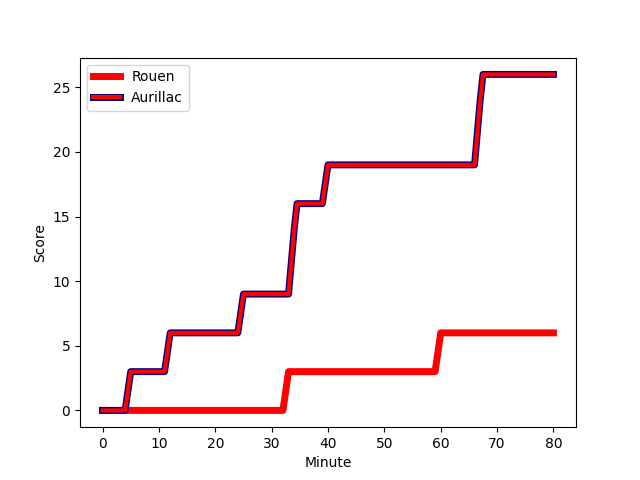
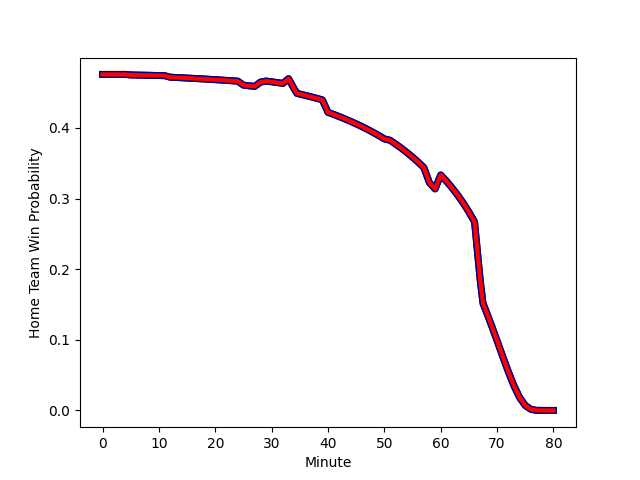

---  
layout: page  
title: Aurillac at Rouen; 26-6  
date: 2022-12-16 19:30:00 18:00:00 -0500  
categories: match review  
---
# Aurillac (1432.13) at Rouen (1389.89); 26-6

# Prediction: Aurillac by 1.2

Aurillac by 4.2 on a neutral field
## Scores over Time

## Win Probability over Time

# Pre-Match Prediction: Aurillac by 2.2

Aurillac by 5.2 on a neutral pitch

|   Away Minutes | Away Player                                                               |   Away elo |   Away Percentile |   Number |   Home Percentile |   Home elo | Home Player                                                             |   Home Minutes |
|---------------:|:--------------------------------------------------------------------------|-----------:|------------------:|---------:|------------------:|-----------:|:------------------------------------------------------------------------|---------------:|
|             62 | [Alexandre Plantier](..//playerfiles//AlexandrePlantier_cleaned.md)       |     100.74 |                72 |        1 |                22 |      90.53 | [Antoine Fournier](..//playerfiles//AntoineFournier_cleaned.md)         |             51 |
|             70 | [Adrian Smith](..//playerfiles//AdrianSmith_cleaned.md)                   |     103.63 |                81 |        2 |                11 |      86.81 | [Efitusi Ma'afu](..//playerfiles//EfitusiMa'afu_cleaned.md)             |             70 |
|             65 | [Giorgi Kartvelishvili](..//playerfiles//GiorgiKartvelishvili_cleaned.md) |     100.02 |                69 |        3 |                50 |      96    | [Hugo Ndiaye](..//playerfiles//HugoNdiaye_cleaned.md)                   |             29 |
|             80 | [Cam Dodson](..//playerfiles//CamDodson_cleaned.md)                       |     109.36 |                88 |        4 |                85 |     109.54 | [Fabien Vincent](..//playerfiles//FabienVincent_cleaned.md)             |             58 |
|             62 | [Georgi Javakhia](..//playerfiles//GeorgiJavakhia_cleaned.md)             |     100.27 |                69 |        5 |                10 |      81.26 | [Shay Kerry](..//playerfiles//ShayKerry_cleaned.md)                     |             28 |
|             80 | [Eoghan Masterson](..//playerfiles//EoghanMasterson_cleaned.md)           |      97.45 |                57 |        6 |                79 |     104.85 | [Willy N'Diaye](..//playerfiles//WillyN'Diaye_cleaned.md)               |             80 |
|             70 | [Beka Shvangiradze](..//playerfiles//BekaShvangiradze_cleaned.md)         |      90.96 |                29 |        7 |                15 |      86.06 | [Samuel Maximin](..//playerfiles//SamuelMaximin_cleaned.md)             |             80 |
|             62 | [Dylan Cretin](..//playerfiles//DylanCretin_cleaned.md)                   |     106.17 |                82 |        8 |                17 |      86.35 | [Tino Mapapalangi](..//playerfiles//TinoMapapalangi_cleaned.md)         |             80 |
|             70 | [David Delarue](..//playerfiles//DavidDelarue_cleaned.md)                 |      82.75 |                 7 |        9 |                 1 |      71.47 | [Theo Nanette](..//playerfiles//TheoNanette_cleaned.md)                 |             51 |
|             80 | [Marc Palmier](..//playerfiles//MarcPalmier_cleaned.md)                   |     109.66 |                84 |       10 |                77 |     105.6  | [Thibault Olender](..//playerfiles//ThibaultOlender_cleaned.md)         |             40 |
|             80 | [AJ Coertzen](..//playerfiles//AJCoertzen_cleaned.md)                     |      88    |                18 |       11 |                36 |      93.64 | [Alex Luatua](..//playerfiles//AlexLuatua_cleaned.md)                   |             80 |
|             60 | [Christa Powell](..//playerfiles//ChristaPowell_cleaned.md)               |      85.05 |                13 |       12 |                17 |      86.55 | [JT Jackson](..//playerfiles//JTJackson_cleaned.md)                     |             80 |
|             80 | [Jimmy Yobo](..//playerfiles//JimmyYobo_cleaned.md)                       |      85.67 |                14 |       13 |                61 |      98.69 | [Opetera Peleseuma](..//playerfiles//OpeteraPeleseuma_cleaned.md)       |             80 |
|             80 | [Giorgi Gogoladze](..//playerfiles//GiorgiGogoladze_cleaned.md)           |      99.62 |                66 |       14 |                41 |      93.65 | [Paul Surano](..//playerfiles//PaulSurano_cleaned.md)                   |             80 |
|             80 | [Anderson Neisen](..//playerfiles//AndersonNeisen_cleaned.md)             |      84.59 |                15 |       15 |                26 |      88.99 | [Marius Marty](..//playerfiles//MariusMarty_cleaned.md)                 |             58 |
|             20 | [Peter Nelson](..//playerfiles//PeterNelson_cleaned.md)                   |      75.87 |                 3 |       16 |                70 |      99.8  | [Jean Leleu](..//playerfiles//JeanLeleu_cleaned.md)                     |             52 |
|             18 | [Latuka Maituku](..//playerfiles//LatukaMaituku_cleaned.md)               |      79.98 |                 6 |       17 |                72 |     102.76 | [Cody Thomas](..//playerfiles//CodyThomas_cleaned.md)                   |             51 |
|             18 | [Jean-Baptiste Singer](..//playerfiles//Jean-BaptisteSinger_cleaned.md)   |      94.1  |                51 |       18 |                42 |      93.77 | [Taylor Gontineac](..//playerfiles//TaylorGontineac_cleaned.md)         |             40 |
|             18 | [Jean-Jacques Gymael](..//playerfiles//Jean-JacquesGymael_cleaned.md)     |      92.61 |                35 |       19 |                55 |      99.22 | [Soulemane Camara](..//playerfiles//SoulemaneCamara_cleaned.md)         |             29 |
|             15 | [Tim Daniel-Meissen](..//playerfiles//TimDaniel-Meissen_cleaned.md)       |      91.24 |                28 |       20 |                 4 |      80.07 | [Florent Campeggia](..//playerfiles//FlorentCampeggia_cleaned.md)       |             29 |
|             10 | [Boris Hadinegoro](..//playerfiles//BorisHadinegoro_cleaned.md)           |      95.69 |               nan |       21 |                 7 |      79.64 | [Kevin Milhorat](..//playerfiles//KevinMilhorat_cleaned.md)             |             22 |
|             10 | [Luka Nioradze](..//playerfiles//LukaNioradze_cleaned.md)                 |     102.04 |                76 |       22 |                44 |      94.01 | [Lucas Costa](..//playerfiles//LucasCosta_cleaned.md)                   |             22 |
|             10 | [Théo Cambon](..//playerfiles//ThéoCambon_cleaned.md)                     |      89.55 |                25 |       23 |                17 |      87.07 | [Jean-Étienne Lesueur](..//playerfiles//Jean-ÉtienneLesueur_cleaned.md) |             10 |

