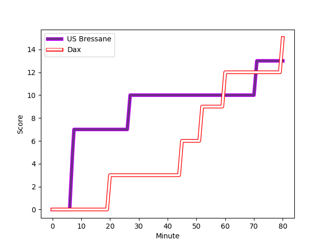
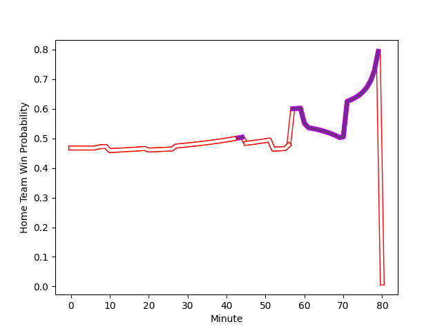

---  
layout: page  
title: Dax at US Bressane; 15-13  
date: 2022-12-16 19:30:00 18:00:00 -0500  
categories: match review  
---
# Dax (1532.13) at US Bressane (1475.23); 15-13

# Prediction: Dax by 2.7

Dax by 5.7 on a neutral field
## Scores over Time

## Win Probability over Time

# Pre-Match Prediction: Dax by 4.0

Dax by 7.0 on a neutral pitch

|   Away Minutes | Away Player                                                                |   Away elo |   Away Percentile |   Number |   Home Percentile |   Home elo | Home Player                                                                       |   Home Minutes |
|---------------:|:---------------------------------------------------------------------------|-----------:|------------------:|---------:|------------------:|-----------:|:----------------------------------------------------------------------------------|---------------:|
|             56 | [Asa Faitotoa](..//playerfiles//AsaFaitotoa_cleaned.md)                    |     109.55 |                90 |        1 |                45 |      94.65 | [Teo Bordenave](..//playerfiles//TeoBordenave_cleaned.md)                         |             40 |
|             56 | [Maxime Delonca](..//playerfiles//MaximeDelonca_cleaned.md)                |     100.83 |                73 |        2 |                16 |      87.43 | [Clement Jullien](..//playerfiles//ClementJullien_cleaned.md)                     |             57 |
|             56 | [Thibaud Dréan](..//playerfiles//ThibaudDréan_cleaned.md)                  |      91.81 |                25 |        3 |                14 |      87.64 | [Zauri Tevdorashvili](..//playerfiles//ZauriTevdorashvili_cleaned.md)             |             40 |
|             80 | [Mattieu Bidau](..//playerfiles//MattieuBidau_cleaned.md)                  |     101.25 |                72 |        4 |                82 |     105.56 | [Marius Antonescu](..//playerfiles//MariusAntonescu_cleaned.md)                   |             80 |
|             40 | [Étienne Loiret](..//playerfiles//ÉtienneLoiret_cleaned.md)                |     102.58 |                71 |        5 |                95 |     120.26 | [Cyril Veyret](..//playerfiles//CyrilVeyret_cleaned.md)                           |             61 |
|             80 | [Arnaud Aletti](..//playerfiles//ArnaudAletti_cleaned.md)                  |      99.52 |                65 |        6 |                41 |      93.45 | [Louis Bruinsma](..//playerfiles//LouisBruinsma_cleaned.md)                       |             80 |
|             56 | [Théo Tremeau](..//playerfiles//ThéoTremeau_cleaned.md)                    |     103.09 |                73 |        7 |                19 |      87.32 | [Loic Baradel](..//playerfiles//LoicBaradel_cleaned.md)                           |             80 |
|             80 | [Brice Ferrer](..//playerfiles//BriceFerrer_cleaned.md)                    |      94.78 |                43 |        8 |                41 |      94.1  | [Adrien Buatier](..//playerfiles//AdrienBuatier_cleaned.md)                       |             71 |
|             70 | [Simon Garrouteigt](..//playerfiles//SimonGarrouteigt_cleaned.md)          |      99.06 |                54 |        9 |                93 |     115.71 | [Nicolas Faure](..//playerfiles//NicolasFaure_cleaned.md)                         |             80 |
|             80 | [Hugo Cerisier](..//playerfiles//HugoCerisier_cleaned.md)                  |     111    |                82 |       10 |                77 |     106.02 | [Sebastian Poet](..//playerfiles//SebastianPoet_cleaned.md)                       |             10 |
|             80 | [Rodrigo Marta](..//playerfiles//RodrigoMarta_cleaned.md)                  |     107.6  |                81 |       11 |                24 |      89.81 | [Élie De Fleurian](..//playerfiles//ÉlieDeFleurian_cleaned.md)                    |             80 |
|             80 | [Ilikena Bolakoro](..//playerfiles//IlikenaBolakoro_cleaned.md)            |      92.86 |                38 |       12 |                63 |      99.65 | [Parataiso Silafai-Lea'ana](..//playerfiles//ParataisoSilafai-Lea'ana_cleaned.md) |             80 |
|             70 | [Sylvère Reteau](..//playerfiles//SylvèreReteau_cleaned.md)                |     114.28 |                91 |       13 |                46 |      94.82 | [Maile Mamao](..//playerfiles//MaileMamao_cleaned.md)                             |             49 |
|             80 | [Théo Gatelier](..//playerfiles//ThéoGatelier_cleaned.md)                  |     106.62 |                78 |       14 |                58 |      97.72 | [Audric Sanlaville](..//playerfiles//AudricSanlaville_cleaned.md)                 |             80 |
|             72 | [Théo Duprat](..//playerfiles//ThéoDuprat_cleaned.md)                      |     109.63 |                85 |       15 |                94 |     117.25 | [Pierre Berard](..//playerfiles//PierreBerard_cleaned.md)                         |             80 |
|             40 | [Mat Luamanu](..//playerfiles//MatLuamanu_cleaned.md)                      |      90.08 |                27 |       16 |                 7 |      82.05 | [Christian Lacombe](..//playerfiles//ChristianLacombe_cleaned.md)                 |             70 |
|             24 | [Louis Mary](..//playerfiles//LouisMary_cleaned.md)                        |     103.44 |                80 |       17 |                29 |      91.68 | [Vazha Kapanadze](..//playerfiles//VazhaKapanadze_cleaned.md)                     |             40 |
|             24 | [Elvis Levi](..//playerfiles//ElvisLevi_cleaned.md)                        |     109.39 |                89 |       18 |                77 |     102.21 | [Erich de Jager](..//playerfiles//ErichdeJager_cleaned.md)                        |             40 |
|             24 | [Diogo Hasse Ferreira](..//playerfiles//DiogoHasseFerreira_cleaned.md)     |      81.52 |                 5 |       19 |                18 |      86.87 | [Benjamin Doy](..//playerfiles//BenjaminDoy_cleaned.md)                           |             31 |
|             24 | [Paul Arnaud Ausset](..//playerfiles//PaulArnaudAusset_cleaned.md)         |     109.33 |                86 |       20 |                91 |     109.25 | [Sione Anga'aelangi](..//playerfiles//SioneAnga'aelangi_cleaned.md)               |             23 |
|             10 | [Adrien Ayestaran](..//playerfiles//AdrienAyestaran_cleaned.md)            |      84.14 |                10 |       21 |                68 |     100.4  | [Thomas Déliance](..//playerfiles//ThomasDéliance_cleaned.md)                     |             19 |
|             10 | [Felipe Berchesi Pisano](..//playerfiles//FelipeBerchesiPisano_cleaned.md) |      91.43 |                28 |       22 |                62 |      98.91 | [Wael May](..//playerfiles//WaelMay_cleaned.md)                                   |              9 |
|              8 | [Guillaume Bouche](..//playerfiles//GuillaumeBouche_cleaned.md)            |     100.79 |                69 |       23 |               nan |     nan    | nan                                                                               |            nan |

