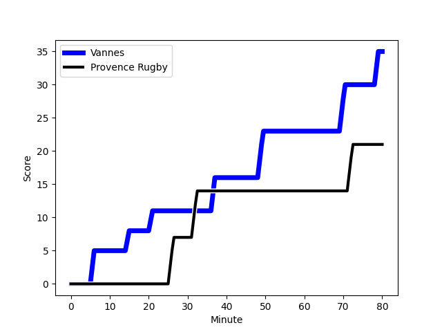
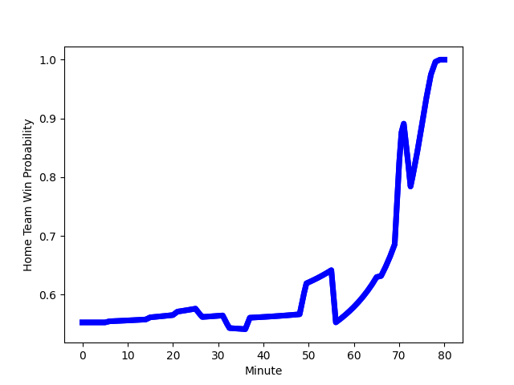

---  
layout: page  
title: Provence Rugby at Vannes; 21-35  
date: 2022-12-16 19:30:00 18:00:00 -0500  
categories: match review  
---
# Provence Rugby (1404.47) at Vannes (1478.96); 21-35

# Prediction: Vannes by 10.4

Vannes by 7.4 on a neutral field
## Scores over Time

## Win Probability over Time

# Pre-Match Prediction: Vannes by 9.8

Vannes by 6.8 on a neutral pitch

|   Away Minutes | Away Player                                                              |   Away elo |   Away Percentile |   Number |   Home Percentile |   Home elo | Home Player                                                                |   Home Minutes |
|---------------:|:-------------------------------------------------------------------------|-----------:|------------------:|---------:|------------------:|-----------:|:---------------------------------------------------------------------------|---------------:|
|             56 | [Federico Wegrzyn](..//playerfiles//FedericoWegrzyn_cleaned.md)          |     112.71 |                93 |        1 |                57 |      97.82 | [Andy Bordelai](..//playerfiles//AndyBordelai_cleaned.md)                  |             56 |
|             45 | [German Kessler Lordon](..//playerfiles//GermanKesslerLordon_cleaned.md) |      96.38 |                55 |        2 |                46 |      93.06 | [Pat Leafa](..//playerfiles//PatLeafa_cleaned.md)                          |             56 |
|             56 | [Luke Tagi](..//playerfiles//LukeTagi_cleaned.md)                        |      93.6  |                40 |        3 |                34 |      92.5  | [John Afoa](..//playerfiles//JohnAfoa_cleaned.md)                          |             56 |
|             45 | [Charly Gambini](..//playerfiles//CharlyGambini_cleaned.md)              |      95.91 |               nan |        4 |                74 |     103.03 | [Edoardo Iachizzi](..//playerfiles//EdoardoIachizzi_cleaned.md)            |             56 |
|             80 | [Hans N'kinsi](..//playerfiles//HansN'kinsi_cleaned.md)                  |      73.38 |                 3 |        5 |                47 |      94.68 | [Ewan Thomas Johnson](..//playerfiles//EwanThomasJohnson_cleaned.md)       |             56 |
|             66 | [Nicolas Mousties](..//playerfiles//NicolasMousties_cleaned.md)          |      86.93 |                15 |        6 |                70 |     102.75 | [Léon Boulier](..//playerfiles//LéonBoulier_cleaned.md)                    |             66 |
|             80 | [Jessy Jegerlehner](..//playerfiles//JessyJegerlehner_cleaned.md)        |      62.33 |                 0 |        7 |                98 |     132.7  | [Francisco Gorrissen](..//playerfiles//FranciscoGorrissen_cleaned.md)      |             80 |
|             80 | [Carl Axtens](..//playerfiles//CarlAxtens_cleaned.md)                    |      84.22 |                12 |        8 |                78 |     102.08 | [Joe Edwards](..//playerfiles//JoeEdwards_cleaned.md)                      |             80 |
|             65 | [Simon Tarel](..//playerfiles//SimonTarel_cleaned.md)                    |      95.13 |                46 |        9 |                62 |      96.83 | [Alexandre Gouaux](..//playerfiles//AlexandreGouaux_cleaned.md)            |             66 |
|             45 | [Johnny McPhillips](..//playerfiles//JohnnyMcPhillips_cleaned.md)        |      90.82 |                30 |       10 |                25 |      90.27 | [Maxime Lafage](..//playerfiles//MaximeLafage_cleaned.md)                  |             76 |
|             80 | [Kevin Bly](..//playerfiles//KevinBly_cleaned.md)                        |     106.72 |                82 |       11 |                55 |      97    | [Théo Bastardie](..//playerfiles//ThéoBastardie_cleaned.md)                |             80 |
|             80 | [Louis Marrou](..//playerfiles//LouisMarrou_cleaned.md)                  |     113.19 |                88 |       12 |                36 |      92.03 | [Andres Vilaseca Hontou](..//playerfiles//AndresVilasecaHontou_cleaned.md) |             80 |
|             68 | [Dorian Lavernhe](..//playerfiles//DorianLavernhe_cleaned.md)            |      86.71 |                18 |       13 |                56 |      97.74 | [Nicolas Freitas](..//playerfiles//NicolasFreitas_cleaned.md)              |             80 |
|             80 | [Nadir Bouhedjeur](..//playerfiles//NadirBouhedjeur_cleaned.md)          |     109.16 |                85 |       14 |                41 |      93.75 | [Nathanael Hulleu](..//playerfiles//NathanaelHulleu_cleaned.md)            |             80 |
|             80 | [Léo Drouet](..//playerfiles//LéoDrouet_cleaned.md)                      |     103.37 |                77 |       15 |                87 |     111.01 | [Romaric Camou](..//playerfiles//RomaricCamou_cleaned.md)                  |             80 |
|             35 | [Lucas Martin](..//playerfiles//LucasMartin_cleaned.md)                  |      97.04 |                58 |       16 |                18 |      87.72 | [Ximun Bessonart](..//playerfiles//XimunBessonart_cleaned.md)              |             24 |
|             35 | [Enzo Selponi](..//playerfiles//EnzoSelponi_cleaned.md)                  |     116.03 |                91 |       17 |                 0 |      63.7  | [Eric Marks](..//playerfiles//EricMarks_cleaned.md)                        |             24 |
|             35 | [Dave Lolohea](..//playerfiles//DaveLolohea_cleaned.md)                  |      71.21 |                 1 |       18 |                63 |      98.16 | [Cyril Blanchard](..//playerfiles//CyrilBlanchard_cleaned.md)              |             24 |
|             24 | [Mohammed Loukia](..//playerfiles//MohammedLoukia_cleaned.md)            |      92.9  |                42 |       19 |                 7 |      78.44 | [Myles Edwards](..//playerfiles//MylesEdwards_cleaned.md)                  |             24 |
|             24 | [Thomas Vernet](..//playerfiles//ThomasVernet_cleaned.md)                |      87.12 |                13 |       20 |                95 |     114.9  | [Paga Tafili](..//playerfiles//PagaTafili_cleaned.md)                      |             24 |
|             15 | [Jeremie Martin](..//playerfiles//JeremieMartin_cleaned.md)              |      95.09 |               nan |       21 |                10 |      83.97 | [Hugo Zabalza](..//playerfiles//HugoZabalza_cleaned.md)                    |             14 |
|             14 | [Loick Jammes](..//playerfiles//LoickJammes_cleaned.md)                  |      79.51 |                 4 |       22 |                 1 |      70.63 | [Gregoire Bazin](..//playerfiles//GregoireBazin_cleaned.md)                |             14 |
|             12 | [Adrian Sanday](..//playerfiles//AdrianSanday_cleaned.md)                |     104.04 |                71 |       23 |                85 |     110.71 | [Quentin Etienne Lecoq](..//playerfiles//QuentinEtienneLecoq_cleaned.md)   |              4 |

