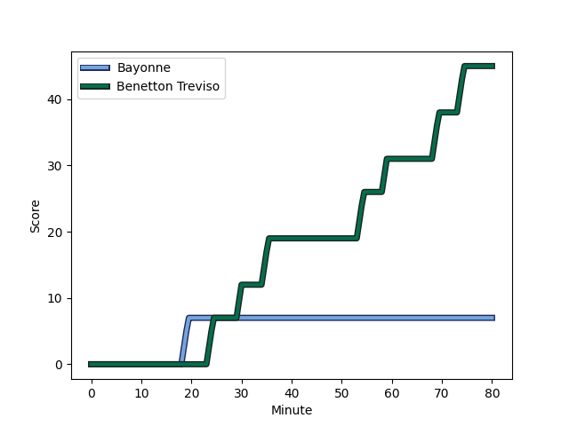
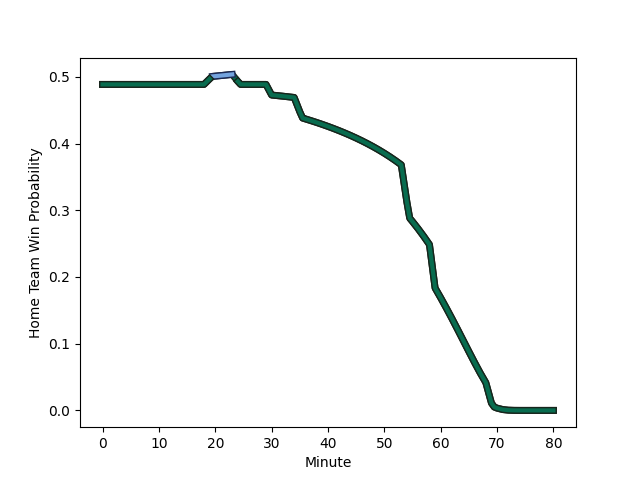

---  
layout: page  
title: Benetton Treviso at Bayonne; 45-7  
date: 2022-12-17 18:30:00 18:00:00 -0500  
categories: match review  
---
# Benetton Treviso (1445.08) at Bayonne (1425.4); 45-7

# Prediction: Bayonne by 1.0

Benetton Treviso by 2.0 on a neutral field
## Scores over Time

## Win Probability over Time

# Pre-Match Prediction: Benetton Treviso by 1.1

Benetton Treviso by 1.9 on a neutral pitch

|   Away Minutes | Away Player                                                              |   Away elo |   Away Percentile |   Number |   Home Percentile |   Home elo | Home Player                                                       |   Home Minutes |
|---------------:|:-------------------------------------------------------------------------|-----------:|------------------:|---------:|------------------:|-----------:|:------------------------------------------------------------------|---------------:|
|             80 | [Nahuel Tetaz Chaparro](..//playerfiles//NahuelTetazChaparro_cleaned.md) |     100.44 |                71 |        1 |                13 |      87    | [Pieter Scholtz](..//playerfiles//PieterScholtz_cleaned.md)       |             80 |
|             80 | [Gianmarco Lucchesi](..//playerfiles//GianmarcoLucchesi_cleaned.md)      |      93.81 |                44 |        2 |                96 |     118.01 | [Thomas Acquier](..//playerfiles//ThomasAcquier_cleaned.md)       |             80 |
|             80 | [Simone Ferrari](..//playerfiles//SimoneFerrari_cleaned.md)              |     101.88 |                75 |        3 |                 8 |      83.78 | [Chris Talakai](..//playerfiles//ChrisTalakai_cleaned.md)         |             80 |
|             80 | [Marco Lazzaroni](..//playerfiles//MarcoLazzaroni_cleaned.md)            |      68.72 |                 1 |        4 |                43 |      93.96 | [Geoff Cridge](..//playerfiles//GeoffCridge_cleaned.md)           |             80 |
|             80 | [Federico Ruzza](..//playerfiles//FedericoRuzza_cleaned.md)              |     100.22 |                69 |        5 |                75 |     102.62 | [Manuel Leindekar](..//playerfiles//ManuelLeindekar_cleaned.md)   |             80 |
|             80 | [Sebastian Negri](..//playerfiles//SebastianNegri_cleaned.md)            |      83.51 |                 9 |        6 |                25 |      89.83 | [Pierre Huguet](..//playerfiles//PierreHuguet_cleaned.md)         |             80 |
|             80 | [Michele Lamaro](..//playerfiles//MicheleLamaro_cleaned.md)              |     109.52 |                87 |        7 |               nan |      95    | [Esteban Capilla](..//playerfiles//EstebanCapilla_cleaned.md)     |             80 |
|             80 | [Lorenzo Cannone](..//playerfiles//LorenzoCannone_cleaned.md)            |     105.39 |                78 |        8 |                22 |      87.61 | [Aitor Hourcade](..//playerfiles//AitorHourcade_cleaned.md)       |             80 |
|             80 | [Alessandro Garbisi](..//playerfiles//AlessandroGarbisi_cleaned.md)      |      95.51 |                48 |        9 |                85 |     108.74 | [Michael Ruru](..//playerfiles//MichaelRuru_cleaned.md)           |             80 |
|             80 | [Tomas Albornoz](..//playerfiles//TomasAlbornoz_cleaned.md)              |     109.83 |                83 |       10 |                 5 |      78.47 | [Jason Robertson](..//playerfiles//JasonRobertson_cleaned.md)     |             55 |
|             80 | [Onisi Ratave](..//playerfiles//OnisiRatave_cleaned.md)                  |      91.34 |                30 |       11 |                60 |      98.26 | [Victor Hannoun](..//playerfiles//VictorHannoun_cleaned.md)       |             80 |
|             67 | [Joaquin Riera](..//playerfiles//JoaquinRiera_cleaned.md)                |      89.41 |                24 |       12 |                62 |      99.26 | [Guillaume Martocq](..//playerfiles//GuillaumeMartocq_cleaned.md) |             80 |
|             80 | [Juan Ignacio Brex](..//playerfiles//JuanIgnacioBrex_cleaned.md)         |      99.97 |                64 |       13 |                94 |     118.33 | [Peyo Muscarditz](..//playerfiles//PeyoMuscarditz_cleaned.md)     |             80 |
|             80 | [Marcus Watson](..//playerfiles//MarcusWatson_cleaned.md)                |      96.92 |                54 |       14 |                 3 |      73.5  | [Bastien Pourailly](..//playerfiles//BastienPourailly_cleaned.md) |             80 |
|             80 | [Rhyno Smith](..//playerfiles//RhynoSmith_cleaned.md)                    |     100.58 |                67 |       15 |               nan |      91.78 | [Tom Spring](..//playerfiles//TomSpring_cleaned.md)               |             80 |
|             13 | [MISSINGNO](..//playerfiles//MISSINGNO_cleaned.md)                       |       8.63 |               nan |       30 |               nan |       8.63 | [MISSINGNO](..//playerfiles//MISSINGNO_cleaned.md)                |             25 |

