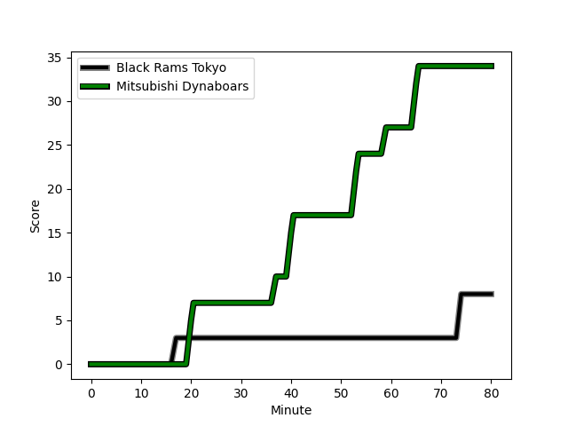
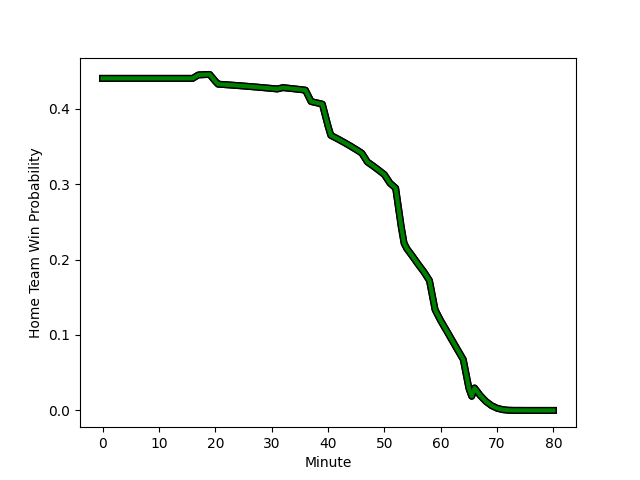

---  
layout: page  
title: Mitsubishi Dynaboars at Black Rams Tokyo; 34-8  
date: 2022-12-17 00:00:00 18:00:00 -0500  
categories: match review  
---
# Mitsubishi Dynaboars (1524.87) at Black Rams Tokyo (1420.45); 34-8

# Prediction: Mitsubishi Dynaboars by 7.4

Mitsubishi Dynaboars by 10.4 on a neutral field
## Scores over Time

## Win Probability over Time

# Pre-Match Prediction: Mitsubishi Dynaboars by 4.5

Mitsubishi Dynaboars by 7.5 on a neutral pitch

|   Away Minutes | Away Player                                                                 |   Away elo |   Away Percentile |   Number |   Home Percentile |   Home elo | Home Player                                                         |   Home Minutes |
|---------------:|:----------------------------------------------------------------------------|-----------:|------------------:|---------:|------------------:|-----------:|:--------------------------------------------------------------------|---------------:|
|             60 | [Naoki Kawamata](..//playerfiles//NaokiKawamata_cleaned.md)                 |     113.37 |                95 |        1 |               nan |      87.77 | [Kazuma Nishi](..//playerfiles//KazumaNishi_cleaned.md)             |             54 |
|             66 | [Yuki Miyazato](..//playerfiles//YukiMiyazato_cleaned.md)                   |      88.28 |                21 |        2 |                85 |     105.23 | [Hinata Takei](..//playerfiles//HinataTakei_cleaned.md)             |             75 |
|             51 | [Jun Morimoto](..//playerfiles//JunMorimoto_cleaned.md)                     |      97    |                55 |        3 |                39 |      91.08 | [Daigo Sasagawa](..//playerfiles//DaigoSasagawa_cleaned.md)         |             75 |
|             66 | [Daniel Linde](..//playerfiles//DanielLinde_cleaned.md)                     |     103.68 |                78 |        4 |                 5 |      76.39 | [Daiki Yanagawa](..//playerfiles//DaikiYanagawa_cleaned.md)         |             80 |
|             66 | [Walt Steenkamp](..//playerfiles//WaltSteenkamp_cleaned.md)                 |     102.88 |                75 |        5 |                 1 |      65.61 | [Mike Stolberg](..//playerfiles//MikeStolberg_cleaned.md)           |             51 |
|             80 | [Masataka Tsuruya](..//playerfiles//MasatakaTsuruya_cleaned.md)             |     116.15 |                95 |        6 |                 4 |      76.44 | [Amato Fakatava](..//playerfiles//AmatoFakatava_cleaned.md)         |             80 |
|             80 | [Yusuke Sakamoto](..//playerfiles//YusukeSakamoto_cleaned.md)               |      95    |               nan |        7 |                78 |     103.75 | [Shininchi Tanaka](..//playerfiles//ShininchiTanaka_cleaned.md)     |             47 |
|             80 | [Jackson Hemopo](..//playerfiles//JacksonHemopo_cleaned.md)                 |     113.79 |                91 |        8 |                93 |     120.79 | [Nathan Hughes](..//playerfiles//NathanHughes_cleaned.md)           |             60 |
|             80 | [Kota Iwamura](..//playerfiles//KotaIwamura_cleaned.md)                     |     114.24 |                92 |        9 |                77 |     103.47 | [Syota Yamamoto](..//playerfiles//SyotaYamamoto_cleaned.md)         |             57 |
|             80 | [Brackin Karauria-Henry](..//playerfiles//BrackinKarauria-Henry_cleaned.md) |      88.59 |                22 |       10 |                19 |      87.78 | [Isaac Lucas](..//playerfiles//IsaacLucas_cleaned.md)               |             80 |
|             80 | [Tomoyuki Ochiai](..//playerfiles//TomoyukiOchiai_cleaned.md)               |      95    |               nan |       11 |                11 |      84.93 | [Netani Vakayalia](..//playerfiles//NetaniVakayalia_cleaned.md)     |             80 |
|             66 | [Curtis Rona](..//playerfiles//CurtisRona_cleaned.md)                       |      90.63 |                29 |       12 |                90 |     113.77 | [Hadleigh Parkes](..//playerfiles//HadleighParkes_cleaned.md)       |             80 |
|             80 | [Matt Vaega](..//playerfiles//MattVaega_cleaned.md)                         |      97.99 |                59 |       13 |                80 |     106.71 | [Yuki Ikeda](..//playerfiles//YukiIkeda_cleaned.md)                 |             80 |
|             32 | [Jonmoon Han](..//playerfiles//JonmoonHan_cleaned.md)                       |      95    |               nan |       14 |                76 |     103.23 | [Daisuke Nishikawa](..//playerfiles//DaisukeNishikawa_cleaned.md)   |             51 |
|             80 | [Roland Alaiasa](..//playerfiles//RolandAlaiasa_cleaned.md)                 |     100.21 |                67 |       15 |                23 |      89.71 | [Main Taira](..//playerfiles//MainTaira_cleaned.md)                 |             80 |
|             48 | [Kazuki Ishida](..//playerfiles//KazukiIshida_cleaned.md)                   |      97.47 |                57 |       16 |                33 |      91.79 | [Shuhei Matsuhashi](..//playerfiles//ShuheiMatsuhashi_cleaned.md)   |             33 |
|             29 | [Tomoaki Ishii](..//playerfiles//TomoakiIshii_cleaned.md)                   |     129.44 |                99 |       17 |                98 |     133.76 | [Brodi McCurran](..//playerfiles//BrodiMcCurran_cleaned.md)         |             29 |
|             20 | [Shunsuke Sakamoto](..//playerfiles//ShunsukeSakamoto_cleaned.md)           |      95    |               nan |       18 |                29 |      90.01 | [Matt McGahan](..//playerfiles//MattMcGahan_cleaned.md)             |             29 |
|             14 | [Yoshimitsu Yasue](..//playerfiles//YoshimitsuYasue_cleaned.md)             |     107.21 |                86 |       19 |                42 |      94.38 | [Yuichiro Taniguchi](..//playerfiles//YuichiroTaniguchi_cleaned.md) |             26 |
|             14 | [Sam Chongkit](..//playerfiles//SamChongkit_cleaned.md)                     |     109.44 |                87 |       20 |                39 |      91.55 | [Takanobu Minami](..//playerfiles//TakanobuMinami_cleaned.md)       |             23 |
|             14 | [Epineri Uluiviti](..//playerfiles//EpineriUluiviti_cleaned.md)             |      86.37 |                16 |       21 |                15 |      85.25 | [Josh Goodhue](..//playerfiles//JoshGoodhue_cleaned.md)             |             20 |
|             14 | [James Shillcock](..//playerfiles//JamesShillcock_cleaned.md)               |     107.62 |                82 |       22 |                38 |      92.45 | [Kazuhiro Shibata](..//playerfiles//KazuhiroShibata_cleaned.md)     |              5 |
|            nan | nan                                                                         |     nan    |               nan |       23 |                23 |      87.53 | [Masaaki Onishi](..//playerfiles//MasaakiOnishi_cleaned.md)         |              5 |

