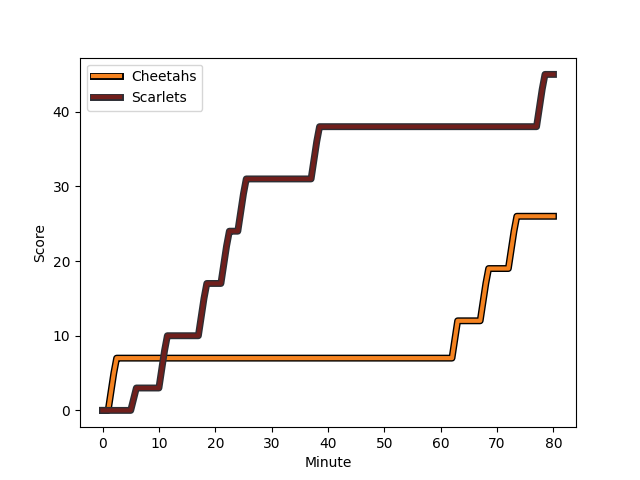
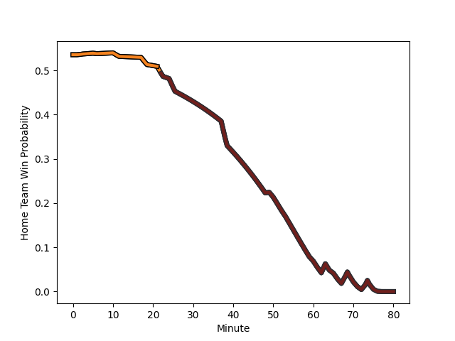

---  
layout: page  
title: Scarlets at Cheetahs; 45-26  
date: 2022-12-17 16:15:00 18:00:00 -0500  
categories: match review  
---
# Scarlets (1472.51) at Cheetahs (1553.79); 45-26

# Prediction: Cheetahs by 11.1

Cheetahs by 8.1 on a neutral field
## Scores over Time

## Win Probability over Time

# Pre-Match Prediction: Cheetahs by 5.2

Cheetahs by 2.2 on a neutral pitch

|   Away Minutes | Away Player                                                     |   Away elo |   Away Percentile |   Number |   Home Percentile |   Home elo | Home Player                                                                              |   Home Minutes |
|---------------:|:----------------------------------------------------------------|-----------:|------------------:|---------:|------------------:|-----------:|:-----------------------------------------------------------------------------------------|---------------:|
|             60 | [Kemsley Mathias](..//playerfiles//KemsleyMathias_cleaned.md)   |      97.54 |                56 |        1 |                 3 |      78.84 | [Schalk Ferreira](..//playerfiles//SchalkFerreira_cleaned.md)                            |             79 |
|             41 | [Ryan Elias](..//playerfiles//RyanElias_cleaned.md)             |     109.78 |                90 |        2 |                97 |     120.45 | [Marko Louis Janse van Rensburg](..//playerfiles//MarkoLouisJansevanRensburg_cleaned.md) |             53 |
|             60 | [WillGriff John](..//playerfiles//WillGriffJohn_cleaned.md)     |     107.89 |                87 |        3 |                94 |     114.22 | [Aranos Coetzee](..//playerfiles//AranosCoetzee_cleaned.md)                              |             76 |
|             65 | [Sam Lousi](..//playerfiles//SamLousi_cleaned.md)               |     105.85 |                82 |        4 |                57 |      98.4  | [Rynier Bernardo](..//playerfiles//RynierBernardo_cleaned.md)                            |             79 |
|             80 | [Vaea Fifita](..//playerfiles//VaeaFifita_cleaned.md)           |     116.93 |                94 |        5 |                89 |     111.73 | [Victor Kutlwano Sekekete](..//playerfiles//VictorKutlwanoSekekete_cleaned.md)           |             80 |
|             50 | [Aaron Shingler](..//playerfiles//AaronShingler_cleaned.md)     |      98.6  |                62 |        6 |                51 |      97.08 | [Daniel Johannes Maartens](..//playerfiles//DanielJohannesMaartens_cleaned.md)           |             80 |
|             80 | [Josh MacLeod](..//playerfiles//JoshMacLeod_cleaned.md)         |      90.77 |                28 |        7 |                64 |     100.89 | [Friedle Olivier](..//playerfiles//FriedleOlivier_cleaned.md)                            |             80 |
|             80 | [Sione Kalamafoni](..//playerfiles//SioneKalamafoni_cleaned.md) |     103.44 |                77 |        8 |                81 |     105.72 | [Jeandre Rudolph](..//playerfiles//JeandreRudolph_cleaned.md)                            |             79 |
|             41 | [Dane Blacker](..//playerfiles//DaneBlacker_cleaned.md)         |      78.12 |                 3 |        9 |                96 |     121.31 | [Ruan Pienaar](..//playerfiles//RuanPienaar_cleaned.md)                                  |             80 |
|             80 | [Sam Costelow](..//playerfiles//SamCostelow_cleaned.md)         |      74.69 |                 3 |       10 |                72 |     102.51 | [Siya Masuku](..//playerfiles//SiyaMasuku_cleaned.md)                                    |             80 |
|             80 | [Ryan Conbeer](..//playerfiles//RyanConbeer_cleaned.md)         |      92.77 |                37 |       11 |                84 |     108.22 | [Munier Hartzenberg](..//playerfiles//MunierHartzenberg_cleaned.md)                      |             80 |
|             69 | [Scott Williams](..//playerfiles//ScottWilliams_cleaned.md)     |     101.94 |                70 |       12 |                53 |      97.21 | [Reinhardt Fortuin](..//playerfiles//ReinhardtFortuin_cleaned.md)                        |             69 |
|             80 | [Ioan Nicholas](..//playerfiles//IoanNicholas_cleaned.md)       |      94.94 |                45 |       13 |                86 |     111.18 | [David Benjamin Brits](..//playerfiles//DavidBenjaminBrits_cleaned.md)                   |             80 |
|             80 | [Steffan Evans](..//playerfiles//SteffanEvans_cleaned.md)       |     100.6  |                61 |       14 |                82 |     106.16 | [Daniel Kasende Kalepula](..//playerfiles//DanielKasendeKalepula_cleaned.md)             |             80 |
|             49 | [Johnny McNicholl](..//playerfiles//JohnnyMcNicholl_cleaned.md) |     113.49 |                91 |       15 |                15 |      86.73 | [Tapiwa Lloyd Mafura](..//playerfiles//TapiwaLloydMafura_cleaned.md)                     |             80 |
|             20 | [Steffan Thomas](..//playerfiles//SteffanThomas_cleaned.md)     |      88.48 |                21 |       16 |                56 |      98.6  | [Mzamo Majola](..//playerfiles//MzamoMajola_cleaned.md)                                  |              1 |
|             39 | [Ken Owens](..//playerfiles//KenOwens_cleaned.md)               |      94.94 |                46 |       17 |                87 |     107.42 | [Louis van der Westhuizen](..//playerfiles//LouisvanderWesthuizen_cleaned.md)            |             27 |
|             20 | [Javan Sebastian](..//playerfiles//JavanSebastian_cleaned.md)   |      85.3  |                12 |       18 |                13 |      87.33 | [Hencus van Wyk](..//playerfiles//HencusvanWyk_cleaned.md)                               |              4 |
|             15 | [Tom Price](..//playerfiles//TomPrice_cleaned.md)               |      68.99 |                 1 |       19 |                25 |      89.3  | [Mzwanele Richman Zito](..//playerfiles//MzwaneleRichmanZito_cleaned.md)                 |              1 |
|             30 | [Tomas Lezana](..//playerfiles//TomasLezana_cleaned.md)         |      92.9  |                36 |       20 |                86 |     111.43 | [Sibabalo Qoma](..//playerfiles//SibabaloQoma_cleaned.md)                                |              1 |
|             39 | [Kieran Hardy](..//playerfiles//KieranHardy_cleaned.md)         |     108.67 |                89 |       21 |                16 |      87.61 | [Robert Ebersohn](..//playerfiles//RobertEbersohn_cleaned.md)                            |             11 |
|             11 | [Rhys Patchell](..//playerfiles//RhysPatchell_cleaned.md)       |     134.73 |                98 |       22 |               nan |     nan    | nan                                                                                      |            nan |
|             31 | [Leigh Halfpenny](..//playerfiles//LeighHalfpenny_cleaned.md)   |      87.59 |                26 |       23 |               nan |     nan    | nan                                                                                      |            nan |

