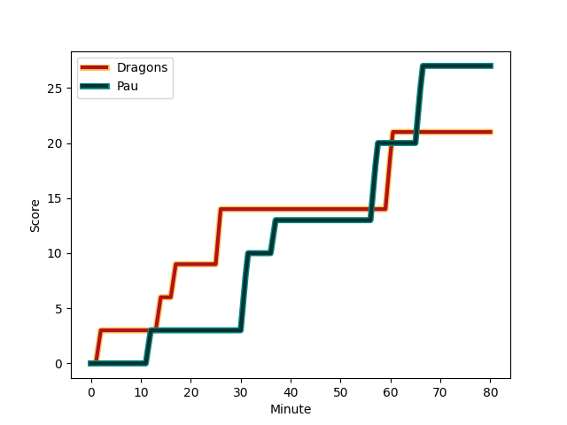

---  
layout: page  
title: Pau at Dragons; 27-21  
date: 2022-12-17 18:30:00 18:00:00 -0500  
categories: match review  
---
# Pau (1429.68) at Dragons (1498.7); 27-21

# Prediction: Dragons by 9.9

Dragons by 6.9 on a neutral field
## Scores over Time

## Win Probability over Time

# Pre-Match Prediction: Dragons by 7.9

Dragons by 4.9 on a neutral pitch

|   Away Minutes | Away Player                                                           |   Away elo |   Away Percentile |   Number |   Home Percentile |   Home elo | Home Player                                                       |   Home Minutes |
|---------------:|:----------------------------------------------------------------------|-----------:|------------------:|---------:|------------------:|-----------:|:------------------------------------------------------------------|---------------:|
|             47 | [Remi Seneca](..//playerfiles//RemiSeneca_cleaned.md)                 |     104.86 |                81 |        1 |                38 |      93.2  | [Rhodri Jones](..//playerfiles//RhodriJones_cleaned.md)           |             67 |
|             56 | [Youri Delhommel](..//playerfiles//YouriDelhommel_cleaned.md)         |      89.88 |                32 |        2 |                53 |      95.99 | [Bradley Roberts](..//playerfiles//BradleyRoberts_cleaned.md)     |             80 |
|             58 | [Nicolas Corato](..//playerfiles//NicolasCorato_cleaned.md)           |      81.74 |                 6 |        3 |                61 |      98.49 | [Chris Coleman](..//playerfiles//ChrisColeman_cleaned.md)         |             59 |
|             70 | [Hugo Auradou](..//playerfiles//HugoAuradou_cleaned.md)               |      86.8  |                19 |        4 |                41 |      93.2  | [Joseph Davies](..//playerfiles//JosephDavies_cleaned.md)         |             80 |
|             51 | [Jimi Maximin](..//playerfiles//JimiMaximin_cleaned.md)               |     101.16 |                72 |        5 |                14 |      83.81 | [Matthew Screech](..//playerfiles//MatthewScreech_cleaned.md)     |             80 |
|             80 | [Martin Puech](..//playerfiles//MartinPuech_cleaned.md)               |      99.01 |                63 |        6 |                53 |      96.23 | [Sean Lonsdale](..//playerfiles//SeanLonsdale_cleaned.md)         |             71 |
|             80 | [Thibault Hamonou](..//playerfiles//ThibaultHamonou_cleaned.md)       |      80.82 |                 6 |        7 |                 3 |      76    | [Harrison Keddie](..//playerfiles//HarrisonKeddie_cleaned.md)     |             80 |
|             80 | [Brent Liufau](..//playerfiles//BrentLiufau_cleaned.md)               |      95    |               nan |        8 |                85 |     107.86 | [Aaron Wainwright](..//playerfiles//AaronWainwright_cleaned.md)   |             47 |
|             57 | [Clovis Le bail](..//playerfiles//ClovisLebail_cleaned.md)            |     108.22 |                84 |        9 |                93 |     115.41 | [Rhodri Williams](..//playerfiles//RhodriWilliams_cleaned.md)     |             71 |
|             80 | [Thibault Debaes](..//playerfiles//ThibaultDebaes_cleaned.md)         |      95.42 |                45 |       10 |                91 |     117.01 | [Sam Davies](..//playerfiles//SamDavies_cleaned.md)               |             53 |
|             80 | [Eoghan Barrett](..//playerfiles//EoghanBarrett_cleaned.md)           |      91.2  |                29 |       11 |                74 |     102.35 | [Ashton Hewitt](..//playerfiles//AshtonHewitt_cleaned.md)         |             80 |
|             73 | [Jale Vatubua](..//playerfiles//JaleVatubua_cleaned.md)               |      99.39 |                61 |       12 |                91 |     115.56 | [Jack Dixon](..//playerfiles//JackDixon_cleaned.md)               |             51 |
|             51 | [Nathan Decron](..//playerfiles//NathanDecron_cleaned.md)             |     113.73 |                88 |       13 |                89 |     114.56 | [Sio Tomkinson](..//playerfiles//SioTomkinson_cleaned.md)         |             80 |
|             80 | [Thomas Carol](..//playerfiles//ThomasCarol_cleaned.md)               |      85.35 |                13 |       14 |                 1 |      70.38 | [Rio Dyer](..//playerfiles//RioDyer_cleaned.md)                   |             80 |
|             80 | [Mathias Colombet](..//playerfiles//MathiasColombet_cleaned.md)       |      86.68 |                18 |       15 |                91 |     114.08 | [Jordan Williams](..//playerfiles//JordanWilliams_cleaned.md)     |             80 |
|             33 | [Siegfried Fisi'ihoi](..//playerfiles//SiegfriedFisi'ihoi_cleaned.md) |     122.25 |                98 |       16 |                95 |     116.11 | [Rob Evans](..//playerfiles//RobEvans_cleaned.md)                 |             13 |
|             22 | [Maks van Dyk](..//playerfiles//MaksvanDyk_cleaned.md)                |     103.92 |                81 |       17 |                20 |      88.95 | [Lloyd Fairbrother](..//playerfiles//LloydFairbrother_cleaned.md) |             21 |
|             24 | [Romain Ruffenach](..//playerfiles//RomainRuffenach_cleaned.md)       |     102.14 |                73 |       18 |                88 |     112.7  | [Ross Moriarty](..//playerfiles//RossMoriarty_cleaned.md)         |             33 |
|             10 | [Sacha Zegueur](..//playerfiles//SachaZegueur_cleaned.md)             |      96.01 |                47 |       19 |               nan |      95    | [Ryan Woodman](..//playerfiles//RyanWoodman_cleaned.md)           |              9 |
|             29 | [Fabrice Metz](..//playerfiles//FabriceMetz_cleaned.md)               |     101.46 |                73 |       20 |                68 |     101.17 | [Lewis Jones](..//playerfiles//LewisJones_cleaned.md)             |              9 |
|             29 | [Elliot Roudil](..//playerfiles//ElliotRoudil_cleaned.md)             |      83.56 |                11 |       21 |                93 |     118.21 | [Max Clark](..//playerfiles//MaxClark_cleaned.md)                 |             27 |
|              7 | [Gregoire Arfeuil](..//playerfiles//GregoireArfeuil_cleaned.md)       |      95    |               nan |       22 |                94 |     122.93 | [JJ Hanrahan](..//playerfiles//JJHanrahan_cleaned.md)             |             29 |
|             23 | [Dan Robson](..//playerfiles//DanRobson_cleaned.md)                   |     120.5  |                96 |       23 |               nan |     nan    | nan                                                               |            nan |

