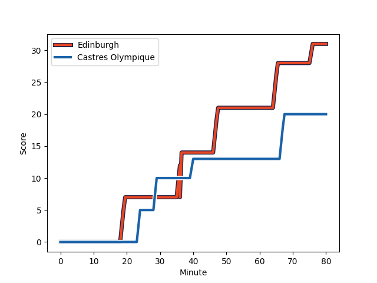
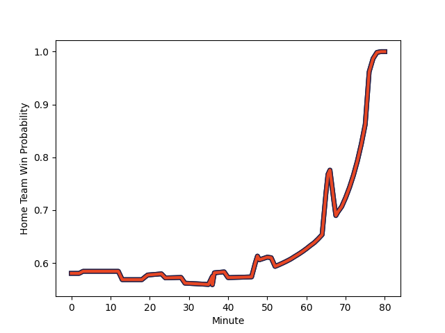

---  
layout: page  
title: Castres Olympique at Edinburgh; 20-31  
date: 2022-12-17 14:00:00 18:00:00 -0500  
categories: match review  
---
# Castres Olympique (1414.07) at Edinburgh (1580.74); 20-31

# Prediction: Edinburgh by 19.7

Edinburgh by 16.7 on a neutral field
## Scores over Time

## Win Probability over Time

# Pre-Match Prediction: Edinburgh by 20.7

Edinburgh by 17.7 on a neutral pitch

|   Away Minutes | Away Player                                                             |   Away elo |   Away Percentile |   Number |   Home Percentile |   Home elo | Home Player                                                         |   Home Minutes |
|---------------:|:------------------------------------------------------------------------|-----------:|------------------:|---------:|------------------:|-----------:|:--------------------------------------------------------------------|---------------:|
|             52 | [Quentin Walcker](..//playerfiles//QuentinWalcker_cleaned.md)           |      88.78 |                18 |        1 |                21 |      89.7  | [Pierre Schoeman](..//playerfiles//PierreSchoeman_cleaned.md)       |             62 |
|             51 | [Pierre Colonna](..//playerfiles//PierreColonna_cleaned.md)             |      90.29 |               nan |        2 |                 3 |      79.05 | [Stuart McInally](..//playerfiles//StuartMcInally_cleaned.md)       |              3 |
|             52 | [Aurélien Azar](..//playerfiles//AurélienAzar_cleaned.md)               |      79.37 |                 3 |        3 |                99 |     127.19 | [WP Nel](..//playerfiles//WPNel_cleaned.md)                         |             62 |
|             52 | [Gauthier Maravat](..//playerfiles//GauthierMaravat_cleaned.md)         |      79.46 |                 7 |        4 |                69 |      98.25 | [Glen Young](..//playerfiles//GlenYoung_cleaned.md)                 |             57 |
|             80 | [Theo Hannoyer](..//playerfiles//TheoHannoyer_cleaned.md)               |      79.89 |                 9 |        5 |                95 |     120.25 | [Grant Gilchrist](..//playerfiles//GrantGilchrist_cleaned.md)       |             80 |
|             80 | [Baptiste Delaporte](..//playerfiles//BaptisteDelaporte_cleaned.md)     |      97.04 |                60 |        6 |                98 |     130.84 | [Jamie Ritchie](..//playerfiles//JamieRitchie_cleaned.md)           |             80 |
|             75 | [Asier Usarraga](..//playerfiles//AsierUsarraga_cleaned.md)             |      96.91 |                54 |        7 |                92 |     114.41 | [Luke Crosbie](..//playerfiles//LukeCrosbie_cleaned.md)             |             69 |
|             52 | [Kevin Kornath](..//playerfiles//KevinKornath_cleaned.md)               |      87.68 |                17 |        8 |                47 |      95.86 | [Viliame Mata](..//playerfiles//ViliameMata_cleaned.md)             |             80 |
|             62 | [Julien Blanc](..//playerfiles//JulienBlanc_cleaned.md)                 |      92.18 |                36 |        9 |                79 |     103.75 | [Ben Vellacott](..//playerfiles//BenVellacott_cleaned.md)           |             80 |
|             80 | [Ben Botica](..//playerfiles//BenBotica_cleaned.md)                     |     132.78 |                98 |       10 |                99 |     138.32 | [Blair Kinghorn](..//playerfiles//BlairKinghorn_cleaned.md)         |             13 |
|             80 | [Antoine Bouzerand](..//playerfiles//AntoineBouzerand_cleaned.md)       |      92.87 |               nan |       11 |                78 |     103.82 | [Duhan van der Merwe](..//playerfiles//DuhanvanderMerwe_cleaned.md) |             80 |
|             80 | [Adrien Seguret](..//playerfiles//AdrienSeguret_cleaned.md)             |      88.69 |                22 |       12 |                84 |     109.33 | [James Lang](..//playerfiles//JamesLang_cleaned.md)                 |             80 |
|             80 | [Antoine Zeghdar](..//playerfiles//AntoineZeghdar_cleaned.md)           |      92.5  |                36 |       13 |                74 |     103.61 | [Matt Currie](..//playerfiles//MattCurrie_cleaned.md)               |             48 |
|             80 | [Martin Laveau](..//playerfiles//MartinLaveau_cleaned.md)               |      90.94 |                29 |       14 |                89 |     111.71 | [Wes Goosen](..//playerfiles//WesGoosen_cleaned.md)                 |             80 |
|             52 | [Julien Dumora](..//playerfiles//JulienDumora_cleaned.md)               |      92.11 |                38 |       15 |                33 |      91.17 | [Emiliano Boffelli](..//playerfiles//EmilianoBoffelli_cleaned.md)   |             80 |
|             28 | [Loïs Guerois](..//playerfiles//LoïsGuerois_cleaned.md)                 |      94.74 |               nan |       16 |                92 |     108.93 | [Boan Venter](..//playerfiles//BoanVenter_cleaned.md)               |             18 |
|             28 | [Antoine Guillamon](..//playerfiles//AntoineGuillamon_cleaned.md)       |      96.92 |                55 |       17 |                54 |      96.27 | [Marshall Sykes](..//playerfiles//MarshallSykes_cleaned.md)         |             23 |
|             29 | [Brice Humbert](..//playerfiles//BriceHumbert_cleaned.md)               |     107.19 |                87 |       18 |                65 |      99.03 | [Angus Williams](..//playerfiles//AngusWilliams_cleaned.md)         |             18 |
|              5 | [Josaia Raisuqe](..//playerfiles//JosaiaRaisuqe_cleaned.md)             |      92.55 |                47 |       19 |                21 |      87.21 | [Tom Cruse](..//playerfiles//TomCruse_cleaned.md)                   |             77 |
|             28 | [Florent Vanverberghe](..//playerfiles//FlorentVanverberghe_cleaned.md) |     102.05 |                74 |       20 |                63 |     100.64 | [Ben Muncaster](..//playerfiles//BenMuncaster_cleaned.md)           |             11 |
|             18 | [Rory Kockott](..//playerfiles//RoryKockott_cleaned.md)                 |     113.42 |                92 |       21 |                57 |      98.2  | [Charlie Savala](..//playerfiles//CharlieSavala_cleaned.md)         |             67 |
|             28 | [Baptiste Cope](..//playerfiles//BaptisteCope_cleaned.md)               |      95    |               nan |       22 |                20 |      87.88 | [Chris Dean](..//playerfiles//ChrisDean_cleaned.md)                 |             32 |
|             28 | [Thomas Larregain](..//playerfiles//ThomasLarregain_cleaned.md)         |     101.41 |                69 |       23 |               nan |     nan    | nan                                                                 |            nan |

