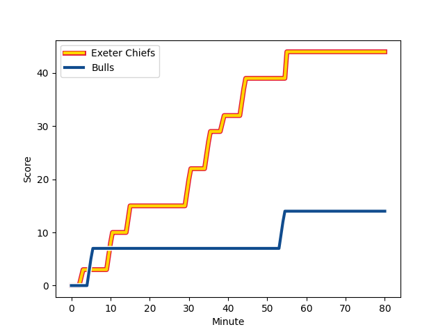
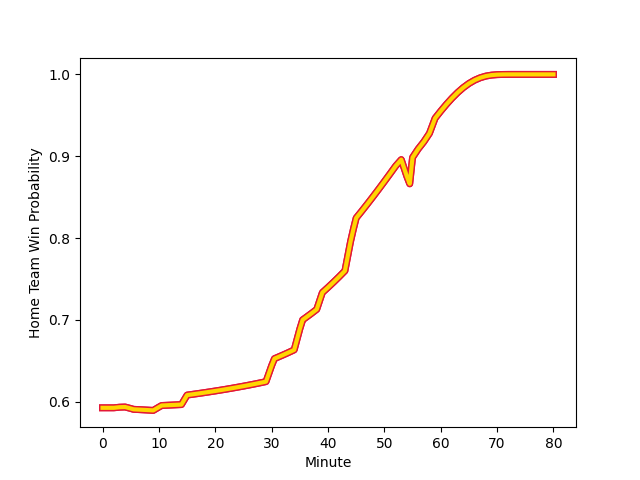

---  
layout: page  
title: Bulls at Exeter Chiefs; 14-44  
date: 2022-12-17 14:00:00 18:00:00 -0500  
categories: match review  
---
# Bulls (1470.41) at Exeter Chiefs (1632.93); 14-44

# Prediction: Exeter Chiefs by 19.3

Exeter Chiefs by 16.3 on a neutral field
## Scores over Time

## Win Probability over Time

# Pre-Match Prediction: Exeter Chiefs by 17.4

Exeter Chiefs by 14.4 on a neutral pitch

|   Away Minutes | Away Player                                                                  |   Away elo |   Away Percentile |   Number |   Home Percentile |   Home elo | Home Player                                                       |   Home Minutes |
|---------------:|:-----------------------------------------------------------------------------|-----------:|------------------:|---------:|------------------:|-----------:|:------------------------------------------------------------------|---------------:|
|             47 | [Dylan Smith](..//playerfiles//DylanSmith_cleaned.md)                        |      95.1  |                46 |        1 |                31 |      91.72 | [Scott Sio](..//playerfiles//ScottSio_cleaned.md)                 |             53 |
|             59 | [Bismarck du Plessis](..//playerfiles//BismarckduPlessis_cleaned.md)         |     116.63 |                95 |        2 |                85 |     105.27 | [Luke Cowan-Dickie](..//playerfiles//LukeCowan-Dickie_cleaned.md) |             45 |
|             57 | [Jacques van Rooyen](..//playerfiles//JacquesvanRooyen_cleaned.md)           |     112.81 |                93 |        3 |                94 |     114.41 | [Harry Williams](..//playerfiles//HarryWilliams_cleaned.md)       |             53 |
|             80 | [Reinhardt Ludwig](..//playerfiles//ReinhardtLudwig_cleaned.md)              |      89.51 |                25 |        4 |                73 |     101.71 | [Dafydd Jenkins](..//playerfiles//DafyddJenkins_cleaned.md)       |             80 |
|             80 | [Janko Swanepoel](..//playerfiles//JankoSwanepoel_cleaned.md)                |      92.11 |                36 |        5 |                86 |     109.2  | [Jonny Gray](..//playerfiles//JonnyGray_cleaned.md)               |             55 |
|             73 | [Nizaam Carr](..//playerfiles//NizaamCarr_cleaned.md)                        |     102.72 |                73 |        6 |                97 |     126.99 | [Dave Ewers](..//playerfiles//DaveEwers_cleaned.md)               |             80 |
|             80 | [Muller Uys](..//playerfiles//MullerUys_cleaned.md)                          |      99.36 |                59 |        7 |                38 |      92.55 | [Christ Tshiunza](..//playerfiles//ChristTshiunza_cleaned.md)     |             80 |
|             59 | [WJ Steenkamp](..//playerfiles//WJSteenkamp_cleaned.md)                      |      91.45 |                31 |        8 |                93 |     119.75 | [Sam Simmonds](..//playerfiles//SamSimmonds_cleaned.md)           |             55 |
|             69 | [Bernard van der Linde](..//playerfiles//BernardvanderLinde_cleaned.md)      |      96.41 |                53 |        9 |                25 |      90.42 | [Sam Maunder](..//playerfiles//SamMaunder_cleaned.md)             |             59 |
|             80 | [Morne Steyn](..//playerfiles//MorneSteyn_cleaned.md)                        |      98.05 |                55 |       10 |                92 |     118.38 | [Joe Simmonds](..//playerfiles//JoeSimmonds_cleaned.md)           |             80 |
|             80 | [Stravino Jacobs](..//playerfiles//StravinoJacobs_cleaned.md)                |      85.25 |                13 |       11 |                95 |     119.97 | [Olly Woodburn](..//playerfiles//OllyWoodburn_cleaned.md)         |             80 |
|             59 | [Chris Smith](..//playerfiles//ChrisSmith_cleaned.md)                        |     109.88 |                85 |       12 |                66 |     100.78 | [Rory O'Loughlin](..//playerfiles//RoryO'Loughlin_cleaned.md)     |             15 |
|             80 | [Stedman-Gee Rivett Gans](..//playerfiles//Stedman-GeeRivettGans_cleaned.md) |     104.47 |                76 |       13 |                94 |     118.38 | [Henry Slade](..//playerfiles//HenrySlade_cleaned.md)             |             80 |
|             80 | [Sibongile Vukile Novuka](..//playerfiles//SibongileVukileNovuka_cleaned.md) |      94.58 |                45 |       14 |                88 |     111.26 | [Jack Nowell](..//playerfiles//JackNowell_cleaned.md)             |             80 |
|             68 | [Wandisile Simelane](..//playerfiles//WandisileSimelane_cleaned.md)          |     100.42 |                66 |       15 |                86 |     111.43 | [Stuart Hogg](..//playerfiles//StuartHogg_cleaned.md)             |             57 |
|             33 | [Lizo Gqoboka](..//playerfiles//LizoGqoboka_cleaned.md)                      |      93.97 |                42 |       16 |                66 |      99.69 | [Alec Hepburn](..//playerfiles//AlecHepburn_cleaned.md)           |             27 |
|             23 | [Sebastian Lombard](..//playerfiles//SebastianLombard_cleaned.md)            |      93.96 |               nan |       17 |                99 |     127.25 | [Jack Yeandle](..//playerfiles//JackYeandle_cleaned.md)           |             35 |
|             21 | [Joe van Zyl](..//playerfiles//JoevanZyl_cleaned.md)                         |      89.14 |               nan |       18 |                69 |     100.39 | [Josh Iosefa-Scott](..//playerfiles//JoshIosefa-Scott_cleaned.md) |             27 |
|              7 | [Cameron Hanekom](..//playerfiles//CameronHanekom_cleaned.md)                |      91.48 |                32 |       19 |                85 |     108.99 | [Ruben van Heerden](..//playerfiles//RubenvanHeerden_cleaned.md)  |             25 |
|             21 | [Phumzile Maqondwana](..//playerfiles//PhumzileMaqondwana_cleaned.md)        |      95.1  |                50 |       20 |                65 |     100.03 | [Santiago Grondona](..//playerfiles//SantiagoGrondona_cleaned.md) |             25 |
|             11 | [Keagan Johannes](..//playerfiles//KeaganJohannes_cleaned.md)                |      93.27 |                42 |       21 |               nan |      95.63 | [Will Becconsall](..//playerfiles//WillBecconsall_cleaned.md)     |             21 |
|             21 | [Carlton Banies](..//playerfiles//CarltonBanies_cleaned.md)                  |      95    |               nan |       22 |                83 |     107.3  | [Solomone Kata](..//playerfiles//SolomoneKata_cleaned.md)         |             65 |
|             12 | [Juan Mostert](..//playerfiles//JuanMostert_cleaned.md)                      |      94.56 |                43 |       23 |                16 |      86.08 | [Josh Hodge](..//playerfiles//JoshHodge_cleaned.md)               |             23 |

