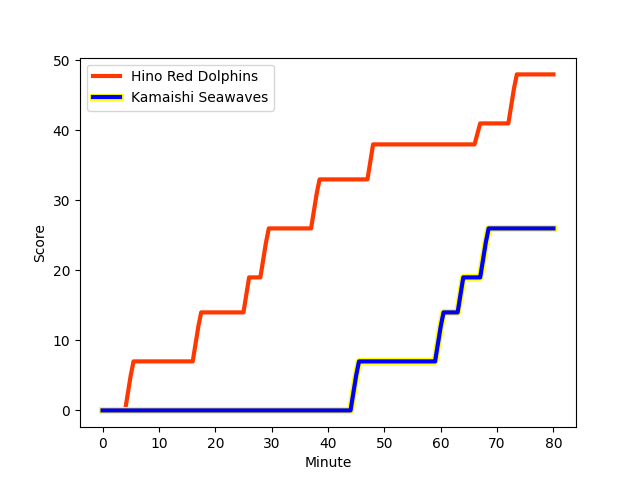
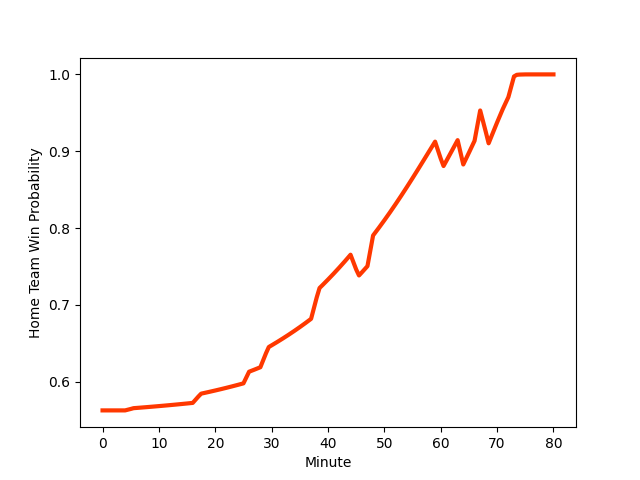

---  
layout: page  
title: Kamaishi Seawaves at Hino Red Dolphins; 26-46  
date: 2022-12-17 00:00:00 18:00:00 -0500  
categories: match review  
---
# Kamaishi Seawaves (1343.93) at Hino Red Dolphins (1453.58); 26-46

# Prediction: Hino Red Dolphins by 14.0

Hino Red Dolphins by 11.0 on a neutral field
## Scores over Time

## Win Probability over Time

# Pre-Match Prediction: Hino Red Dolphins by 14.0

Hino Red Dolphins by 11.0 on a neutral pitch

|   Away Minutes | Away Player                                                        |   Away elo |   Away Percentile |   Number |   Home Percentile |   Home elo | Home Player                                                   |   Home Minutes |
|---------------:|:-------------------------------------------------------------------|-----------:|------------------:|---------:|------------------:|-----------:|:--------------------------------------------------------------|---------------:|
|             80 | [Shoichiro Inada](..//playerfiles//ShoichiroInada_cleaned.md)      |      95    |               nan |        1 |               nan |      78.86 | [Yuichi Hisatomi](..//playerfiles//YuichiHisatomi_cleaned.md) |             80 |
|             80 | [Daiki Ito](..//playerfiles//DaikiIto_cleaned.md)                  |      81.14 |                 4 |        2 |               nan |      88.7  | [Yuki Go](..//playerfiles//YukiGo_cleaned.md)                 |             80 |
|             80 | [Taiki Noguchi](..//playerfiles//TaikiNoguchi_cleaned.md)          |      95    |               nan |        3 |                 0 |      67.82 | [Takuma Asahara](..//playerfiles//TakumaAsahara_cleaned.md)   |             80 |
|             80 | [Dallas Tatana](..//playerfiles//DallasTatana_cleaned.md)          |      91.5  |                31 |        4 |                90 |     112.57 | [Rory Arnold](..//playerfiles//RoryArnold_cleaned.md)         |             80 |
|             80 | [Ben Nee Nee](..//playerfiles//BenNeeNee_cleaned.md)               |      80.84 |                 9 |        5 |               nan |      95    | [Sione Vuna](..//playerfiles//SioneVuna_cleaned.md)           |             80 |
|             80 | [Naoki Ono](..//playerfiles//NaokiOno_cleaned.md)                  |      95    |               nan |        6 |                10 |      83.91 | [Ash Parker](..//playerfiles//AshParker_cleaned.md)           |             80 |
|             80 | [Daisuke Musya](..//playerfiles//DaisukeMusya_cleaned.md)          |     100.58 |               nan |        7 |               nan |      95    | [Noah Tovio](..//playerfiles//NoahTovio_cleaned.md)           |             80 |
|             80 | [Sam Henwood](..//playerfiles//SamHenwood_cleaned.md)              |      87.77 |                20 |        8 |                59 |      99.01 | [Ryosuke Chifu](..//playerfiles//RyosukeChifu_cleaned.md)     |             80 |
|             80 | [Youhei Murakami](..//playerfiles//YouheiMurakami_cleaned.md)      |      83.71 |                 9 |        9 |                90 |     111.95 | [Augustine Pulu](..//playerfiles//AugustinePulu_cleaned.md)   |             80 |
|             80 | [Joshua Stander](..//playerfiles//JoshuaStander_cleaned.md)        |      98.89 |                57 |       10 |                82 |     109.29 | [Riku Kitahara](..//playerfiles//RikuKitahara_cleaned.md)     |             80 |
|             80 | [Kodai Ono](..//playerfiles//KodaiOno_cleaned.md)                  |      73.05 |                 2 |       11 |                81 |     105.66 | [Chance Peni](..//playerfiles//ChancePeni_cleaned.md)         |             80 |
|             80 | [Osuka Lloyd Murata](..//playerfiles//OsukaLloydMurata_cleaned.md) |      84.1  |               nan |       12 |                80 |     104.8  | [Taiki Kawai](..//playerfiles//TaikiKawai_cleaned.md)         |             80 |
|             80 | [Kohei Ishigaki](..//playerfiles//KoheiIshigaki_cleaned.md)        |     103.92 |                78 |       13 |                78 |     105.25 | [TJ Faiane](..//playerfiles//TJFaiane_cleaned.md)             |             80 |
|             80 | [Ryuji Abe](..//playerfiles//RyujiAbe_cleaned.md)                  |      95    |               nan |       14 |                44 |      94.02 | [Ryo Kikkawa](..//playerfiles//RyoKikkawa_cleaned.md)         |             80 |
|             80 | [Cam Bailey](..//playerfiles//CamBailey_cleaned.md)                |      78.43 |                 6 |       15 |                69 |     101.73 | [Taroma Togo](..//playerfiles//TaromaTogo_cleaned.md)         |             80 |

