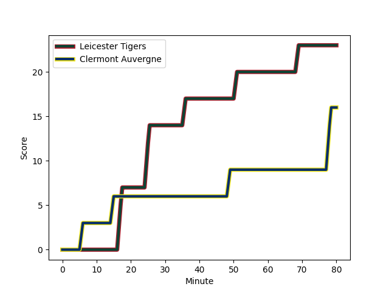
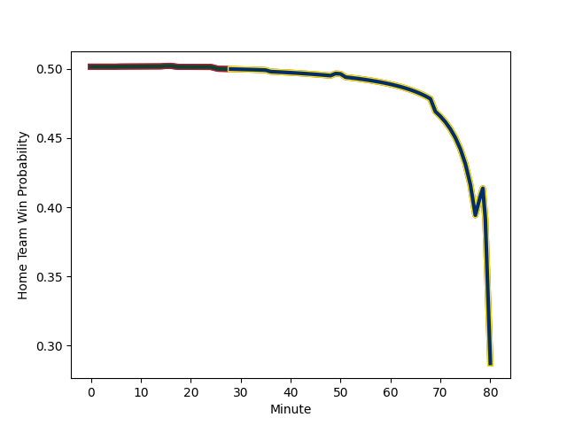

---  
layout: page  
title: Clermont Auvergne at Leicester Tigers; 16-23  
date: 2022-12-17 16:15:00 18:00:00 -0500  
categories: match review  
---
# Clermont Auvergne (1569.68) at Leicester Tigers (1559.83); 16-23

# Prediction: Leicester Tigers by 2.0

Clermont Auvergne by 1.0 on a neutral field
## Scores over Time

## Win Probability over Time

# Pre-Match Prediction: Clermont Auvergne by 4.9

Leicester Tigers by 1.9 on a neutral pitch

|   Away Minutes | Away Player                                                            |   Away elo |   Away Percentile |   Number |   Home Percentile |   Home elo | Home Player                                                             |   Home Minutes |
|---------------:|:-----------------------------------------------------------------------|-----------:|------------------:|---------:|------------------:|-----------:|:------------------------------------------------------------------------|---------------:|
|             33 | [Etienne Falgoux](..//playerfiles//EtienneFalgoux_cleaned.md)          |     108.85 |                88 |        1 |                86 |     107.44 | [James Cronin](..//playerfiles//JamesCronin_cleaned.md)                 |             49 |
|             80 | [Yohan Beheregaray](..//playerfiles//YohanBeheregaray_cleaned.md)      |      97.25 |                58 |        2 |                68 |      99.7  | [Julian Montoya](..//playerfiles//JulianMontoya_cleaned.md)             |             50 |
|             49 | [Davit Kubriashvili](..//playerfiles//DavitKubriashvili_cleaned.md)    |     119.13 |                97 |        3 |                59 |      98.09 | [Dan Cole](..//playerfiles//DanCole_cleaned.md)                         |             58 |
|             11 | [Paul Jedrasiak](..//playerfiles//PaulJedrasiak_cleaned.md)            |      92.35 |                37 |        4 |                83 |     106.59 | [Ollie Chessum](..//playerfiles//OllieChessum_cleaned.md)               |             80 |
|             80 | [Tomas Lavanini](..//playerfiles//TomasLavanini_cleaned.md)            |     110.61 |                88 |        5 |                37 |      92.38 | [Calum Green](..//playerfiles//CalumGreen_cleaned.md)                   |             49 |
|             80 | [Killian Tixeront](..//playerfiles//KillianTixeront_cleaned.md)        |      95.15 |                36 |        6 |                94 |     116.27 | [Hanro Liebenberg](..//playerfiles//HanroLiebenberg_cleaned.md)         |             80 |
|             64 | [Alexandre Fischer](..//playerfiles//AlexandreFischer_cleaned.md)      |     127.94 |                97 |        7 |                96 |     122.55 | [Tommy Reffell](..//playerfiles//TommyReffell_cleaned.md)               |             64 |
|              5 | [Arthur Iturria](..//playerfiles//ArthurIturria_cleaned.md)            |     105.64 |                80 |        8 |                85 |     110.43 | [Jasper Wiese](..//playerfiles//JasperWiese_cleaned.md)                 |             80 |
|             80 | [Sebastien Bezy](..//playerfiles//SebastienBezy_cleaned.md)            |     116.03 |                94 |        9 |                88 |     110.54 | [Ben Youngs](..//playerfiles//BenYoungs_cleaned.md)                     |             49 |
|             80 | [Anthony Belleau](..//playerfiles//AnthonyBelleau_cleaned.md)          |     109.72 |                84 |       10 |                70 |     101.93 | [Charlie Atkinson](..//playerfiles//CharlieAtkinson_cleaned.md)         |             80 |
|             80 | [Bautista Delguy](..//playerfiles//BautistaDelguy_cleaned.md)          |     108.55 |                85 |       11 |                49 |      95.47 | [Harry Potter](..//playerfiles//HarryPotter_cleaned.md)                 |             80 |
|             51 | [Apisai Naqalevu](..//playerfiles//ApisaiNaqalevu_cleaned.md)          |     108.23 |                83 |       12 |                93 |     117.82 | [Dan Kelly](..//playerfiles//DanKelly_cleaned.md)                       |             74 |
|             80 | [Cheikh Tiberghien](..//playerfiles//CheikhTiberghien_cleaned.md)      |      94.49 |                44 |       13 |                42 |      93.78 | [Guy Porter](..//playerfiles//GuyPorter_cleaned.md)                     |             80 |
|             80 | [Damian Penaud](..//playerfiles//DamianPenaud_cleaned.md)              |     104.59 |                80 |       14 |                28 |      89.5  | [Anthony Watson](..//playerfiles//AnthonyWatson_cleaned.md)             |             55 |
|             80 | [Alex Newsome](..//playerfiles//AlexNewsome_cleaned.md)                |     111.1  |                86 |       15 |                46 |      94.31 | [Freddie Steward](..//playerfiles//FreddieSteward_cleaned.md)           |             80 |
|             16 | [Benjamin Boudou](..//playerfiles//BenjaminBoudou_cleaned.md)          |      90.31 |                21 |       16 |                19 |      87.82 | [Nephi Leatigaga](..//playerfiles//NephiLeatigaga_cleaned.md)           |             31 |
|             47 | [Daniel Bibi Biziwu](..//playerfiles//DanielBibiBiziwu_cleaned.md)     |      99.49 |                74 |       17 |                22 |      89.22 | [Charlie Clare](..//playerfiles//CharlieClare_cleaned.md)               |             30 |
|             31 | [Rabah Slimani](..//playerfiles//RabahSlimani_cleaned.md)              |     100.12 |                71 |       18 |                37 |      94.55 | [Will Hurd](..//playerfiles//WillHurd_cleaned.md)                       |             22 |
|             69 | [Miles Amatosero](..//playerfiles//MilesAmatosero_cleaned.md)          |      85.89 |                18 |       19 |                96 |     120.74 | [Harry Wells](..//playerfiles//HarryWells_cleaned.md)                   |             31 |
|             75 | [Thibaud Lanen](..//playerfiles//ThibaudLanen_cleaned.md)              |      99.91 |                61 |       20 |                17 |      86.42 | [Olly Cracknell](..//playerfiles//OllyCracknell_cleaned.md)             |             16 |
|             29 | [Jean Pascal Barraque](..//playerfiles//JeanPascalBarraque_cleaned.md) |      84.46 |                17 |       21 |                91 |     113.86 | [Richard Wigglesworth](..//playerfiles//RichardWigglesworth_cleaned.md) |             31 |
|            nan | nan                                                                    |     nan    |               nan |       22 |                97 |     124.65 | [Chris Ashton](..//playerfiles//ChrisAshton_cleaned.md)                 |              6 |
|            nan | nan                                                                    |     nan    |               nan |       23 |                93 |     121.36 | [Freddie Burns](..//playerfiles//FreddieBurns_cleaned.md)               |             25 |

