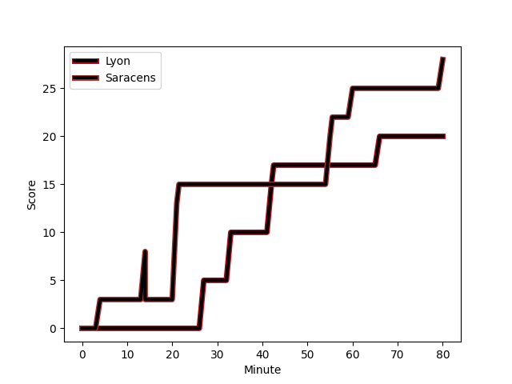
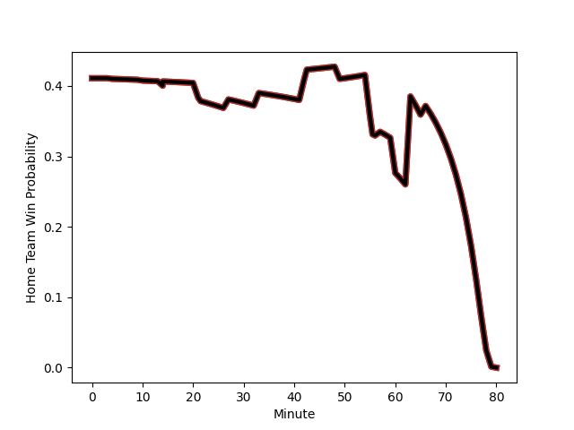

---  
layout: page  
title: Saracens at Lyon; 28-20  
date: 2022-12-17 16:15:00 18:00:00 -0500  
categories: match review  
---
# Saracens (1675.56) at Lyon (1501.2); 28-20

# Prediction: Saracens by 14.4

Saracens by 17.4 on a neutral field
## Scores over Time

## Win Probability over Time

# Pre-Match Prediction: Saracens by 11.6

Saracens by 14.6 on a neutral pitch

|   Away Minutes | Away Player                                                         |   Away elo |   Away Percentile |   Number |   Home Percentile |   Home elo | Home Player                                                                            |   Home Minutes |
|---------------:|:--------------------------------------------------------------------|-----------:|------------------:|---------:|------------------:|-----------:|:---------------------------------------------------------------------------------------|---------------:|
|             60 | [Mako Vunipola](..//playerfiles//MakoVunipola_cleaned.md)           |     129.62 |                99 |        1 |                30 |      91.42 | [Hamza Kaabeche](..//playerfiles//HamzaKaabeche_cleaned.md)                            |             49 |
|             60 | [Jamie George](..//playerfiles//JamieGeorge_cleaned.md)             |     138.92 |               100 |        2 |                54 |      95.94 | [Yanis Charcosset](..//playerfiles//YanisCharcosset_cleaned.md)                        |             49 |
|             60 | [Marco Riccioni](..//playerfiles//MarcoRiccioni_cleaned.md)         |      93.41 |                38 |        3 |                91 |     109.94 | [Francisco Gomez Kodela](..//playerfiles//FranciscoGomezKodela_cleaned.md)             |             49 |
|             66 | [Callum Hunter-Hill](..//playerfiles//CallumHunter-Hill_cleaned.md) |      88.37 |                24 |        4 |                95 |     118.59 | [Felix Lambey](..//playerfiles//FelixLambey_cleaned.md)                                |             80 |
|             57 | [Hugh Tizard](..//playerfiles//HughTizard_cleaned.md)               |     105.5  |                81 |        5 |                57 |      96.99 | [Temo Mayanavanua](..//playerfiles//TemoMayanavanua_cleaned.md)                        |             63 |
|             80 | [Theodore McFarland](..//playerfiles//TheodoreMcFarland_cleaned.md) |      93.44 |                41 |        6 |                43 |      93.44 | [Theo William](..//playerfiles//TheoWilliam_cleaned.md)                                |             80 |
|             80 | [Ben Earl](..//playerfiles//BenEarl_cleaned.md)                     |     119.16 |                95 |        7 |                53 |      96.85 | [Mickael Guillard](..//playerfiles//MickaelGuillard_cleaned.md)                        |             80 |
|             80 | [Billy Vunipola](..//playerfiles//BillyVunipola_cleaned.md)         |     129.13 |                96 |        8 |                91 |     117.01 | [Jordan Taufua](..//playerfiles//JordanTaufua_cleaned.md)                              |             55 |
|             80 | [Ivan van Zyl](..//playerfiles//IvanvanZyl_cleaned.md)              |      96.56 |                53 |        9 |                96 |     120.01 | [Baptiste Couilloud](..//playerfiles//BaptisteCouilloud_cleaned.md)                    |             75 |
|             80 | [Owen Farrell](..//playerfiles//OwenFarrell_cleaned.md)             |     131.97 |                97 |       10 |                 9 |      83.24 | [Fletcher Smith](..//playerfiles//FletcherSmith_cleaned.md)                            |             80 |
|             80 | [Sean Maitland](..//playerfiles//SeanMaitland_cleaned.md)           |     124.88 |                97 |       11 |                24 |      89.41 | [Tavite Veredamu](..//playerfiles//TaviteVeredamu_cleaned.md)                          |             80 |
|             80 | [Nick Tompkins](..//playerfiles//NickTompkins_cleaned.md)           |     127.65 |                98 |       12 |                85 |     109.58 | [Kyle Godwin](..//playerfiles//KyleGodwin_cleaned.md)                                  |             80 |
|             66 | [Alex Lozowski](..//playerfiles//AlexLozowski_cleaned.md)           |      96.13 |                50 |       13 |                75 |     103.94 | [Thibault Regard](..//playerfiles//ThibaultRegard_cleaned.md)                          |             80 |
|             49 | [Alex Lewington](..//playerfiles//AlexLewington_cleaned.md)         |      97.38 |                56 |       14 |                23 |      89.17 | [Xavier Mignot](..//playerfiles//XavierMignot_cleaned.md)                              |             10 |
|             80 | [Elliot Daly](..//playerfiles//ElliotDaly_cleaned.md)               |     107.41 |                82 |       15 |                43 |      93.18 | [Alexandre Tchaptchet Noutcha](..//playerfiles//AlexandreTchaptchetNoutcha_cleaned.md) |             49 |
|             20 | [Eroni Mawi](..//playerfiles//EroniMawi_cleaned.md)                 |      94.22 |                44 |       16 |                 3 |      79.12 | [Jerome Rey](..//playerfiles//JeromeRey_cleaned.md)                                    |             31 |
|             20 | [Tom Woolstencroft](..//playerfiles//TomWoolstencroft_cleaned.md)   |     103.86 |                86 |       17 |                 5 |      81.66 | [Guillaume Marchand](..//playerfiles//GuillaumeMarchand_cleaned.md)                    |             31 |
|             20 | [Alec Clarey](..//playerfiles//AlecClarey_cleaned.md)               |     101.46 |                66 |       18 |                17 |      88.29 | [Paulo Tafili](..//playerfiles//PauloTafili_cleaned.md)                                |             31 |
|             14 | [Jackson Wray](..//playerfiles//JacksonWray_cleaned.md)             |     131.82 |                98 |       19 |                44 |      93.81 | [Loann Goujon](..//playerfiles//LoannGoujon_cleaned.md)                                |             17 |
|             23 | [Andy Christie](..//playerfiles//AndyChristie_cleaned.md)           |     102.19 |                73 |       20 |                93 |     119.47 | [Arno Botha](..//playerfiles//ArnoBotha_cleaned.md)                                    |             25 |
|             14 | [Alex Goode](..//playerfiles//AlexGoode_cleaned.md)                 |     124.6  |                95 |       21 |                64 |      98.32 | [Jonathan Pelissie](..//playerfiles//JonathanPelissie_cleaned.md)                      |              5 |
|             31 | [Max Malins](..//playerfiles//MaxMalins_cleaned.md)                 |      97.35 |                56 |       22 |                96 |     119.66 | [Jean-Marc Doussain](..//playerfiles//Jean-MarcDoussain_cleaned.md)                    |             31 |
|            nan | nan                                                                 |     nan    |               nan |       23 |                32 |      91.67 | [Alfred Parisien](..//playerfiles//AlfredParisien_cleaned.md)                          |             70 |

