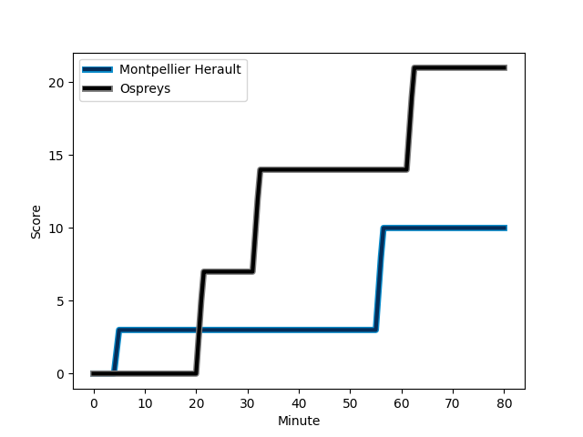
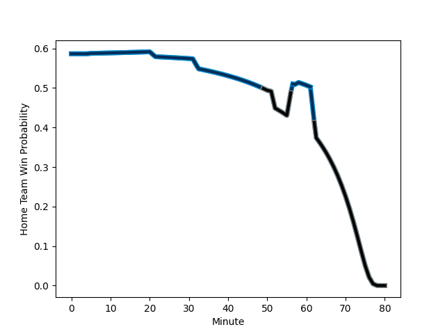

---  
layout: page  
title: Ospreys at Montpellier Herault; 21-10  
date: 2022-12-17 21:00:00 18:00:00 -0500  
categories: match review  
---
# Ospreys (1470.04) at Montpellier Herault (1622.19); 21-10

# Prediction: Montpellier Herault by 18.2

Montpellier Herault by 15.2 on a neutral field
## Scores over Time

## Win Probability over Time

# Pre-Match Prediction: Montpellier Herault by 21.4

Montpellier Herault by 18.4 on a neutral pitch

|   Away Minutes | Away Player                                                   |   Away elo |   Away Percentile |   Number |   Home Percentile |   Home elo | Home Player                                                             |   Home Minutes |
|---------------:|:--------------------------------------------------------------|-----------:|------------------:|---------:|------------------:|-----------:|:------------------------------------------------------------------------|---------------:|
|             52 | [Gareth Thomas](..//playerfiles//GarethThomas_cleaned.md)     |      80    |                 4 |        1 |                89 |     109.38 | [Enzo Forletta](..//playerfiles//EnzoForletta_cleaned.md)               |             80 |
|             52 | [Sam Parry](..//playerfiles//SamParry_cleaned.md)             |      88.84 |                22 |        2 |                32 |      91.71 | [Brandon Paenga-Amosa](..//playerfiles//BrandonPaenga-Amosa_cleaned.md) |             56 |
|             52 | [Tom Botha](..//playerfiles//TomBotha_cleaned.md)             |      77.58 |                 3 |        3 |                26 |      91.44 | [Henry Thomas](..//playerfiles//HenryThomas_cleaned.md)                 |             56 |
|             65 | [Rhys Davies](..//playerfiles//RhysDavies_cleaned.md)         |      97.23 |                61 |        4 |                92 |     115.17 | [Florian Verhaeghe](..//playerfiles//FlorianVerhaeghe_cleaned.md)       |             80 |
|             80 | [Adam Beard](..//playerfiles//AdamBeard_cleaned.md)           |      90.92 |                31 |        5 |                97 |     121.83 | [Bastien Chalureau](..//playerfiles//BastienChalureau_cleaned.md)       |             51 |
|             56 | [Ethan Roots](..//playerfiles//EthanRoots_cleaned.md)         |     101.11 |                69 |        6 |                89 |     112.79 | [Clément Doumenc](..//playerfiles//ClémentDoumenc_cleaned.md)           |             71 |
|             80 | [Justin Tipuric](..//playerfiles//JustinTipuric_cleaned.md)   |     113.16 |                91 |        7 |                52 |      95.9  | [Alexandre Becognee](..//playerfiles//AlexandreBecognee_cleaned.md)     |             63 |
|             80 | [Morgan Morris](..//playerfiles//MorganMorris_cleaned.md)     |      81.86 |                 9 |        8 |                70 |     102.83 | [Zach Mercer](..//playerfiles//ZachMercer_cleaned.md)                   |             80 |
|             80 | [Rhys Webb](..//playerfiles//RhysWebb_cleaned.md)             |      98.51 |                61 |        9 |                92 |     114.54 | [Cobus Reinach](..//playerfiles//CobusReinach_cleaned.md)               |             58 |
|             80 | [Owen Williams](..//playerfiles//OwenWilliams_cleaned.md)     |     118.25 |                92 |       10 |                76 |     105.29 | [Louis Carbonel](..//playerfiles//LouisCarbonel_cleaned.md)             |             80 |
|             80 | [Luke Morgan](..//playerfiles//LukeMorgan_cleaned.md)         |      82.97 |                 9 |       11 |                95 |     120.29 | [George Bridge](..//playerfiles//GeorgeBridge_cleaned.md)               |             80 |
|             65 | [Keiran Williams](..//playerfiles//KeiranWilliams_cleaned.md) |     103.39 |                73 |       12 |                85 |     109.86 | [Paolo Garbisi](..//playerfiles//PaoloGarbisi_cleaned.md)               |             80 |
|             80 | [Michael Collins](..//playerfiles//MichaelCollins_cleaned.md) |     107.55 |                83 |       13 |                35 |      92.03 | [Thomas Darmon](..//playerfiles//ThomasDarmon_cleaned.md)               |             80 |
|             80 | [Alex Cuthbert](..//playerfiles//AlexCuthbert_cleaned.md)     |     111.17 |                88 |       14 |                96 |     122.19 | [Ben Lam](..//playerfiles//BenLam_cleaned.md)                           |             68 |
|             80 | [Max Nagy](..//playerfiles//MaxNagy_cleaned.md)               |      96.6  |                54 |       15 |                84 |     110.16 | [Anthony Bouthier](..//playerfiles//AnthonyBouthier_cleaned.md)         |             80 |
|             28 | [Nicky Smith](..//playerfiles//NickySmith_cleaned.md)         |      88.28 |                19 |       16 |                54 |      96.36 | [Curtis Langdon](..//playerfiles//CurtisLangdon_cleaned.md)             |             24 |
|             28 | [Scott Baldwin](..//playerfiles//ScottBaldwin_cleaned.md)     |     112.32 |                93 |       17 |               nan |     111.82 | [Karl Tu'inukuafe](..//playerfiles//KarlTu'inukuafe_cleaned.md)         |             24 |
|             28 | [Tomas Francis](..//playerfiles//TomasFrancis_cleaned.md)     |     116.94 |                96 |       18 |                80 |     106.33 | [Masivesi Dakuwaqa](..//playerfiles//MasivesiDakuwaqa_cleaned.md)       |              9 |
|             15 | [Huw Owen-Sutton](..//playerfiles//HuwOwen-Sutton_cleaned.md) |     104.15 |                79 |       19 |                97 |     126.75 | [Paul Willemse](..//playerfiles//PaulWillemse_cleaned.md)               |             29 |
|             24 | [Jac Morgan](..//playerfiles//JacMorgan_cleaned.md)           |      94.15 |                45 |       20 |                71 |     101.3  | [Marco Tauleigne](..//playerfiles//MarcoTauleigne_cleaned.md)           |             17 |
|             15 | [Joe Hawkins](..//playerfiles//JoeHawkins_cleaned.md)         |      86.37 |                17 |       21 |                80 |     107.18 | [Léo Coly](..//playerfiles//LéoColy_cleaned.md)                         |             22 |
|            nan | nan                                                           |     nan    |               nan |       22 |                91 |     116.18 | [Julien Tisseron](..//playerfiles//JulienTisseron_cleaned.md)           |             12 |

