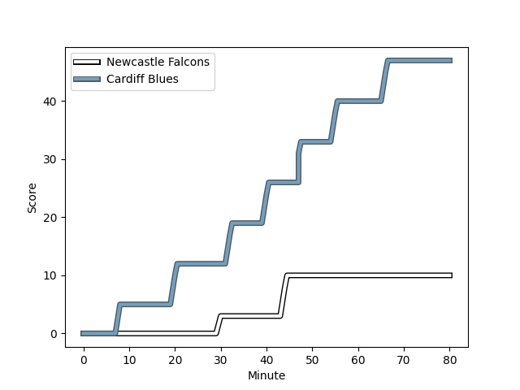
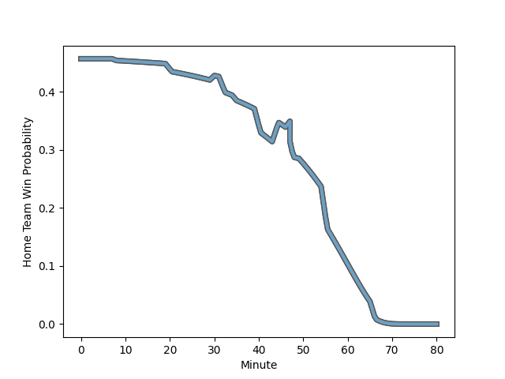

---  
layout: page  
title: Cardiff Blues at Newcastle Falcons; 47-10  
date: 2022-12-17 18:30:00 18:00:00 -0500  
categories: match review  
---
# Cardiff Blues (1453.12) at Newcastle Falcons (1390.3); 47-10

# Prediction: Cardiff Blues by 3.3

Cardiff Blues by 6.3 on a neutral field
## Scores over Time

## Win Probability over Time

# Pre-Match Prediction: Cardiff Blues by 5.9

Cardiff Blues by 8.9 on a neutral pitch

|   Away Minutes | Away Player                                                           |   Away elo |   Away Percentile |   Number |   Home Percentile |   Home elo | Home Player                                                          |   Home Minutes |
|---------------:|:----------------------------------------------------------------------|-----------:|------------------:|---------:|------------------:|-----------:|:---------------------------------------------------------------------|---------------:|
|             52 | [Rhys Carré](..//playerfiles//RhysCarré_cleaned.md)                   |      93.48 |                39 |        1 |                 1 |      70.69 | [Trevor Davison](..//playerfiles//TrevorDavison_cleaned.md)          |             49 |
|             57 | [Kirby Myhill](..//playerfiles//KirbyMyhill_cleaned.md)               |      90.82 |                28 |        2 |               nan |      95    | [Ollie Fletcher](..//playerfiles//OllieFletcher_cleaned.md)          |             80 |
|             57 | [Dimitri Arhip](..//playerfiles//DimitriArhip_cleaned.md)             |      98.91 |                64 |        3 |                21 |      89.41 | [Mark Tampin](..//playerfiles//MarkTampin_cleaned.md)                |             61 |
|             80 | [Seb Davies](..//playerfiles//SebDavies_cleaned.md)                   |      90.13 |                27 |        4 |                40 |      93.07 | [Sebastian de Chaves](..//playerfiles//SebastiandeChaves_cleaned.md) |             68 |
|             57 | [Rory Thornton](..//playerfiles//RoryThornton_cleaned.md)             |      82.92 |                12 |        5 |                26 |      90.07 | [Matthew Dalton](..//playerfiles//MatthewDalton_cleaned.md)          |             80 |
|             80 | [Josh Turnbull](..//playerfiles//JoshTurnbull_cleaned.md)             |      98.13 |                60 |        6 |                85 |     108.75 | [Sean Robinson](..//playerfiles//SeanRobinson_cleaned.md)            |             35 |
|             80 | [Ellis Jenkins](..//playerfiles//EllisJenkins_cleaned.md)             |     106.03 |                82 |        7 |                51 |      95.8  | [Guy Pepper](..//playerfiles//GuyPepper_cleaned.md)                  |             80 |
|             65 | [Taulupe Faletau](..//playerfiles//TaulupeFaletau_cleaned.md)         |      95.83 |                43 |        8 |                38 |      92.6  | [Tom Marshall](..//playerfiles//TomMarshall_cleaned.md)              |             80 |
|             65 | [Tomos Williams](..//playerfiles//TomosWilliams_cleaned.md)           |     109.21 |                86 |        9 |                 1 |      73.14 | [Sam Stuart](..//playerfiles//SamStuart_cleaned.md)                  |             47 |
|             80 | [Rhys Priestland](..//playerfiles//RhysPriestland_cleaned.md)         |      89.06 |                23 |       10 |                17 |      86.58 | [Josh Thomas](..//playerfiles//JoshThomas_cleaned.md)                |             48 |
|             80 | [Josh Adams](..//playerfiles//JoshAdams_cleaned.md)                   |     101.58 |                73 |       11 |                37 |      92.77 | [Mateo Carreras](..//playerfiles//MateoCarreras_cleaned.md)          |             80 |
|             41 | [Max Llewellyn](..//playerfiles//MaxLlewellyn_cleaned.md)             |     101.68 |                69 |       12 |               nan |      98.12 | [Zach Kerr](..//playerfiles//ZachKerr_cleaned.md)                    |             80 |
|             80 | [Rey Lee-Lo](..//playerfiles//ReyLee-Lo_cleaned.md)                   |     131.3  |                99 |       13 |                52 |      97.09 | [Ben Stevenson](..//playerfiles//BenStevenson_cleaned.md)            |             80 |
|             59 | [Owen Lane](..//playerfiles//OwenLane_cleaned.md)                     |      69.58 |                 1 |       14 |                94 |     117.79 | [Nathan Earle](..//playerfiles//NathanEarle_cleaned.md)              |             80 |
|             80 | [Ben Thomas](..//playerfiles//BenThomas_cleaned.md)                   |      91.9  |                38 |       15 |                 3 |      74.59 | [Elliot Obatoyinbo](..//playerfiles//ElliotObatoyinbo_cleaned.md)    |             60 |
|             28 | [Bradley Thyer](..//playerfiles//BradleyThyer_cleaned.md)             |     102.96 |                73 |       16 |                26 |      89.97 | [Adam Brocklebank](..//playerfiles//AdamBrocklebank_cleaned.md)      |             31 |
|             23 | [Teddy Williams](..//playerfiles//TeddyWilliams_cleaned.md)           |      96.77 |               nan |       17 |                59 |      97.62 | [Richard Palframan](..//playerfiles//RichardPalframan_cleaned.md)    |             19 |
|             23 | [Liam Belcher](..//playerfiles//LiamBelcher_cleaned.md)               |      88.66 |                20 |       18 |                55 |      97.02 | [Conrad Cade](..//playerfiles//ConradCade_cleaned.md)                |             12 |
|             23 | [William Davies-King](..//playerfiles//WilliamDavies-King_cleaned.md) |      87.24 |                15 |       19 |                53 |      95.7  | [Josh Peters](..//playerfiles//JoshPeters_cleaned.md)                |             45 |
|             15 | [James Ratti](..//playerfiles//JamesRatti_cleaned.md)                 |     101.04 |                64 |       20 |                65 |      98.81 | [Josh Barton](..//playerfiles//JoshBarton_cleaned.md)                |             33 |
|             39 | [Theo Cabango](..//playerfiles//TheoCabango_cleaned.md)               |      94.17 |                43 |       21 |                 3 |      76.56 | [Brett Connon](..//playerfiles//BrettConnon_cleaned.md)              |             32 |
|             15 | [Ellis Bevan](..//playerfiles//EllisBevan_cleaned.md)                 |      94.61 |               nan |       22 |               nan |      96.91 | [Iwan Stephens](..//playerfiles//IwanStephens_cleaned.md)            |             20 |
|             21 | [Mason Grady](..//playerfiles//MasonGrady_cleaned.md)                 |      87.36 |                16 |       23 |               nan |     nan    | nan                                                                  |            nan |

