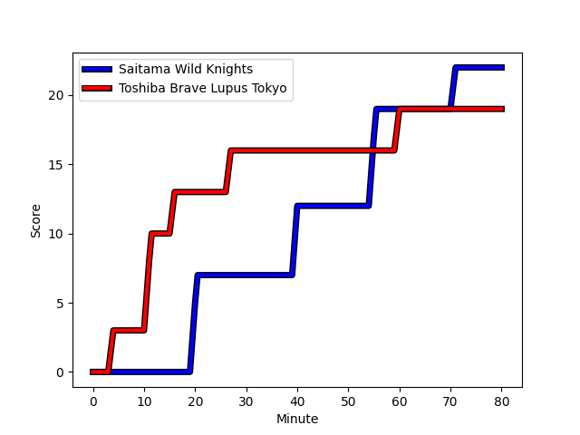
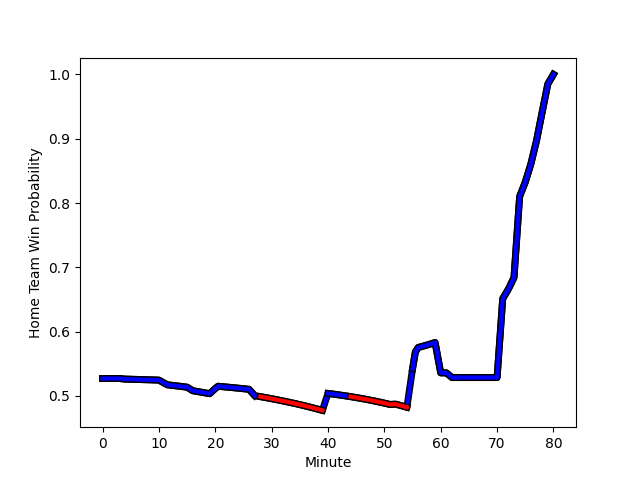

---  
layout: page  
title: Toshiba Brave Lupus Tokyo at Saitama Wild Knights; 19-22  
date: 2022-12-17 00:00:00 18:00:00 -0500  
categories: match review  
---
# Toshiba Brave Lupus Tokyo (1532.6) at Saitama Wild Knights (1585.06); 19-22

# Prediction: Saitama Wild Knights by 8.2

Saitama Wild Knights by 5.2 on a neutral field
## Scores over Time

## Win Probability over Time

# Pre-Match Prediction: Saitama Wild Knights by 5.4

Saitama Wild Knights by 2.4 on a neutral pitch

|   Away Minutes | Away Player                                                         |   Away elo |   Away Percentile |   Number |   Home Percentile |   Home elo | Home Player                                                       |   Home Minutes |
|---------------:|:--------------------------------------------------------------------|-----------:|------------------:|---------:|------------------:|-----------:|:------------------------------------------------------------------|---------------:|
|             68 | [Sena Kimura](..//playerfiles//SenaKimura_cleaned.md)               |      95    |               nan |        1 |                90 |     109.28 | [Keita Inagaki](..//playerfiles//KeitaInagaki_cleaned.md)         |             52 |
|             68 | [Mamoru Harada](..//playerfiles//MamoruHarada_cleaned.md)           |      95    |               nan |        2 |                78 |     102.59 | [Atsushi Sakate](..//playerfiles//AtsushiSakate_cleaned.md)       |             52 |
|             74 | [Yuta Kokaji](..//playerfiles//YutaKokaji_cleaned.md)               |     105.51 |                84 |        3 |               nan |      95    | [Taiki Fujii](..//playerfiles//TaikiFujii_cleaned.md)             |             80 |
|             80 | [Warner Dearns](..//playerfiles//WarnerDearns_cleaned.md)           |     100    |                67 |        4 |                41 |      93.76 | [Mark Abbott](..//playerfiles//MarkAbbott_cleaned.md)             |             80 |
|             68 | [Jacob Pierce](..//playerfiles//JacobPierce_cleaned.md)             |     125.47 |                97 |        5 |                88 |     109.64 | [Esei Ha'angana](..//playerfiles//EseiHa'angana_cleaned.md)       |             56 |
|             80 | [Shin Ito](..//playerfiles//ShinIto_cleaned.md)                     |      92.57 |               nan |        6 |                73 |     101.99 | [Shota Fukui](..//playerfiles//ShotaFukui_cleaned.md)             |             80 |
|             80 | [Yoshitaka Tokunaga](..//playerfiles//YoshitakaTokunaga_cleaned.md) |      85.56 |                14 |        7 |                91 |     112.85 | [Shunsuke Nunomaki](..//playerfiles//ShunsukeNunomaki_cleaned.md) |             67 |
|             80 | [Michael Leitch](..//playerfiles//MichaelLeitch_cleaned.md)         |     124.42 |                97 |        8 |                88 |     110    | [Jack Cornelsen](..//playerfiles//JackCornelsen_cleaned.md)       |             80 |
|             74 | [Takahiro Ogawa](..//playerfiles//TakahiroOgawa_cleaned.md)         |      99.47 |                66 |        9 |                91 |     114.15 | [Taiki Koyama](..//playerfiles//TaikiKoyama_cleaned.md)           |             80 |
|             74 | [Tom Taylor](..//playerfiles//TomTaylor_cleaned.md)                 |      87.72 |                18 |       10 |                75 |     105.12 | [Rikiya Matsuda](..//playerfiles//RikiyaMatsuda_cleaned.md)       |             62 |
|             80 | [Masaki Hamada](..//playerfiles//MasakiHamada_cleaned.md)           |      98.66 |                62 |       11 |                74 |     102.37 | [Marika Koroibete](..//playerfiles//MarikaKoroibete_cleaned.md)   |             80 |
|             80 | [Hayata Nakao](..//playerfiles//HayataNakao_cleaned.md)             |     106.66 |                78 |       12 |                95 |     123.3  | [Damian de Allende](..//playerfiles//DamiandeAllende_cleaned.md)  |             80 |
|             80 | [Seta Tamanivalu](..//playerfiles//SetaTamanivalu_cleaned.md)       |     113.08 |                89 |       13 |                86 |     109.54 | [Dylan Riley](..//playerfiles//DylanRiley_cleaned.md)             |             80 |
|             80 | [Jone Naikabula](..//playerfiles//JoneNaikabula_cleaned.md)         |      99.42 |                64 |       14 |                46 |      94.79 | [Semisi Ofa Tupou](..//playerfiles//SemisiOfaTupou_cleaned.md)    |             80 |
|             80 | [Takuro Matsunaga](..//playerfiles//TakuroMatsunaga_cleaned.md)     |     104.82 |                74 |       15 |                53 |      96.42 | [Ryuji Noguchi](..//playerfiles//RyujiNoguchi_cleaned.md)         |             80 |
|             12 | [Masataka Mikami](..//playerfiles//MasatakaMikami_cleaned.md)       |     104.15 |                81 |       16 |                52 |      95.15 | [Craig Millar](..//playerfiles//CraigMillar_cleaned.md)           |             28 |
|             12 | [Takeshi Sasaki](..//playerfiles//TakeshiSasaki_cleaned.md)         |      94.84 |               nan |       17 |                99 |     127.59 | [Shota Horie](..//playerfiles//ShotaHorie_cleaned.md)             |             28 |
|             12 | [Shin Ouchi](..//playerfiles//ShinOuchi_cleaned.md)                 |     100.92 |                70 |       18 |                98 |     129.65 | [Ryota Hasegawa](..//playerfiles//RyotaHasegawa_cleaned.md)       |             24 |
|              6 | [Rikyu Yamakawa](..//playerfiles//RikyuYamakawa_cleaned.md)         |      95    |               nan |       19 |                37 |      93.24 | [Kyohei Yamasawa](..//playerfiles//KyoheiYamasawa_cleaned.md)     |             18 |
|              6 | [Jack Stratton](..//playerfiles//JackStratton_cleaned.md)           |     111.39 |                89 |       20 |                48 |      95.28 | [Itsuki Onishi](..//playerfiles//ItsukiOnishi_cleaned.md)         |             13 |
|              6 | [Nicholas McCurran](..//playerfiles//NicholasMcCurran_cleaned.md)   |     107.5  |                81 |       21 |               nan |     nan    | nan                                                               |            nan |

