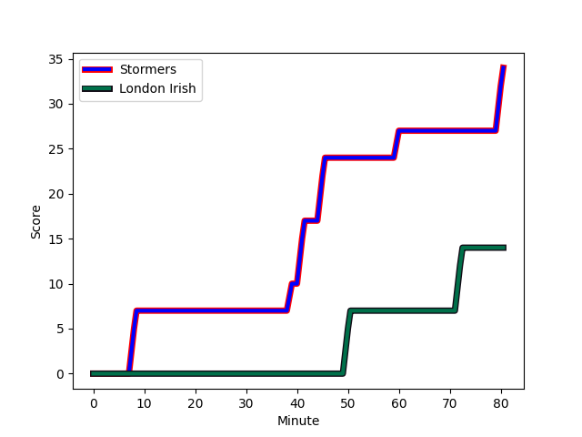
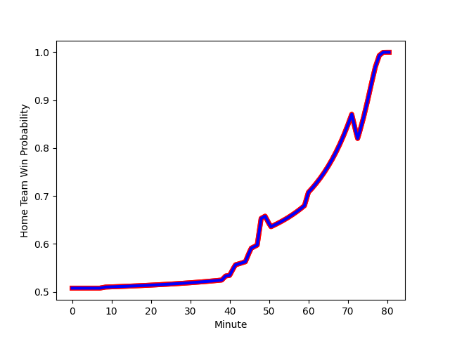

---  
layout: page  
title: London Irish at Stormers; 14-34  
date: 2022-12-17 18:30:00 18:00:00 -0500  
categories: match review  
---
# London Irish (1583.57) at Stormers (1608.84); 14-34

# Prediction: Stormers by 5.5

Stormers by 2.5 on a neutral field
## Scores over Time

## Win Probability over Time

# Pre-Match Prediction: Stormers by 9.4

Stormers by 6.4 on a neutral pitch

|   Away Minutes | Away Player                                                                       |   Away elo |   Away Percentile |   Number |   Home Percentile |   Home elo | Home Player                                                              |   Home Minutes |
|---------------:|:----------------------------------------------------------------------------------|-----------:|------------------:|---------:|------------------:|-----------:|:-------------------------------------------------------------------------|---------------:|
|             59 | [Will Goodrick-Clarke](..//playerfiles//WillGoodrick-Clarke_cleaned.md)           |     103.38 |                78 |        1 |                98 |     122.43 | [Steven Kitshoff](..//playerfiles//StevenKitshoff_cleaned.md)            |             64 |
|             67 | [Mike Willemse](..//playerfiles//MikeWillemse_cleaned.md)                         |     103.13 |                73 |        2 |                51 |      95.33 | [Joseph Dweba](..//playerfiles//JosephDweba_cleaned.md)                  |             62 |
|             59 | [Lovejoy Chawatama](..//playerfiles//LovejoyChawatama_cleaned.md)                 |      94.16 |                42 |        3 |                91 |     110.89 | [Frans Malherbe](..//playerfiles//FransMalherbe_cleaned.md)              |             59 |
|             80 | [Rob Simmons](..//playerfiles//RobSimmons_cleaned.md)                             |     121.66 |                96 |        4 |                62 |      98.58 | [Salmaan Moerat](..//playerfiles//SalmaanMoerat_cleaned.md)              |             48 |
|             67 | [Adam Coleman](..//playerfiles//AdamColeman_cleaned.md)                           |     121.2  |                96 |        5 |                58 |      97.33 | [Marvin Orie](..//playerfiles//MarvinOrie_cleaned.md)                    |             80 |
|             48 | [Matt Rogerson](..//playerfiles//MattRogerson_cleaned.md)                         |     114.42 |                92 |        6 |                99 |     143.04 | [Deon Fourie](..//playerfiles//DeonFourie_cleaned.md)                    |             60 |
|             80 | [Tom Pearson](..//playerfiles//TomPearson_cleaned.md)                             |     114.25 |                92 |        7 |                84 |     107.44 | [Willie Engelbrecht](..//playerfiles//WillieEngelbrecht_cleaned.md)      |             65 |
|             80 | [Josh Basham](..//playerfiles//JoshBasham_cleaned.md)                             |     100.36 |                62 |        8 |                82 |     107.6  | [Hacjivah Dayimani](..//playerfiles//HacjivahDayimani_cleaned.md)        |             80 |
|             48 | [Joe Powell](..//playerfiles//JoePowell_cleaned.md)                               |      95.37 |                50 |        9 |                36 |      91.33 | [Albertus Paul de Wet](..//playerfiles//AlbertusPauldeWet_cleaned.md)    |             80 |
|             80 | [Paddy Jackson](..//playerfiles//PaddyJackson_cleaned.md)                         |     110.17 |                84 |       10 |                77 |     105.67 | [Manie Libbok](..//playerfiles//ManieLibbok_cleaned.md)                  |             80 |
|             80 | [Ollie Hassell-Collins](..//playerfiles//OllieHassell-Collins_cleaned.md)         |      94.85 |                46 |       11 |                75 |     102.68 | [Leolin Zas](..//playerfiles//LeolinZas_cleaned.md)                      |             46 |
|             80 | [Benhard Janse van Rensburg](..//playerfiles//BenhardJansevanRensburg_cleaned.md) |      92.8  |                38 |       12 |                95 |     122.37 | [Damian Willemse](..//playerfiles//DamianWillemse_cleaned.md)            |             80 |
|             80 | [Luca Morisi](..//playerfiles//LucaMorisi_cleaned.md)                             |     118.55 |                94 |       13 |                87 |     112.82 | [Ruhan Nel](..//playerfiles//RuhanNel_cleaned.md)                        |             36 |
|             66 | [Lucio Cinti](..//playerfiles//LucioCinti_cleaned.md)                             |      92.02 |                33 |       14 |                86 |     108.47 | [Angelo Davids](..//playerfiles//AngeloDavids_cleaned.md)                |             80 |
|             80 | [Ben Loader](..//playerfiles//BenLoader_cleaned.md)                               |     109.87 |                84 |       15 |                81 |     108.4  | [Clayton Blommetjies](..//playerfiles//ClaytonBlommetjies_cleaned.md)    |             80 |
|             21 | [Facundo Gigena](..//playerfiles//FacundoGigena_cleaned.md)                       |      92.28 |                33 |       16 |                11 |      86.21 | [Sazi Sandi](..//playerfiles//SaziSandi_cleaned.md)                      |             21 |
|             21 | [Oli Hoskins](..//playerfiles//OliHoskins_cleaned.md)                             |     115.07 |                94 |       17 |                43 |      91.41 | [JJ Kotze](..//playerfiles//JJKotze_cleaned.md)                          |             18 |
|             13 | [Ignacio Ruiz](..//playerfiles//IgnacioRuiz_cleaned.md)                           |      98.52 |                65 |       18 |               100 |     141.41 | [Brok Harris](..//playerfiles//BrokHarris_cleaned.md)                    |             16 |
|             32 | [Chandler Cunningham-South](..//playerfiles//ChandlerCunningham-South_cleaned.md) |      94.56 |                48 |       19 |                39 |      90.26 | [Connor Evans](..//playerfiles//ConnorEvans_cleaned.md)                  |             32 |
|             13 | [Api Ratuniyarawa](..//playerfiles//ApiRatuniyarawa_cleaned.md)                   |     103.87 |                78 |       20 |                53 |      94.72 | [Junior Pokomela](..//playerfiles//JuniorPokomela_cleaned.md)            |             20 |
|             32 | [Ben White](..//playerfiles//BenWhite_cleaned.md)                                 |     109.21 |                86 |       21 |                19 |      87.6  | [Marcel Theunissen](..//playerfiles//MarcelTheunissen_cleaned.md)        |             15 |
|             14 | [Will Joseph](..//playerfiles//WillJoseph_cleaned.md)                             |      96.45 |                49 |       22 |                92 |     113.79 | [Herschel Jantjies](..//playerfiles//HerschelJantjies_cleaned.md)        |             34 |
|            nan | nan                                                                               |     nan    |               nan |       23 |                60 |      99.05 | [Suleiman  Hartzenberg](..//playerfiles//SuleimanHartzenberg_cleaned.md) |             44 |

