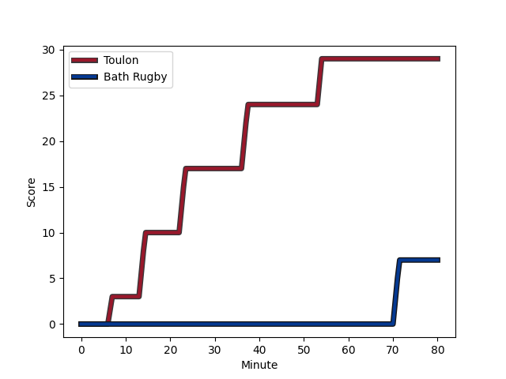
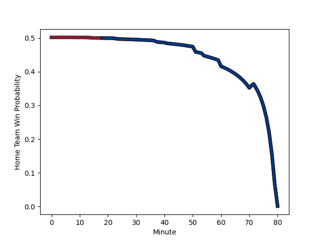

---  
layout: page  
title: Bath Rugby at Toulon; 7-29  
date: 2022-12-17 14:00:00 18:00:00 -0500  
categories: match review  
---
# Bath Rugby (1477.28) at Toulon (1478.96); 7-29

# Prediction: Toulon by 3.2

Toulon by 0.2 on a neutral field
## Scores over Time

## Win Probability over Time

# Pre-Match Prediction: Toulon by 0.2

Bath Rugby by 2.8 on a neutral pitch

|   Away Minutes | Away Player                                                              |   Away elo |   Away Percentile |   Number |   Home Percentile |   Home elo | Home Player                                                       |   Home Minutes |
|---------------:|:-------------------------------------------------------------------------|-----------:|------------------:|---------:|------------------:|-----------:|:------------------------------------------------------------------|---------------:|
|             48 | [Lewis Boyce](..//playerfiles//LewisBoyce_cleaned.md)                    |      90.89 |                33 |        1 |                15 |      87.27 | [Bruce Devaux](..//playerfiles//BruceDevaux_cleaned.md)           |             50 |
|             60 | [Tom Dunn](..//playerfiles//TomDunn_cleaned.md)                          |     115.18 |                94 |        2 |                77 |     102.99 | [Anthony Etrillard](..//playerfiles//AnthonyEtrillard_cleaned.md) |             50 |
|             51 | [D'Arcy Rae](..//playerfiles//D'ArcyRae_cleaned.md)                      |      80.5  |                 4 |        3 |                14 |      87.89 | [Kieran Brookes](..//playerfiles//KieranBrookes_cleaned.md)       |             41 |
|             51 | [Dave Attwood](..//playerfiles//DaveAttwood_cleaned.md)                  |     138.6  |                99 |        4 |                21 |      87.46 | [Swan Rebbadj](..//playerfiles//SwanRebbadj_cleaned.md)           |             67 |
|             80 | [Fergus Lee-Warner](..//playerfiles//FergusLee-Warner_cleaned.md)        |      88.28 |                23 |        5 |                43 |      93.65 | [Adrien Warion](..//playerfiles//AdrienWarion_cleaned.md)         |             80 |
|             51 | [Tom Ellis](..//playerfiles//TomEllis_cleaned.md)                        |      89.78 |                29 |        6 |                58 |      97.61 | [Jules Coulon](..//playerfiles//JulesCoulon_cleaned.md)           |             80 |
|             80 | [Miles Reid](..//playerfiles//MilesReid_cleaned.md)                      |     118.43 |                95 |        7 |                88 |     110.95 | [Raphael Lakafia](..//playerfiles//RaphaelLakafia_cleaned.md)     |             56 |
|             51 | [Richard de Carpentier](..//playerfiles//RicharddeCarpentier_cleaned.md) |     104.15 |                76 |        8 |                85 |     110.76 | [Sergio Parisse](..//playerfiles//SergioParisse_cleaned.md)       |             80 |
|             67 | [Ben Spencer](..//playerfiles//BenSpencer_cleaned.md)                    |      96.66 |                54 |        9 |                47 |      95.38 | [Jules Danglot](..//playerfiles//JulesDanglot_cleaned.md)         |             80 |
|             80 | [Piers Francis](..//playerfiles//PiersFrancis_cleaned.md)                |     107.45 |                80 |       10 |                99 |     140.84 | [Dan Biggar](..//playerfiles//DanBiggar_cleaned.md)               |             61 |
|             80 | [Will Butt](..//playerfiles//WillButt_cleaned.md)                        |     103.6  |                78 |       11 |                65 |      99.27 | [Jiuta Wainiqolo](..//playerfiles//JiutaWainiqolo_cleaned.md)     |             80 |
|             80 | [Max Ojomoh](..//playerfiles//MaxOjomoh_cleaned.md)                      |      93.22 |                39 |       12 |                12 |      84.42 | [Maëlan Rabut](..//playerfiles//MaëlanRabut_cleaned.md)           |             80 |
|             72 | [Ollie Lawrence](..//playerfiles//OllieLawrence_cleaned.md)              |      89.83 |                26 |       13 |                 7 |      79.9  | [Jérémy Sinzelle](..//playerfiles//JérémySinzelle_cleaned.md)     |             80 |
|             80 | [Joe Cokanasiga](..//playerfiles//JoeCokanasiga_cleaned.md)              |     100.49 |                69 |       14 |                58 |      97.67 | [Gervais Cordin](..//playerfiles//GervaisCordin_cleaned.md)       |             80 |
|             80 | [Tom de Glanville](..//playerfiles//TomdeGlanville_cleaned.md)           |      85.71 |                17 |       15 |                49 |      95.22 | [Thomas Salles](..//playerfiles//ThomasSalles_cleaned.md)         |             13 |
|             20 | [Tom Doughty](..//playerfiles//TomDoughty_cleaned.md)                    |      91.38 |                34 |       16 |                30 |      91.28 | [Teddy Baubigny](..//playerfiles//TeddyBaubigny_cleaned.md)       |             30 |
|             29 | [Johannes Jonker](..//playerfiles//JohannesJonker_cleaned.md)            |      87.95 |               nan |       17 |                65 |      99.24 | [Dany Priso](..//playerfiles//DanyPriso_cleaned.md)               |             30 |
|             32 | [Valery Morozov](..//playerfiles//ValeryMorozov_cleaned.md)              |      88.87 |                20 |       18 |                84 |     106.42 | [Beka Gigashvili](..//playerfiles//BekaGigashvili_cleaned.md)     |             39 |
|             29 | [Will Spencer](..//playerfiles//WillSpencer_cleaned.md)                  |     103.23 |                79 |       19 |                71 |     100.73 | [Brian Alainu'uese](..//playerfiles//BrianAlainu'uese_cleaned.md) |             13 |
|             29 | [Josh Bayliss](..//playerfiles//JoshBayliss_cleaned.md)                  |      82.16 |                10 |       20 |                95 |     118.61 | [Charles Ollivon](..//playerfiles//CharlesOllivon_cleaned.md)     |             24 |
|             29 | [Ted Hill](..//playerfiles//TedHill_cleaned.md)                          |      91.69 |                33 |       21 |                57 |      97.35 | [Aymeric Luc](..//playerfiles//AymericLuc_cleaned.md)             |             67 |
|             13 | [Max Green](..//playerfiles//MaxGreen_cleaned.md)                        |      89.17 |                21 |       22 |                81 |     108.5  | [Ihaia West](..//playerfiles//IhaiaWest_cleaned.md)               |             19 |
|              8 | [Orlando Bailey](..//playerfiles//OrlandoBailey_cleaned.md)              |      88.69 |                23 |       23 |               nan |     nan    | nan                                                               |            nan |

