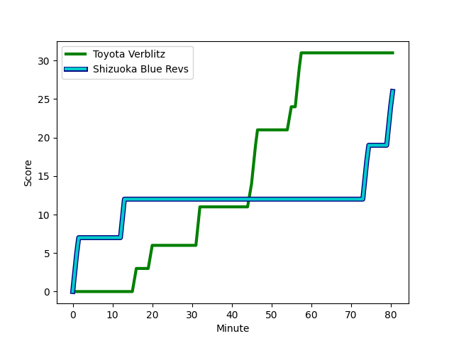

---  
layout: page  
title: Shizuoka Blue Revs at Toyota Verblitz; 26-31  
date: 2022-12-17 00:00:00 18:00:00 -0500  
categories: match review  
---
# Shizuoka Blue Revs (1518.4) at Toyota Verblitz (1446.69); 26-31

# Prediction: Shizuoka Blue Revs by 4.2

Shizuoka Blue Revs by 7.2 on a neutral field
## Scores over Time

## Win Probability over Time

# Pre-Match Prediction: Shizuoka Blue Revs by 2.2

Shizuoka Blue Revs by 5.2 on a neutral pitch

|   Away Minutes | Away Player                                                         |   Away elo |   Away Percentile |   Number |   Home Percentile |   Home elo | Home Player                                                                            |   Home Minutes |
|---------------:|:--------------------------------------------------------------------|-----------:|------------------:|---------:|------------------:|-----------:|:---------------------------------------------------------------------------------------|---------------:|
|             40 | [Joren Fuchi](..//playerfiles//JorenFuchi_cleaned.md)               |      95    |               nan |        1 |                43 |      94.28 | [Shogo Miura](..//playerfiles//ShogoMiura_cleaned.md)                                  |             55 |
|             80 | [Takeshi Hino](..//playerfiles//TakeshiHino_cleaned.md)             |     133.21 |                99 |        2 |                69 |     100.1  | [Yoshikatsu Hikosaka](..//playerfiles//YoshikatsuHikosaka_cleaned.md)                  |             55 |
|             65 | [Heiichiro Ito](..//playerfiles//HeiichiroIto_cleaned.md)           |     122.9  |                98 |        3 |                10 |      84.69 | [Shunsuke Asaoka](..//playerfiles//ShunsukeAsaoka_cleaned.md)                          |             55 |
|             80 | [Yuya Odo](..//playerfiles//YuyaOdo_cleaned.md)                     |     104.7  |                80 |        4 |                81 |     105.13 | [Ryoma Nishimura](..//playerfiles//RyomaNishimura_cleaned.md)                          |             80 |
|             55 | [Eishin Kuwano](..//playerfiles//EishinKuwano_cleaned.md)           |      94.19 |                45 |        5 |                31 |      90.94 | [Daichi Akiyama](..//playerfiles//DaichiAkiyama_cleaned.md)                            |             67 |
|             64 | [Riki Sugihara](..//playerfiles//RikiSugihara_cleaned.md)           |      95    |               nan |        6 |                45 |      94.18 | [Pieter-Steph du Toit](..//playerfiles//Pieter-StephduToit_cleaned.md)                 |             80 |
|             80 | [Shoji Takuma](..//playerfiles//ShojiTakuma_cleaned.md)             |      95    |               nan |        7 |                69 |     100.93 | [Kyo Yoshida](..//playerfiles//KyoYoshida_cleaned.md)                                  |             80 |
|             80 | [Kwagga Smith](..//playerfiles//KwaggaSmith_cleaned.md)             |     112.85 |                85 |        8 |                41 |      93.83 | [Lautaimi Fetuani](..//playerfiles//LautaimiFetuani_cleaned.md)                        |             58 |
|             59 | [Bryn Hall](..//playerfiles//BrynHall_cleaned.md)                   |     111.22 |                88 |        9 |                35 |      92.64 | [Kenta Fukuda](..//playerfiles//KentaFukuda_cleaned.md)                                |             64 |
|             80 | [Sam Greene](..//playerfiles//SamGreene_cleaned.md)                 |      88.44 |                20 |       10 |                 9 |      82.58 | [Tiaan Falcon](..//playerfiles//TiaanFalcon_cleaned.md)                                |             80 |
|             80 | [Malo Tuitama](..//playerfiles//MaloTuitama_cleaned.md)             |     101.17 |                71 |       11 |                30 |      90.98 | [Jone Turaganivalu Nabetelevu](..//playerfiles//JoneTuraganivaluNabetelevu_cleaned.md) |             80 |
|             80 | [Jonathan Faauli](..//playerfiles//JonathanFaauli_cleaned.md)       |      96.2  |                49 |       12 |                90 |     114.96 | [Rob Thompson](..//playerfiles//RobThompson_cleaned.md)                                |             80 |
|             59 | [Hiroto Kobayashi](..//playerfiles//HirotoKobayashi_cleaned.md)     |     104.59 |                77 |       13 |                51 |      96.72 | [Dick Wilson](..//playerfiles//DickWilson_cleaned.md)                                  |             76 |
|             75 | [Chikara Ito](..//playerfiles//ChikaraIto_cleaned.md)               |      86.37 |                14 |       14 |                71 |     101.22 | [Taichi Takahashi](..//playerfiles//TaichiTakahashi_cleaned.md)                        |             67 |
|             80 | [Kakeru Okumura](..//playerfiles//KakeruOkumura_cleaned.md)         |      93.25 |                43 |       15 |               nan |      95    | [Vatiliai Tuidraki](..//playerfiles//VatiliaiTuidraki_cleaned.md)                      |             80 |
|             40 | [Kazuhiro Kawata](..//playerfiles//KazuhiroKawata_cleaned.md)       |      99.21 |                65 |       16 |                49 |      95.68 | [Gaku Shimizu](..//playerfiles//GakuShimizu_cleaned.md)                                |             25 |
|             25 | [Samuela Anise](..//playerfiles//SamuelaAnise_cleaned.md)           |      80.05 |                 9 |       17 |                51 |      95.59 | [Ryusei Kato](..//playerfiles//RyuseiKato_cleaned.md)                                  |             25 |
|             21 | [Hironori Yatomi](..//playerfiles//HironoriYatomi_cleaned.md)       |      88.28 |                19 |       18 |                85 |     105.63 | [Yusuke Kizu](..//playerfiles//YusukeKizu_cleaned.md)                                  |             25 |
|             21 | [Clinton Swart](..//playerfiles//ClintonSwart_cleaned.md)           |      94.31 |               nan |       19 |                70 |     102.63 | [Kazuki Himeno](..//playerfiles//KazukiHimeno_cleaned.md)                              |             22 |
|             16 | [Richmond Tongatama](..//playerfiles//RichmondTongatama_cleaned.md) |      95    |               nan |       20 |                37 |      92.44 | [Kaito Shigeno](..//playerfiles//KaitoShigeno_cleaned.md)                              |             16 |
|             15 | [Takayoshi Mohara](..//playerfiles//TakayoshiMohara_cleaned.md)     |      95    |               nan |       21 |                77 |     104.04 | [Masato Furukawa](..//playerfiles//MasatoFurukawa_cleaned.md)                          |             13 |
|              5 | [Keagan Faria](..//playerfiles//KeaganFaria_cleaned.md)             |      95.53 |                49 |       22 |                33 |      92.09 | [Yuki Okada](..//playerfiles//YukiOkada_cleaned.md)                                    |             13 |
|            nan | nan                                                                 |     nan    |               nan |       23 |               nan |      95    | [Rintaro Maruyama](..//playerfiles//RintaroMaruyama_cleaned.md)                        |              4 |

