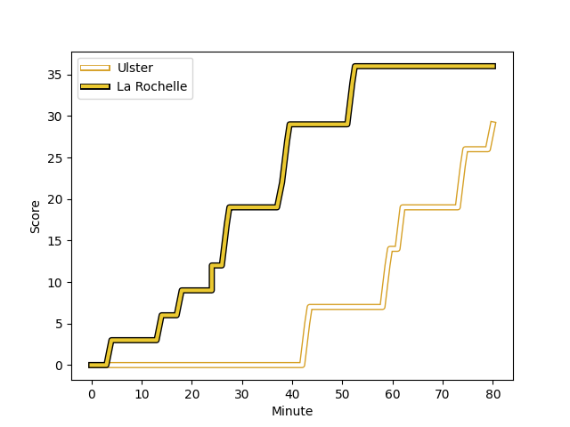
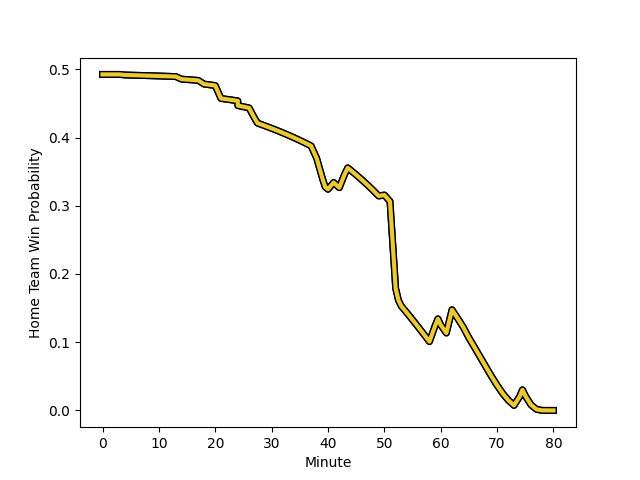

---  
layout: page  
title: La Rochelle at Ulster; 36-29  
date: 2022-12-17 18:30:00 18:00:00 -0500  
categories: match review  
---
# La Rochelle (1623.46) at Ulster (1610.56); 36-29

# Prediction: Ulster by 1.7

La Rochelle by 1.3 on a neutral field
## Scores over Time

## Win Probability over Time

# Pre-Match Prediction: La Rochelle by 0.9

La Rochelle by 3.9 on a neutral pitch

|   Away Minutes | Away Player                                                            |   Away elo |   Away Percentile |   Number |   Home Percentile |   Home elo | Home Player                                                           |   Home Minutes |
|---------------:|:-----------------------------------------------------------------------|-----------:|------------------:|---------:|------------------:|-----------:|:----------------------------------------------------------------------|---------------:|
|             50 | [Reda Wardi](..//playerfiles//RedaWardi_cleaned.md)                    |     109.5  |                91 |        1 |                75 |     100.7  | [Rory Sutherland](..//playerfiles//RorySutherland_cleaned.md)         |             60 |
|             60 | [Pierre Bourgarit](..//playerfiles//PierreBourgarit_cleaned.md)        |     106.64 |                87 |        2 |                49 |      92.75 | [Tom Stewart](..//playerfiles//TomStewart_cleaned.md)                 |             52 |
|             50 | [Uini Atonio](..//playerfiles//UiniAtonio_cleaned.md)                  |     112.59 |                94 |        3 |                83 |     104.05 | [Marty Moore](..//playerfiles//MartyMoore_cleaned.md)                 |             60 |
|             80 | [Romain Sazy](..//playerfiles//RomainSazy_cleaned.md)                  |     102.03 |                70 |        4 |                93 |     117.31 | [Alan O'Connor](..//playerfiles//AlanO'Connor_cleaned.md)             |             80 |
|             60 | [Will Skelton](..//playerfiles//WillSkelton_cleaned.md)                |     113.11 |                91 |        5 |                89 |     110.81 | [Sam Carter](..//playerfiles//SamCarter_cleaned.md)                   |             53 |
|             80 | [Remi Bourdeau](..//playerfiles//RemiBourdeau_cleaned.md)              |     123.26 |                97 |        6 |                80 |     105.04 | [Iain Henderson](..//playerfiles//IainHenderson_cleaned.md)           |             80 |
|             48 | [Yoan Tanga](..//playerfiles//YoanTanga_cleaned.md)                    |     108.01 |                84 |        7 |                81 |     105.49 | [Nick Timoney](..//playerfiles//NickTimoney_cleaned.md)               |             65 |
|             80 | [Gregory Alldritt](..//playerfiles//GregoryAlldritt_cleaned.md)        |     117.26 |                91 |        8 |                98 |     133.31 | [Duane Vermeulen](..//playerfiles//DuaneVermeulen_cleaned.md)         |             80 |
|             41 | [Tawera Kerr-Barlow](..//playerfiles//TaweraKerr-Barlow_cleaned.md)    |     126.56 |                98 |        9 |                89 |     110.99 | [John Cooney](..//playerfiles//JohnCooney_cleaned.md)                 |             80 |
|             80 | [Antoine Hastoy](..//playerfiles//AntoineHastoy_cleaned.md)            |      90.73 |                27 |       10 |                92 |     118.5  | [Billy Burns](..//playerfiles//BillyBurns_cleaned.md)                 |             21 |
|             60 | [Pierre Boudehent](..//playerfiles//PierreBoudehent_cleaned.md)        |      92.68 |                37 |       11 |                70 |     100.8  | [Rob Lyttle](..//playerfiles//RobLyttle_cleaned.md)                   |             80 |
|             80 | [Jonathan Danty](..//playerfiles//JonathanDanty_cleaned.md)            |     117.96 |                93 |       12 |                97 |     126.51 | [Stuart McCloskey](..//playerfiles//StuartMcCloskey_cleaned.md)       |             80 |
|             65 | [Ulupano Seuteni](..//playerfiles//UlupanoSeuteni_cleaned.md)          |      96.94 |                54 |       13 |                88 |     111.85 | [Luke Marshall](..//playerfiles//LukeMarshall_cleaned.md)             |             73 |
|             80 | [Dillyn Leyds](..//playerfiles//DillynLeyds_cleaned.md)                |     111.34 |                89 |       14 |                72 |     101.57 | [Ethan McIlroy](..//playerfiles//EthanMcIlroy_cleaned.md)             |             80 |
|             80 | [Brice Dulin](..//playerfiles//BriceDulin_cleaned.md)                  |     122.01 |                96 |       15 |                57 |      97.5  | [Michael Lowry](..//playerfiles//MichaelLowry_cleaned.md)             |             80 |
|             20 | [Quentin Lespiaucq](..//playerfiles//QuentinLespiaucq_cleaned.md)      |      91.46 |                22 |       16 |                84 |     103.48 | [Eric O'Sullivan](..//playerfiles//EricO'Sullivan_cleaned.md)         |             20 |
|             30 | [Thierry Paiva](..//playerfiles//ThierryPaiva_cleaned.md)              |      94.82 |                45 |       17 |                71 |     100.1  | [Rob Herring](..//playerfiles//RobHerring_cleaned.md)                 |             28 |
|             30 | [Joel Sclavi](..//playerfiles//JoelSclavi_cleaned.md)                  |     108.6  |                87 |       18 |                68 |     100.2  | [Kieran Treadwell](..//playerfiles//KieranTreadwell_cleaned.md)       |             27 |
|             32 | [Paul Boudehent](..//playerfiles//PaulBoudehent_cleaned.md)            |      92.53 |                35 |       19 |                70 |     100.1  | [Gareth Milasinovich](..//playerfiles//GarethMilasinovich_cleaned.md) |             20 |
|             20 | [Ultan Dillane](..//playerfiles//UltanDillane_cleaned.md)              |     103.86 |                77 |       20 |                63 |      97.84 | [David McCann](..//playerfiles//DavidMcCann_cleaned.md)               |             15 |
|             39 | [Thomas Berjon](..//playerfiles//ThomasBerjon_cleaned.md)              |      92.58 |                27 |       21 |                13 |      86.12 | [Nathan Doak](..//playerfiles//NathanDoak_cleaned.md)                 |             59 |
|             20 | [Raymond Rhule](..//playerfiles//RaymondRhule_cleaned.md)              |     105.32 |                77 |       22 |                91 |     111.89 | [Stewart Moore](..//playerfiles//StewartMoore_cleaned.md)             |              7 |
|             15 | [Levani Botia Veivuke](..//playerfiles//LevaniBotiaVeivuke_cleaned.md) |     126.58 |                97 |       23 |               nan |     nan    | nan                                                                   |            nan |

