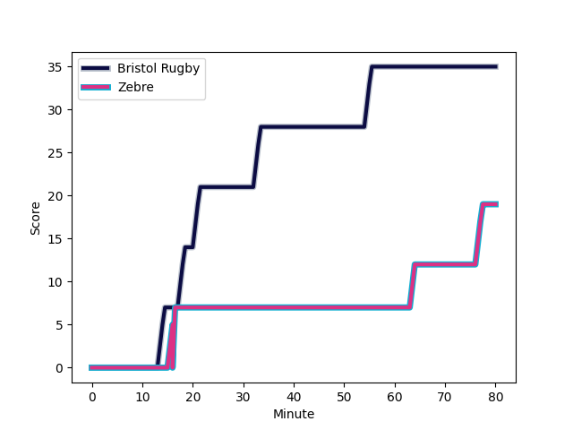
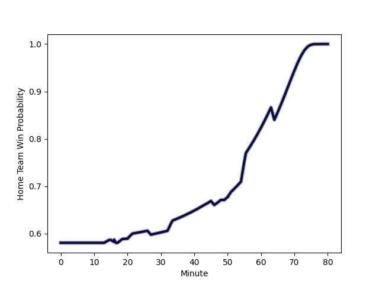

---  
layout: page  
title: Zebre at Bristol Rugby; 19-35  
date: 2022-12-18 14:00:00 18:00:00 -0500  
categories: match review  
---
# Zebre (1392.1) at Bristol Rugby (1533.54); 19-35

# Prediction: Bristol Rugby by 17.1

Bristol Rugby by 14.1 on a neutral field
## Scores over Time

## Win Probability over Time

# Pre-Match Prediction: Bristol Rugby by 21.0

Bristol Rugby by 18.0 on a neutral pitch

|   Away Minutes | Away Player                                                                 |   Away elo |   Away Percentile |   Number |   Home Percentile |   Home elo | Home Player                                                   |   Home Minutes |
|---------------:|:----------------------------------------------------------------------------|-----------:|------------------:|---------:|------------------:|-----------:|:--------------------------------------------------------------|---------------:|
|             44 | [Juan Manuel Pitinari](..//playerfiles//JuanManuelPitinari_cleaned.md)      |      92.41 |                36 |        1 |                88 |     108.8  | [Jake Woolmore](..//playerfiles//JakeWoolmore_cleaned.md)     |             46 |
|             49 | [Marco Manfredi](..//playerfiles//MarcoManfredi_cleaned.md)                 |      68.36 |                 0 |        2 |                68 |      99.76 | [Harry Thacker](..//playerfiles//HarryThacker_cleaned.md)     |             55 |
|             44 | [Ion Neculai](..//playerfiles//IonNeculai_cleaned.md)                       |      86.68 |                17 |        3 |                97 |     119.99 | [Jay Tyack](..//playerfiles//JayTyack_cleaned.md)             |             46 |
|             80 | [Jan Uys](..//playerfiles//JanUys_cleaned.md)                               |      97.52 |                63 |        4 |                86 |     108.99 | [Joe Batley](..//playerfiles//JoeBatley_cleaned.md)           |             80 |
|             49 | [Andrea Zambonin](..//playerfiles//AndreaZambonin_cleaned.md)               |      85.03 |                15 |        5 |                88 |     110.26 | [Chris Vui](..//playerfiles//ChrisVui_cleaned.md)             |             53 |
|             49 | [Iacopo Bianchi](..//playerfiles//IacopoBianchi_cleaned.md)                 |      74.93 |                 2 |        6 |                94 |     116.45 | [Steven Luatua](..//playerfiles//StevenLuatua_cleaned.md)     |             53 |
|             80 | [MJ Pelser](..//playerfiles//MJPelser_cleaned.md)                           |      74.39 |                 2 |        7 |                12 |      85.32 | [Jake Heenan](..//playerfiles//JakeHeenan_cleaned.md)         |             80 |
|             80 | [Taina Fox-Matamua](..//playerfiles//TainaFox-Matamua_cleaned.md)           |     116.69 |                94 |        8 |                72 |     103.2  | [Fitz Harding](..//playerfiles//FitzHarding_cleaned.md)       |             80 |
|             69 | [Ratko Jelic](..//playerfiles//RatkoJelic_cleaned.md)                       |      94.21 |               nan |        9 |                57 |      97.55 | [Will Porter](..//playerfiles//WillPorter_cleaned.md)         |             27 |
|             80 | [Tiff Eden](..//playerfiles//TiffEden_cleaned.md)                           |      88.44 |                21 |       10 |                63 |      99.33 | [AJ MacGinty](..//playerfiles//AJMacGinty_cleaned.md)         |             72 |
|             80 | [Simone Gesi](..//playerfiles//SimoneGesi_cleaned.md)                       |      95.59 |                49 |       11 |                70 |     100.82 | [Gabriel Ibitoye](..//playerfiles//GabrielIbitoye_cleaned.md) |             80 |
|             57 | [Franco Smith](..//playerfiles//FrancoSmith_cleaned.md)                     |      92.44 |                40 |       12 |                42 |      92.85 | [Ioan Lloyd](..//playerfiles//IoanLloyd_cleaned.md)           |             80 |
|             80 | [Erich Cronje](..//playerfiles//ErichCronje_cleaned.md)                     |      86.18 |                16 |       13 |                78 |     105.69 | [Semi Radradra](..//playerfiles//SemiRadradra_cleaned.md)     |             60 |
|             80 | [Jacobus van Wyk](..//playerfiles//JacobusvanWyk_cleaned.md)                |     112.92 |                90 |       14 |                 6 |      79.52 | [Deago Bailey](..//playerfiles//DeagoBailey_cleaned.md)       |             80 |
|             51 | [Richard Kriel](..//playerfiles//RichardKriel_cleaned.md)                   |     103.69 |                74 |       15 |                99 |     146.27 | [Luke Morahan](..//playerfiles//LukeMorahan_cleaned.md)       |             80 |
|             36 | [Luca Rizzoli](..//playerfiles//LucaRizzoli_cleaned.md)                     |      88.38 |                19 |       16 |                 1 |      72.25 | [Andy Uren](..//playerfiles//AndyUren_cleaned.md)             |             53 |
|             36 | [Matteo Nocera](..//playerfiles//MatteoNocera_cleaned.md)                   |      92.52 |                34 |       17 |                33 |      92.2  | [Max Lahiff](..//playerfiles//MaxLahiff_cleaned.md)           |             34 |
|             31 | [Jacques du Toit](..//playerfiles//JacquesduToit_cleaned.md)                |      88.8  |                25 |       18 |                66 |      99.5  | [Yann Thomas](..//playerfiles//YannThomas_cleaned.md)         |             34 |
|             31 | [Matt Kvesic](..//playerfiles//MattKvesic_cleaned.md)                       |     101.19 |                65 |       19 |                75 |     102.53 | [Elliott Stooke](..//playerfiles//ElliottStooke_cleaned.md)   |             27 |
|             31 | [Leonard Krumov](..//playerfiles//LeonardKrumov_cleaned.md)                 |      71.26 |                 2 |       20 |                83 |     108.65 | [Daniel Thomas](..//playerfiles//DanielThomas_cleaned.md)     |             27 |
|             29 | [Geronimo Prisciantelli](..//playerfiles//GeronimoPrisciantelli_cleaned.md) |     126    |                96 |       21 |                15 |      86.74 | [Jake Kerr](..//playerfiles//JakeKerr_cleaned.md)             |             25 |
|             23 | [Matteo Moscardi](..//playerfiles//MatteoMoscardi_cleaned.md)               |      95    |               nan |       22 |                89 |     113.46 | [Callum Sheedy](..//playerfiles//CallumSheedy_cleaned.md)     |             20 |
|             11 | [Nicolo Casilio](..//playerfiles//NicoloCasilio_cleaned.md)                 |      95.87 |                49 |       23 |                15 |      85.71 | [Piers O'Conor](..//playerfiles//PiersO'Conor_cleaned.md)     |              8 |

