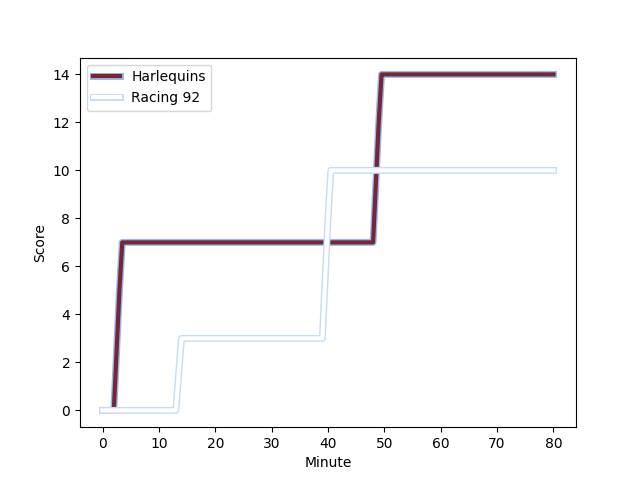
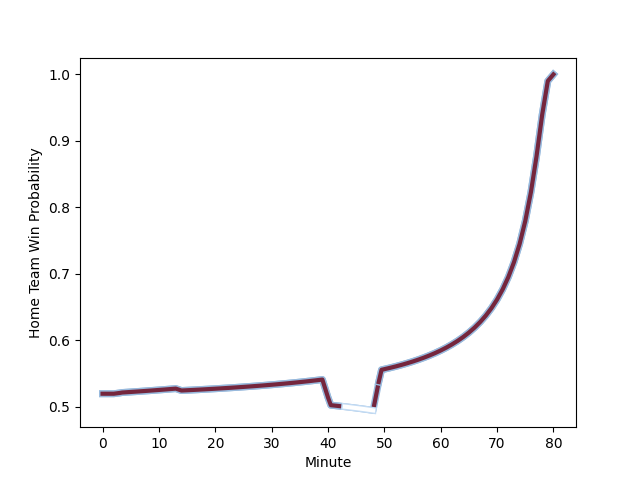

---  
layout: page  
title: Racing 92 at Harlequins; 10-14  
date: 2022-12-18 18:30:00 18:00:00 -0500  
categories: match review  
---
# Racing 92 (1546.24) at Harlequins (1579.79); 10-14

# Prediction: Harlequins by 6.4

Harlequins by 3.4 on a neutral field
## Scores over Time

## Win Probability over Time

# Pre-Match Prediction: Harlequins by 6.4

Harlequins by 3.4 on a neutral pitch

|   Away Minutes | Away Player                                                           |   Away elo |   Away Percentile |   Number |   Home Percentile |   Home elo | Home Player                                                       |   Home Minutes |
|---------------:|:----------------------------------------------------------------------|-----------:|------------------:|---------:|------------------:|-----------:|:------------------------------------------------------------------|---------------:|
|             80 | [Guram Gogichashvili](..//playerfiles//GuramGogichashvili_cleaned.md) |     109.24 |                90 |        1 |                45 |      94.16 | [Fin Baxter](..//playerfiles//FinBaxter_cleaned.md)               |             80 |
|             80 | [Janick Tarrit](..//playerfiles//JanickTarrit_cleaned.md)             |      94.5  |                37 |        2 |                51 |      94.97 | [George Head](..//playerfiles//GeorgeHead_cleaned.md)             |             80 |
|             80 | [Biyi Alo](..//playerfiles//BiyiAlo_cleaned.md)                       |     123.08 |                99 |        3 |                74 |     101.23 | [Simon Kerrod](..//playerfiles//SimonKerrod_cleaned.md)           |             80 |
|             80 | [Boris Palu](..//playerfiles//BorisPalu_cleaned.md)                   |     111.95 |                90 |        4 |                84 |     106.67 | [Dino Lamb](..//playerfiles//DinoLamb_cleaned.md)                 |             80 |
|             80 | [Fabien Sanconnie](..//playerfiles//FabienSanconnie_cleaned.md)       |      67.79 |                 1 |        5 |                91 |     112.79 | [Irne Herbst](..//playerfiles//IrneHerbst_cleaned.md)             |             80 |
|             80 | [Anthime Hemery](..//playerfiles//AnthimeHemery_cleaned.md)           |      98.06 |                55 |        6 |                77 |     103.7  | [Jack Kenningham](..//playerfiles//JackKenningham_cleaned.md)     |             80 |
|             80 | [Cameron Woki](..//playerfiles//CameronWoki_cleaned.md)               |      90.24 |                28 |        7 |                47 |      95.02 | [Will Evans](..//playerfiles//WillEvans_cleaned.md)               |             80 |
|             80 | [Kitione Kamikamica](..//playerfiles//KitioneKamikamica_cleaned.md)   |      88.71 |                23 |        8 |                90 |     115.97 | [Alex Dombrandt](..//playerfiles//AlexDombrandt_cleaned.md)       |             80 |
|             80 | [Teddy Iribaren](..//playerfiles//TeddyIribaren_cleaned.md)           |     120.1  |                96 |        9 |                99 |     129.32 | [Danny Care](..//playerfiles//DannyCare_cleaned.md)               |             80 |
|             80 | [Finn Russell](..//playerfiles//FinnRussell_cleaned.md)               |     126.31 |                96 |       10 |                70 |     102.1  | [Tommaso Allan](..//playerfiles//TommasoAllan_cleaned.md)         |             80 |
|             80 | [Donovan Taofifenua](..//playerfiles//DonovanTaofifenua_cleaned.md)   |      92.47 |                35 |       11 |                93 |     116.3  | [Josh Bassett](..//playerfiles//JoshBassett_cleaned.md)           |             80 |
|             80 | [Gael Fickou](..//playerfiles//GaelFickou_cleaned.md)                 |     116.81 |                92 |       12 |                71 |     102.72 | [Andre Esterhuizen](..//playerfiles//AndreEsterhuizen_cleaned.md) |             80 |
|             80 | [Francis Saili](..//playerfiles//FrancisSaili_cleaned.md)             |      95.91 |                49 |       13 |                77 |     105.14 | [Joe Marchant](..//playerfiles//JoeMarchant_cleaned.md)           |             80 |
|             80 | [Christian Wade](..//playerfiles//ChristianWade_cleaned.md)           |     101.83 |                74 |       14 |                64 |      99.09 | [Cadan Murley](..//playerfiles//CadanMurley_cleaned.md)           |             80 |
|             80 | [Warrick Gelant](..//playerfiles//WarrickGelant_cleaned.md)           |     109.24 |                85 |       15 |                67 |     100.61 | [Nick David](..//playerfiles//NickDavid_cleaned.md)               |             80 |

