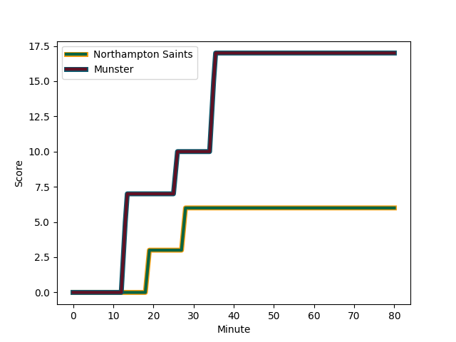
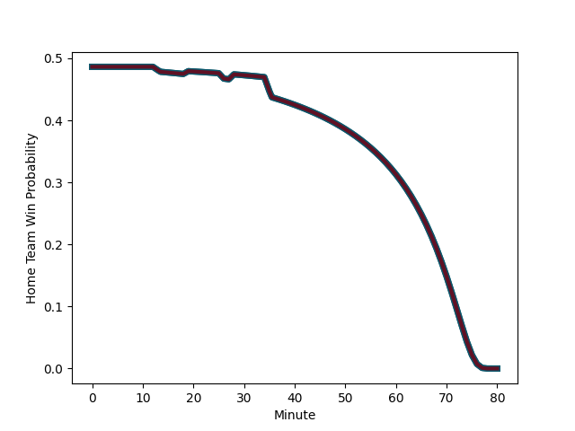

---  
layout: page  
title: Munster at Northampton Saints; 17-6  
date: 2022-12-18 14:00:00 18:00:00 -0500  
categories: match review  
---
# Munster (1552.07) at Northampton Saints (1528.33); 17-6

# Prediction: Northampton Saints by 0.6

Munster by 2.4 on a neutral field
## Scores over Time

## Win Probability over Time

# Pre-Match Prediction: Munster by 0.9

Munster by 2.1 on a neutral pitch

|   Away Minutes | Away Player                                                   |   Away elo |   Away Percentile |   Number |   Home Percentile |   Home elo | Home Player                                                             |   Home Minutes |
|---------------:|:--------------------------------------------------------------|-----------:|------------------:|---------:|------------------:|-----------:|:------------------------------------------------------------------------|---------------:|
|             80 | [Jeremy Loughman](..//playerfiles//JeremyLoughman_cleaned.md) |     111.66 |                92 |        1 |                99 |     127.7  | [Alex Waller](..//playerfiles//AlexWaller_cleaned.md)                   |             80 |
|             80 | [Niall Scannell](..//playerfiles//NiallScannell_cleaned.md)   |     102.53 |                75 |        2 |                65 |      97.75 | [Sam Matavesi](..//playerfiles//SamMatavesi_cleaned.md)                 |             80 |
|             80 | [John Ryan](..//playerfiles//JohnRyan_cleaned.md)             |     101.19 |                71 |        3 |                74 |     100.77 | [Ehren Painter](..//playerfiles//EhrenPainter_cleaned.md)               |             80 |
|             80 | [Jean Kleyn](..//playerfiles//JeanKleyn_cleaned.md)           |     102.57 |                75 |        4 |                18 |      86.38 | [Lukhan Salakaia-Loto](..//playerfiles//LukhanSalakaia-Loto_cleaned.md) |             80 |
|             80 | [Tadhg Beirne](..//playerfiles//TadhgBeirne_cleaned.md)       |     114.35 |                92 |        5 |                83 |     106.82 | [David Ribbans](..//playerfiles//DavidRibbans_cleaned.md)               |             80 |
|             80 | [Jack O'Donoghue](..//playerfiles//JackO'Donoghue_cleaned.md) |     105.99 |                82 |        6 |                70 |     101.03 | [Courtney Lawes](..//playerfiles//CourtneyLawes_cleaned.md)             |             80 |
|             80 | [Peter O'Mahony](..//playerfiles//PeterO'Mahony_cleaned.md)   |      84.08 |                 9 |        7 |                52 |      97.32 | [Lewis Ludlam](..//playerfiles//LewisLudlam_cleaned.md)                 |             80 |
|             80 | [Gavin Coombes](..//playerfiles//GavinCoombes_cleaned.md)     |     111.63 |                87 |        8 |                26 |      88.68 | [Juarno Augustus](..//playerfiles//JuarnoAugustus_cleaned.md)           |             80 |
|             80 | [Conor Murray](..//playerfiles//ConorMurray_cleaned.md)       |     126.42 |                98 |        9 |                87 |     108.7  | [Alex Mitchell](..//playerfiles//AlexMitchell_cleaned.md)               |             80 |
|             80 | [Joey Carbery](..//playerfiles//JoeyCarbery_cleaned.md)       |      95.46 |                46 |       10 |                11 |      84.02 | [Fin Smith](..//playerfiles//FinSmith_cleaned.md)                       |             80 |
|             80 | [Keith Earls](..//playerfiles//KeithEarls_cleaned.md)         |     100.74 |                70 |       11 |                89 |     112.64 | [Tommy Freeman](..//playerfiles//TommyFreeman_cleaned.md)               |             80 |
|             80 | [Jack Crowley](..//playerfiles//JackCrowley_cleaned.md)       |      96.28 |                50 |       12 |                47 |      94.81 | [Rory Hutchinson](..//playerfiles//RoryHutchinson_cleaned.md)           |             80 |
|             80 | [Antoine Frisch](..//playerfiles//AntoineFrisch_cleaned.md)   |      93.28 |                40 |       13 |                80 |     106.28 | [Matt Proctor](..//playerfiles//MattProctor_cleaned.md)                 |             80 |
|             80 | [Calvin Nash](..//playerfiles//CalvinNash_cleaned.md)         |     113.84 |                91 |       14 |                75 |     102.8  | [James Ramm](..//playerfiles//JamesRamm_cleaned.md)                     |             80 |
|             80 | [Mike Haley](..//playerfiles//MikeHaley_cleaned.md)           |      92.04 |                39 |       15 |                89 |     112.62 | [George Furbank](..//playerfiles//GeorgeFurbank_cleaned.md)             |             80 |

