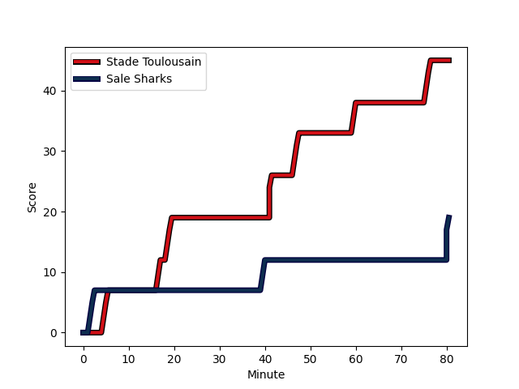
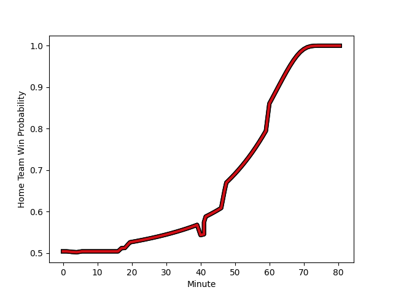

---  
layout: page  
title: Sale Sharks at Stade Toulousain; 19-45  
date: 2022-12-18 14:00:00 18:00:00 -0500  
categories: match review  
---
# Sale Sharks (1639.9) at Stade Toulousain (1646.73); 19-45

# Prediction: Stade Toulousain by 3.7

Stade Toulousain by 0.7 on a neutral field
## Scores over Time

## Win Probability over Time

# Pre-Match Prediction: Stade Toulousain by 3.7

Stade Toulousain by 0.7 on a neutral pitch

|   Away Minutes | Away Player                                                         |   Away elo |   Away Percentile |   Number |   Home Percentile |   Home elo | Home Player                                                     |   Home Minutes |
|---------------:|:--------------------------------------------------------------------|-----------:|------------------:|---------:|------------------:|-----------:|:----------------------------------------------------------------|---------------:|
|             80 | [Bevan Rodd](..//playerfiles//BevanRodd_cleaned.md)                 |     111.11 |                93 |        1 |                87 |     107.83 | [Cyril Baille](..//playerfiles//CyrilBaille_cleaned.md)         |             80 |
|             80 | [Akker van der Merwe](..//playerfiles//AkkervanderMerwe_cleaned.md) |     123.03 |                98 |        2 |                87 |     106.51 | [Julien Marchand](..//playerfiles//JulienMarchand_cleaned.md)   |             80 |
|             80 | [Nic Schonert](..//playerfiles//NicSchonert_cleaned.md)             |      87.69 |                15 |        3 |                95 |     114.44 | [Dorian Aldegheri](..//playerfiles//DorianAldegheri_cleaned.md) |             80 |
|             80 | [Cobus Wiese](..//playerfiles//CobusWiese_cleaned.md)               |      99.82 |                67 |        4 |                31 |      90.92 | [Richie Arnold](..//playerfiles//RichieArnold_cleaned.md)       |             80 |
|             80 | [Jonny Hill](..//playerfiles//JonnyHill_cleaned.md)                 |      89.55 |                25 |        5 |                33 |      91.62 | [Emmanuel Meafou](..//playerfiles//EmmanuelMeafou_cleaned.md)   |             80 |
|             80 | [Jean-Luc du Preez](..//playerfiles//Jean-LucduPreez_cleaned.md)    |     129.7  |                98 |        6 |                94 |     118.7  | [Thibaud Flament](..//playerfiles//ThibaudFlament_cleaned.md)   |             80 |
|             80 | [Tom Curry](..//playerfiles//TomCurry_cleaned.md)                   |     105.6  |                81 |        7 |                93 |     116.6  | [Jack Willis](..//playerfiles//JackWillis_cleaned.md)           |             80 |
|             80 | [Daniel du Preez](..//playerfiles//DanielduPreez_cleaned.md)        |     125.17 |                94 |        8 |                76 |     103.06 | [Anthony Jelonch](..//playerfiles//AnthonyJelonch_cleaned.md)   |             80 |
|             80 | [Gus Warr](..//playerfiles//GusWarr_cleaned.md)                     |      92.24 |                31 |        9 |                98 |     126.4  | [Antoine Dupont](..//playerfiles//AntoineDupont_cleaned.md)     |             80 |
|             80 | [Robert du Preez](..//playerfiles//RobertduPreez_cleaned.md)        |      86.59 |                15 |       10 |                86 |     111.15 | [Romain Ntamack](..//playerfiles//RomainNtamack_cleaned.md)     |             80 |
|             80 | [Arron Reed](..//playerfiles//ArronReed_cleaned.md)                 |     117.56 |                93 |       11 |                98 |     128    | [Matthis Lebel](..//playerfiles//MatthisLebel_cleaned.md)       |             80 |
|             80 | [Sam Hill](..//playerfiles//SamHill_cleaned.md)                     |      98.72 |                61 |       12 |                74 |     103.53 | [Pita Ahki](..//playerfiles//PitaAhki_cleaned.md)               |             80 |
|             80 | [Sam James](..//playerfiles//SamJames_cleaned.md)                   |     123.36 |                96 |       13 |                70 |     102.55 | [Dimitri Delibes](..//playerfiles//DimitriDelibes_cleaned.md)   |             80 |
|             80 | [Tom O'Flaherty](..//playerfiles//TomO'Flaherty_cleaned.md)         |     122.19 |                96 |       14 |                76 |     103.77 | [Lucas Tauzin](..//playerfiles//LucasTauzin_cleaned.md)         |             80 |
|             80 | [Byron McGuigan](..//playerfiles//ByronMcGuigan_cleaned.md)         |     127.56 |                98 |       15 |                96 |     121.65 | [Thomas Ramos](..//playerfiles//ThomasRamos_cleaned.md)         |             80 |

