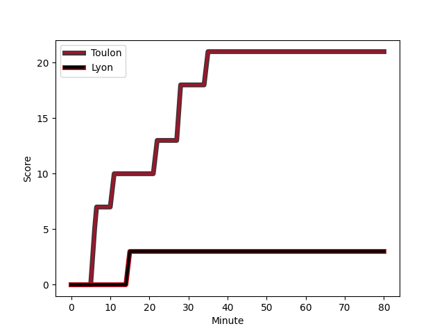
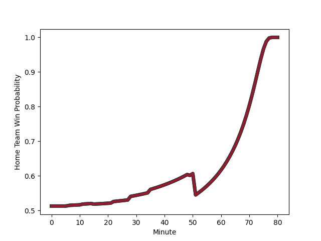

---  
layout: page  
title: Lyon at Toulon; 3-21  
date: 2022-12-22 21:00:00 18:00:00 -0500  
categories: match review  
---
# Lyon (1509.64) at Toulon (1531.04); 3-21

# Prediction: Toulon by 9.1

Toulon by 2.1 on a neutral field
## Scores over Time

## Win Probability over Time

# Pre-Match Prediction: Toulon by 9.5

Toulon by 2.5 on a neutral pitch

|   Away Minutes | Away Player                                                            |   Away elo |   Away Percentile |   Number |   Home Percentile |   Home elo | Home Player                                                       |   Home Minutes |
|---------------:|:-----------------------------------------------------------------------|-----------:|------------------:|---------:|------------------:|-----------:|:------------------------------------------------------------------|---------------:|
|             49 | [Hamza Kaabeche](playerfiles//HamzaKaabeche_cleaned.md)                |      94.22 |                42 |        1 |                38 |      94.2  | [Dany Priso](playerfiles//DanyPriso_cleaned.md)                   |             51 |
|             49 | [Yanis Charcosset](playerfiles//YanisCharcosset_cleaned.md)            |      95.27 |                52 |        2 |                64 |      98.19 | [Anthony Etrillard](playerfiles//AnthonyEtrillard_cleaned.md)     |             51 |
|             49 | [Paulo Tafili](playerfiles//PauloTafili_cleaned.md)                    |      90.5  |                26 |        3 |                88 |     109.01 | [Beka Gigashvili](playerfiles//BekaGigashvili_cleaned.md)         |             51 |
|             80 | [Felix Lambey](playerfiles//FelixLambey_cleaned.md)                    |     116.85 |                93 |        4 |                22 |      88.5  | [Swan Rebbadj](playerfiles//SwanRebbadj_cleaned.md)               |             80 |
|             80 | [Romain Taofifenua](playerfiles//RomainTaofifenua_cleaned.md)          |     105.23 |                81 |        5 |                79 |     104.73 | [Brian Alainu'uese](playerfiles//BrianAlainu'uese_cleaned.md)     |             72 |
|             49 | [Theo William](playerfiles//TheoWilliam_cleaned.md)                    |      90.07 |                27 |        6 |                49 |      95.36 | [Cornell du Preez](playerfiles//CornellduPreez_cleaned.md)        |             80 |
|             60 | [Beka Saghinadze](playerfiles//BekaSaghinadze_cleaned.md)              |     103.48 |                76 |        7 |                96 |     120.98 | [Charles Ollivon](playerfiles//CharlesOllivon_cleaned.md)         |             80 |
|             49 | [Jordan Taufua](playerfiles//JordanTaufua_cleaned.md)                  |     113.98 |                89 |        8 |                89 |     113.69 | [Facundo Isa](playerfiles//FacundoIsa_cleaned.md)                 |             60 |
|             52 | [Baptiste Couilloud](playerfiles//BaptisteCouilloud_cleaned.md)        |     120.43 |                97 |        9 |                88 |     110.79 | [Baptiste Serin](playerfiles//BaptisteSerin_cleaned.md)           |             65 |
|             80 | [Fletcher Smith](playerfiles//FletcherSmith_cleaned.md)                |      85.67 |                14 |       10 |                99 |     146.24 | [Dan Biggar](playerfiles//DanBiggar_cleaned.md)                   |             80 |
|             60 | [Noa Nakaitaci](playerfiles//NoaNakaitaci_cleaned.md)                  |      99.87 |                68 |       11 |                18 |      88.02 | [Gaël Dréan](playerfiles//GaëlDréan_cleaned.md)                   |             80 |
|             80 | [Kyle Godwin](playerfiles//KyleGodwin_cleaned.md)                      |     110.13 |                85 |       12 |                 5 |      78.73 | [Maëlan Rabut](playerfiles//MaëlanRabut_cleaned.md)               |             80 |
|             80 | [Tavite Veredamu](playerfiles//TaviteVeredamu_cleaned.md)              |      92.93 |                38 |       13 |                30 |      91.07 | [Jérémy Sinzelle](playerfiles//JérémySinzelle_cleaned.md)         |             73 |
|             80 | [Ethan Dumortier](playerfiles//EthanDumortier_cleaned.md)              |      98.03 |                60 |       14 |                65 |      99.05 | [Jiuta Wainiqolo](playerfiles//JiutaWainiqolo_cleaned.md)         |             80 |
|             80 | [Leo Berdeu](playerfiles//LeoBerdeu_cleaned.md)                        |      89.84 |                30 |       15 |                70 |     105.06 | [Aymeric Luc](playerfiles//AymericLuc_cleaned.md)                 |             72 |
|             20 | [Mickael Guillard](playerfiles//MickaelGuillard_cleaned.md)            |     101.1  |                71 |       16 |                22 |      89.71 | [Bruce Devaux](playerfiles//BruceDevaux_cleaned.md)               |             29 |
|             20 | [Ethan Clusel](playerfiles//EthanClusel_cleaned.md)                    |      95    |               nan |       17 |                80 |     103.77 | [Christopher Tolofua](playerfiles//ChristopherTolofua_cleaned.md) |             29 |
|             28 | [Jean-Marc Doussain](playerfiles//Jean-MarcDoussain_cleaned.md)        |     117.79 |                95 |       18 |                13 |      86.42 | [Kieran Brookes](playerfiles//KieranBrookes_cleaned.md)           |             29 |
|             31 | [Arno Botha](playerfiles//ArnoBotha_cleaned.md)                        |     121.26 |                94 |       19 |                79 |     104.38 | [Mathieu Bastareaud](playerfiles//MathieuBastareaud_cleaned.md)   |             20 |
|             31 | [Guillaume Marchand](playerfiles//GuillaumeMarchand_cleaned.md)        |      76.89 |                 2 |       20 |                68 |      99.99 | [Jules Danglot](playerfiles//JulesDanglot_cleaned.md)             |             15 |
|             31 | [Francisco Gomez Kodela](playerfiles//FranciscoGomezKodela_cleaned.md) |     112.52 |                94 |       21 |                18 |      86.64 | [Adrien Warion](playerfiles//AdrienWarion_cleaned.md)             |              8 |
|             31 | [Jerome Rey](playerfiles//JeromeRey_cleaned.md)                        |      81.12 |                 5 |       22 |                79 |     103.85 | [Gervais Cordin](playerfiles//GervaisCordin_cleaned.md)           |              8 |
|             31 | [Dylan Cretin](playerfiles//DylanCretin_cleaned.md)                    |     107.43 |                82 |       23 |                80 |     108.21 | [Ihaia West](playerfiles//IhaiaWest_cleaned.md)                   |              7 |

