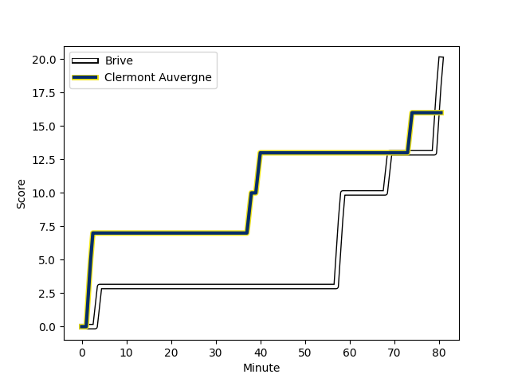
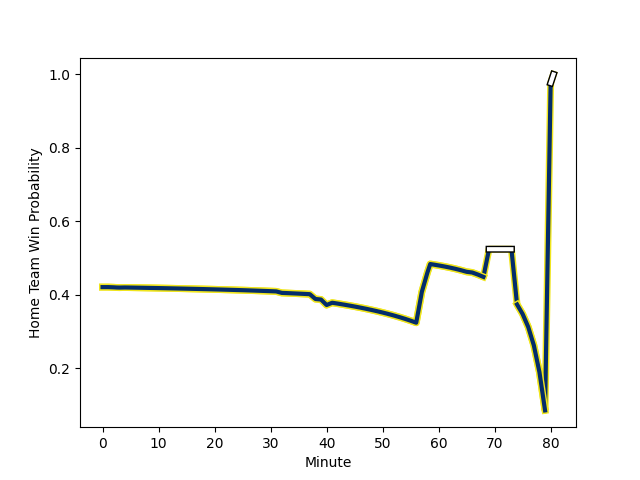

---  
layout: page  
title: Clermont Auvergne at Brive; 16-20  
date: 2022-12-23 18:45:00 18:00:00 -0500  
categories: match review  
---
# Clermont Auvergne (1608.55) at Brive (1470.24); 16-20

# Prediction: Clermont Auvergne by 6.8

Clermont Auvergne by 13.8 on a neutral field
## Scores over Time

## Win Probability over Time

# Pre-Match Prediction: Clermont Auvergne by 2.6

Clermont Auvergne by 9.6 on a neutral pitch

|   Away Minutes | Away Player                                                     |   Away elo |   Away Percentile |   Number |   Home Percentile |   Home elo | Home Player                                                       |   Home Minutes |
|---------------:|:----------------------------------------------------------------|-----------:|------------------:|---------:|------------------:|-----------:|:------------------------------------------------------------------|---------------:|
|             51 | [Giorgi Beria](playerfiles//GiorgiBeria_cleaned.md)             |      97.88 |                57 |        1 |                15 |      87.21 | [Daniel Brennan](playerfiles//DanielBrennan_cleaned.md)           |             41 |
|             63 | [Yohan Beheregaray](playerfiles//YohanBeheregaray_cleaned.md)   |      99.66 |                70 |        2 |                10 |      84.68 | [Motu Matu'u](playerfiles//MotuMatu'u_cleaned.md)                 |             74 |
|             51 | [Davit Kubriashvili](playerfiles//DavitKubriashvili_cleaned.md) |     119.56 |                97 |        3 |                24 |      89.92 | [Pietro Ceccarelli](playerfiles//PietroCeccarelli_cleaned.md)     |             41 |
|             80 | [Thibaud Lanen](playerfiles//ThibaudLanen_cleaned.md)           |     102.98 |                66 |        4 |                50 |      95.21 | [Oskar Rixen](playerfiles//OskarRixen_cleaned.md)                 |             80 |
|             80 | [Tomas Lavanini](playerfiles//TomasLavanini_cleaned.md)         |     110.67 |                89 |        5 |                19 |      86.05 | [Julien Delannoy](playerfiles//JulienDelannoy_cleaned.md)         |             48 |
|             42 | [Killian Tixeront](playerfiles//KillianTixeront_cleaned.md)     |      96.32 |                52 |        6 |                30 |      91.26 | [Esteban Abadie](playerfiles//EstebanAbadie_cleaned.md)           |             80 |
|             80 | [Alexandre Fischer](playerfiles//AlexandreFischer_cleaned.md)   |     127.37 |                98 |        7 |                94 |     116.62 | [Said Hireche](playerfiles//SaidHireche_cleaned.md)               |             80 |
|             80 | [Fritz Lee](playerfiles//FritzLee_cleaned.md)                   |     137.03 |                99 |        8 |                65 |     100.79 | [Abraham Papali'i](playerfiles//AbrahamPapali'i_cleaned.md)       |             32 |
|             66 | [Sebastien Bezy](playerfiles//SebastienBezy_cleaned.md)         |     114.94 |                93 |        9 |                41 |      94.02 | [Vaso Lobzhanidze](playerfiles//VasoLobzhanidze_cleaned.md)       |             57 |
|             66 | [Jules Plisson](playerfiles//JulesPlisson_cleaned.md)           |     108.09 |                80 |       10 |                96 |     128.68 | [Nicolas Sanchez](playerfiles//NicolasSanchez_cleaned.md)         |             57 |
|             80 | [Alivereti Raka](playerfiles//AliveretiRaka_cleaned.md)         |     106.6  |                83 |       11 |                78 |     103.14 | [Axel Muller](playerfiles//AxelMuller_cleaned.md)                 |             80 |
|             80 | [Irae Simone](playerfiles//IraeSimone_cleaned.md)               |      92.65 |                37 |       12 |                 8 |      81.4  | [Sammy Arnold](playerfiles//SammyArnold_cleaned.md)               |             57 |
|             80 | [Cheikh Tiberghien](playerfiles//CheikhTiberghien_cleaned.md)   |      97.72 |                57 |       13 |                79 |     105.89 | [Nico Lee](playerfiles//NicoLee_cleaned.md)                       |             80 |
|             80 | [Damian Penaud](playerfiles//DamianPenaud_cleaned.md)           |     102.16 |                75 |       14 |                55 |      97.12 | [Aaron Grandidier](playerfiles//AaronGrandidier_cleaned.md)       |             80 |
|             80 | [Alex Newsome](playerfiles//AlexNewsome_cleaned.md)             |     107.66 |                81 |       15 |                56 |      97.69 | [Seta Tuicuvu](playerfiles//SetaTuicuvu_cleaned.md)               |             80 |
|             38 | [Loic Godener](playerfiles//LoicGodener_cleaned.md)             |      91.31 |                30 |       16 |                50 |      95.63 | [Retief Marais](playerfiles//RetiefMarais_cleaned.md)             |             48 |
|             29 | [Rabah Slimani](playerfiles//RabahSlimani_cleaned.md)           |     101.35 |                74 |       17 |                58 |      95.58 | [Nathan Fraissenon](playerfiles//NathanFraissenon_cleaned.md)     |             39 |
|             29 | [Daniel Bibi Biziwu](playerfiles//DanielBibiBiziwu_cleaned.md)  |     100.94 |                75 |       18 |                59 |      97.9  | [Marcel van der Merwe](playerfiles//MarcelvanderMerwe_cleaned.md) |             39 |
|             17 | [Adrien Pelissie](playerfiles//AdrienPelissie_cleaned.md)       |      95.62 |                60 |       19 |                75 |     102.64 | [Lucas Paulos](playerfiles//LucasPaulos_cleaned.md)               |             32 |
|             14 | [Anthony Belleau](playerfiles//AnthonyBelleau_cleaned.md)       |     105.36 |                77 |       20 |                91 |     114.13 | [Thomas Laranjeira](playerfiles//ThomasLaranjeira_cleaned.md)     |             23 |
|             14 | [Baptiste Jauneau](playerfiles//BaptisteJauneau_cleaned.md)     |      94.82 |                49 |       21 |                40 |      92.03 | [Tom Raffy](playerfiles//TomRaffy_cleaned.md)                     |             23 |
|            nan | nan                                                             |     nan    |               nan |       22 |                35 |      91.89 | [Enzo Sanga](playerfiles//EnzoSanga_cleaned.md)                   |             23 |
|            nan | nan                                                             |     nan    |               nan |       23 |               nan |      95    | [Aymeric Tronc](playerfiles//AymericTronc_cleaned.md)             |              6 |

