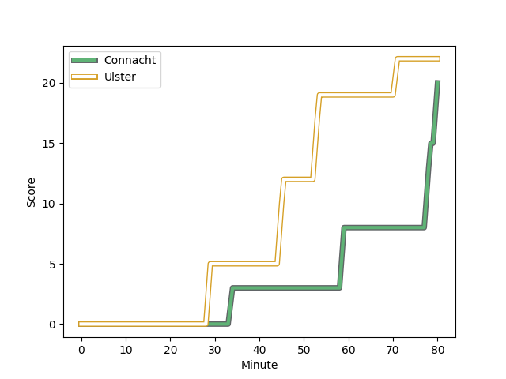
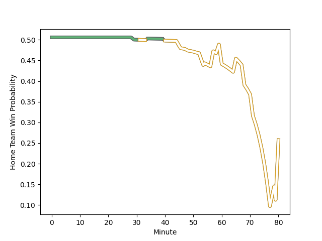

---  
layout: page  
title: Ulster at Connacht; 22-20  
date: 2022-12-23 20:35:00 18:00:00 -0500  
categories: match review  
---
# Ulster (1567.11) at Connacht (1577.35); 22-20

# Prediction: Connacht by 4.0

Connacht by 1.0 on a neutral field
## Scores over Time

## Win Probability over Time

# Pre-Match Prediction: Connacht by 6.8

Connacht by 3.8 on a neutral pitch

|   Away Minutes | Away Player                                                           |   Away elo |   Away Percentile |   Number |   Home Percentile |   Home elo | Home Player                                                                   |   Home Minutes |
|---------------:|:----------------------------------------------------------------------|-----------:|------------------:|---------:|------------------:|-----------:|:------------------------------------------------------------------------------|---------------:|
|             65 | [Rory Sutherland](..//playerfiles//RorySutherland_cleaned.md)         |      97.88 |                59 |        1 |                86 |     107.35 | [Denis Buckley](..//playerfiles//DenisBuckley_cleaned.md)                     |             52 |
|             79 | [Tom Stewart](..//playerfiles//TomStewart_cleaned.md)                 |      92.26 |                35 |        2 |                97 |     120.05 | [Shane Delahunt](..//playerfiles//ShaneDelahunt_cleaned.md)                   |             48 |
|             51 | [Marty Moore](..//playerfiles//MartyMoore_cleaned.md)                 |     106.09 |                85 |        3 |                72 |     100.83 | [Finlay Bealham](..//playerfiles//FinlayBealham_cleaned.md)                   |             68 |
|             54 | [Alan O'Connor](..//playerfiles//AlanO'Connor_cleaned.md)             |     115.94 |                93 |        4 |                94 |     117.92 | [Josh Murphy](..//playerfiles//JoshMurphy_cleaned.md)                         |             48 |
|             80 | [Iain Henderson](..//playerfiles//IainHenderson_cleaned.md)           |     103.87 |                78 |        5 |                67 |     101.56 | [Niall Murray](..//playerfiles//NiallMurray_cleaned.md)                       |             80 |
|             57 | [David McCann](..//playerfiles//DavidMcCann_cleaned.md)               |      99.62 |                71 |        6 |                51 |      96.1  | [Oisin Dowling](..//playerfiles//OisinDowling_cleaned.md)                     |             80 |
|             80 | [Marcus Rea](..//playerfiles//MarcusRea_cleaned.md)                   |     120.53 |                97 |        7 |                81 |     105.74 | [Conor Oliver](..//playerfiles//ConorOliver_cleaned.md)                       |             51 |
|             80 | [Nick Timoney](..//playerfiles//NickTimoney_cleaned.md)               |     103.26 |                76 |        8 |                14 |      85.69 | [Cian Prendergast](..//playerfiles//CianPrendergast_cleaned.md)               |             80 |
|             79 | [John Cooney](..//playerfiles//JohnCooney_cleaned.md)                 |     110.81 |                89 |        9 |                77 |     102.97 | [Caolin Blade](..//playerfiles//CaolinBlade_cleaned.md)                       |             68 |
|             80 | [Nathan Doak](..//playerfiles//NathanDoak_cleaned.md)                 |      83.17 |                13 |       10 |                86 |     111.1  | [Jack Carty](..//playerfiles//JackCarty_cleaned.md)                           |             80 |
|             80 | [Rob Lyttle](..//playerfiles//RobLyttle_cleaned.md)                   |      99.59 |                67 |       11 |                64 |      98.78 | [Mack Hansen](..//playerfiles//MackHansen_cleaned.md)                         |             80 |
|             80 | [Stuart McCloskey](..//playerfiles//StuartMcCloskey_cleaned.md)       |     124.15 |                96 |       12 |                99 |     131.28 | [Bundee Aki](..//playerfiles//BundeeAki_cleaned.md)                           |             60 |
|             79 | [Luke Marshall](..//playerfiles//LukeMarshall_cleaned.md)             |     109.74 |                84 |       13 |                43 |      94.51 | [Tom Farrell](..//playerfiles//TomFarrell_cleaned.md)                         |             80 |
|             80 | [Ethan McIlroy](..//playerfiles//EthanMcIlroy_cleaned.md)             |      99.06 |                65 |       14 |                93 |     117.38 | [John Porch](..//playerfiles//JohnPorch_cleaned.md)                           |             80 |
|             40 | [Michael Lowry](..//playerfiles//MichaelLowry_cleaned.md)             |      94.66 |                45 |       15 |                65 |     100.12 | [Tiernan O'Halloran](..//playerfiles//TiernanO'Halloran_cleaned.md)           |             54 |
|             40 | [Stewart Moore](..//playerfiles//StewartMoore_cleaned.md)             |     116.45 |                96 |       16 |                82 |     106.31 | [Jarrad Butler](..//playerfiles//JarradButler_cleaned.md)                     |             32 |
|             29 | [Gareth Milasinovich](..//playerfiles//GarethMilasinovich_cleaned.md) |     100.27 |                73 |       17 |                55 |      96.42 | [Dave Heffernan](..//playerfiles//DaveHeffernan_cleaned.md)                   |             32 |
|             26 | [Sam Carter](..//playerfiles//SamCarter_cleaned.md)                   |     109.26 |                87 |       18 |                53 |      96.51 | [Shamus Hurley-Langton](..//playerfiles//ShamusHurley-Langton_cleaned.md)     |             29 |
|             23 | [Greg Jones](..//playerfiles//GregJones_cleaned.md)                   |      96.18 |                54 |       19 |                99 |     123.74 | [Peter Dooley](..//playerfiles//PeterDooley_cleaned.md)                       |             28 |
|             15 | [Eric O'Sullivan](..//playerfiles//EricO'Sullivan_cleaned.md)         |     105.12 |                88 |       20 |               nan |      98.27 | [Dominic Robertson-McCoy](..//playerfiles//DominicRobertson-McCoy_cleaned.md) |             12 |
|              1 | [John Andrew](..//playerfiles//JohnAndrew_cleaned.md)                 |      85.29 |                10 |       21 |                90 |     112.74 | [Adam Byrne](..//playerfiles//AdamByrne_cleaned.md)                           |             26 |
|              1 | [Jake Flannery](..//playerfiles//JakeFlannery_cleaned.md)             |      92.27 |                32 |       22 |                72 |     103.66 | [David Hawkshaw](..//playerfiles//DavidHawkshaw_cleaned.md)                   |             20 |
|              1 | [David Shanahan](..//playerfiles//DavidShanahan_cleaned.md)           |      95.38 |               nan |       23 |                86 |     108.79 | [Kieran Marmion](..//playerfiles//KieranMarmion_cleaned.md)                   |             12 |

