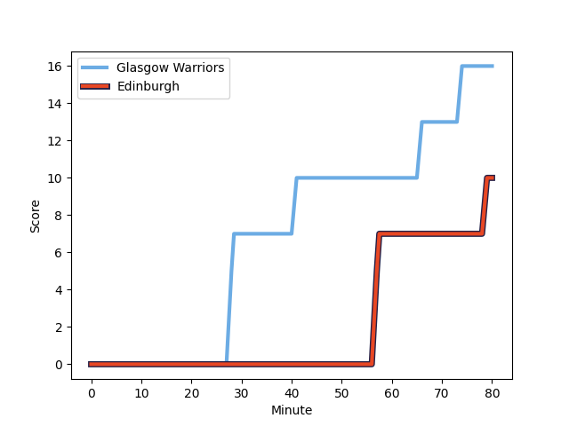
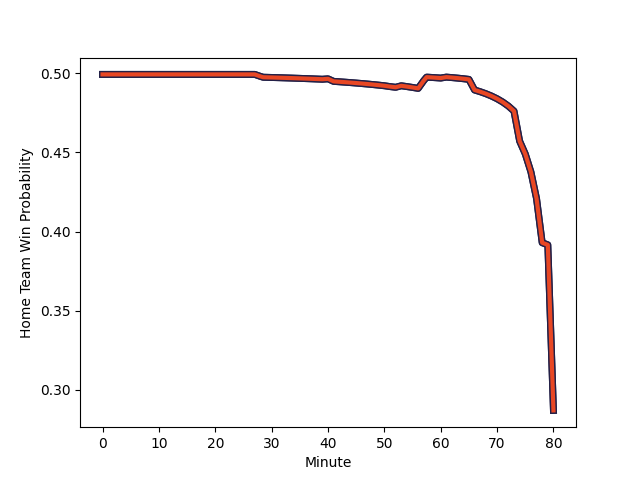

---  
layout: page  
title: Edinburgh at Glasgow Warriors; 10-16  
date: 2022-12-23 20:35:00 18:00:00 -0500  
categories: match review  
---
# Edinburgh (1504.48) at Glasgow Warriors (1522.39); 10-16

# Prediction: Glasgow Warriors by 8.8

Glasgow Warriors by 1.8 on a neutral field
## Scores over Time

## Win Probability over Time

# Pre-Match Prediction: Glasgow Warriors by 5.4

Edinburgh by 1.6 on a neutral pitch

|   Away Minutes | Away Player                                                     |   Away elo |   Away Percentile |   Number |   Home Percentile |   Home elo | Home Player                                                           |   Home Minutes |
|---------------:|:----------------------------------------------------------------|-----------:|------------------:|---------:|------------------:|-----------:|:----------------------------------------------------------------------|---------------:|
|             51 | [Pierre Schoeman](playerfiles//PierreSchoeman_cleaned.md)       |      86.01 |                12 |        1 |                88 |     108.19 | [Jamie Bhatti](playerfiles//JamieBhatti_cleaned.md)                   |             80 |
|             66 | [Tom Cruse](playerfiles//TomCruse_cleaned.md)                   |      82.56 |                19 |        2 |                97 |     120.47 | [Fraser Brown](playerfiles//FraserBrown_cleaned.md)                   |             51 |
|             61 | [WP Nel](playerfiles//WPNel_cleaned.md)                         |     124.69 |                99 |        3 |                82 |     105.58 | [Lucio Sordoni](playerfiles//LucioSordoni_cleaned.md)                 |             51 |
|             51 | [Glen Young](playerfiles//GlenYoung_cleaned.md)                 |      96.9  |                57 |        4 |                74 |     102.38 | [Sintu Manjezi](playerfiles//SintuManjezi_cleaned.md)                 |             51 |
|             80 | [Grant Gilchrist](playerfiles//GrantGilchrist_cleaned.md)       |     117.39 |                93 |        5 |                45 |      94.37 | [Richie Gray](playerfiles//RichieGray_cleaned.md)                     |             63 |
|             80 | [Jamie Ritchie](playerfiles//JamieRitchie_cleaned.md)           |     127.41 |                98 |        6 |                96 |     119.97 | [Matt Fagerson](playerfiles//MattFagerson_cleaned.md)                 |             80 |
|             80 | [Connor Boyle](playerfiles//ConnorBoyle_cleaned.md)             |      97.9  |                65 |        7 |                22 |      88.74 | [Sione Vailanu](playerfiles//SioneVailanu_cleaned.md)                 |             80 |
|             61 | [Viliame Mata](playerfiles//ViliameMata_cleaned.md)             |      91.03 |                29 |        8 |                12 |      83.7  | [Jack Dempsey](playerfiles//JackDempsey_cleaned.md)                   |             61 |
|             53 | [Ben Vellacott](playerfiles//BenVellacott_cleaned.md)           |     102.85 |                76 |        9 |                97 |     124.21 | [George Horne](playerfiles//GeorgeHorne_cleaned.md)                   |             61 |
|             80 | [Charlie Savala](playerfiles//CharlieSavala_cleaned.md)         |      95.55 |                62 |       10 |                32 |      91.81 | [Tom Jordan](playerfiles//TomJordan_cleaned.md)                       |             80 |
|             80 | [Duhan van der Merwe](playerfiles//DuhanvanderMerwe_cleaned.md) |      99.12 |                65 |       11 |                64 |      98.87 | [Kyle Steyn](playerfiles//KyleSteyn_cleaned.md)                       |             80 |
|             40 | [Chris Dean](playerfiles//ChrisDean_cleaned.md)                 |      87.27 |                22 |       12 |                87 |     111.11 | [Stafford McDowall](playerfiles//StaffordMcDowall_cleaned.md)         |             80 |
|             80 | [James Lang](playerfiles//JamesLang_cleaned.md)                 |     104.55 |                76 |       13 |                 7 |      80.98 | [Sione Tuipulotu](playerfiles//SioneTuipulotu_cleaned.md)             |             80 |
|             75 | [Emiliano Boffelli](playerfiles//EmilianoBoffelli_cleaned.md)   |      87.78 |                25 |       14 |                92 |     115.54 | [Sebastian Cancelliere](playerfiles//SebastianCancelliere_cleaned.md) |             80 |
|             80 | [Harry Paterson](playerfiles//HarryPaterson_cleaned.md)         |      95    |               nan |       15 |                19 |      86.43 | [Josh McKay](playerfiles//JoshMcKay_cleaned.md)                       |             80 |
|             40 | [Cameron Scott](playerfiles//CameronScott_cleaned.md)           |      95.28 |               nan |       16 |                98 |     124.53 | [George Turner](playerfiles//GeorgeTurner_cleaned.md)                 |             29 |
|             29 | [Boan Venter](playerfiles//BoanVenter_cleaned.md)               |     109.76 |                94 |       17 |                47 |      94.73 | [Simon Berghan](playerfiles//SimonBerghan_cleaned.md)                 |             29 |
|             29 | [Marshall Sykes](playerfiles//MarshallSykes_cleaned.md)         |      95.09 |                51 |       18 |                28 |      90.25 | [Lewis Bean](playerfiles//LewisBean_cleaned.md)                       |             29 |
|             27 | [Henry Pyrgos](playerfiles//HenryPyrgos_cleaned.md)             |      94.62 |                43 |       19 |                79 |     103.58 | [Ali Price](playerfiles//AliPrice_cleaned.md)                         |             19 |
|             19 | [Angus Williams](playerfiles//AngusWilliams_cleaned.md)         |      97.87 |                65 |       20 |                56 |      96.69 | [JP du Preez](playerfiles//JPduPreez_cleaned.md)                      |             17 |
|             19 | [Ben Muncaster](playerfiles//BenMuncaster_cleaned.md)           |     100.78 |                65 |       21 |                23 |      89.22 | [Cameron Neild](playerfiles//CameronNeild_cleaned.md)                 |             19 |
|             14 | [Patrick Harrison](playerfiles//PatrickHarrison_cleaned.md)     |      90.85 |                27 |       22 |               nan |     nan    | nan                                                                   |            nan |
|              5 | [Jaco van der Walt](playerfiles//JacovanderWalt_cleaned.md)     |     117.99 |                93 |       23 |               nan |     nan    | nan                                                                   |            nan |

